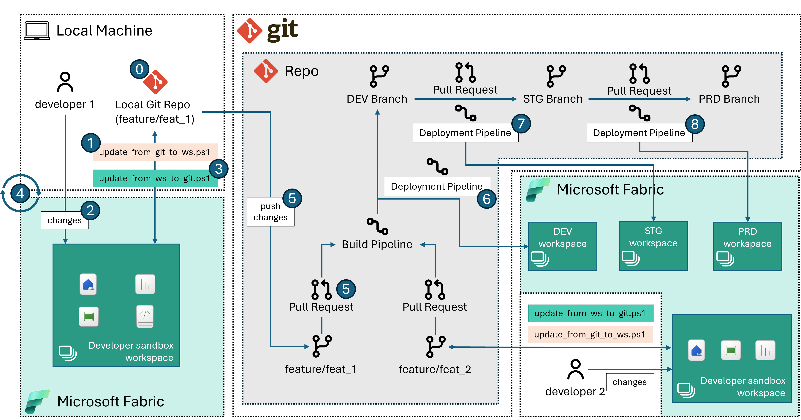

# Release Pipeline via DevOps Pipeline + REST API calls

This approach leverages REST API calls to make changes to Dev, Stg and Prod Fabric workspaces.

## Requirements
- Powershell version 7+
- Local IDE with git command installed.
- A DevOps source control system, like Azure DevOps or GitLab.
- A Fabric tenant with at least one capacity running. 
  - If you don't have a Fabric tenant you can create a [Fabric trial](https://learn.microsoft.com/fabric/get-started/fabric-trial) and use a trial capacity instead.

## Set-up Instructions

### Repository

To use this sample it is advisable that you: 
1. Create a brand new repository with your source control tool of choice.
2. Clone the entire repository locally to a folder of your choice. 
3. Copy everything that is under the [fabric_ci_cd folder](../../) to the folder from step 2.
4. Read remaining instructions.

### PowerShell Scripts

| Script/File | Description |
|--------|-------------|
|[params.psd1](../../src/option_2/params.psd1)|Parameters file - used to set the input arguments to the scripts. Update the values as needed.|
|[update_from_git_to_ws.ps1](../../src/option_2/update_from_git_to_ws.ps1)|Script to create Fabric workspace and sync assets from source control (local git branch) to the workspace.|
|[update_from_ws_to_git.ps1](../../src/option_2/update_from_ws_to_git.ps1)|Script to update the local repository from item defintions in the Fabric workspace.|

> Note: to avoid committing secrets to your remote branch, make sure to ignore changes to the local version of your `params.psd1` file

### DevOps Pipelines

Create Build (CI) and Release (CD) pipelines from the [yml definitions provided in this sample](../../devops/option_2/). To do so, refer to the information in the [DevOps pipeline readme](../../devops/option_2/README.md).

## Fabric Items and Source Control

This sample maintains a record of changes to Fabric items in source control to prevent the need for constant deletion and recreation of modified items. It does this by tracking the *Object Id*s (the GUIDs of the items in the Fabric workspace, as per the Fabric REST APIs) in an `item-config.json` configuration file. 

All Fabric items come with a minimal definition (at the time of writing comprising of Name, Type and Description). Such minimal defintion is stored in the `item-metadata.json` file.

Certain types of items in Fabric can have an [item definition](https://learn.microsoft.com/rest/api/fabric/articles/item-management/definitions/item-definition-overview). You can get this definition by using the [`getDefnition`](https://learn.microsoft.com/rest/api/fabric/core/items/get-item-definition) API. The result of this API call is saved in a file called `item-definition.json`.

To make things easier for developers, the definition, which is encoded in base64 in the `item-definition.json` file, is also stored in the repository. For instance, if the item is a Notebook, a notebook in ipynb format is saved in the repository. This is done by decoding the base64 data that the `getDefnition` API returns. This allows the developer to edit the notebook using their favorite IDE. Any changes made are then saved back in Fabric when the corresponding Fabric item is updated using the [`updateDefnition`](https://learn.microsoft.com/rest/api/fabric/core/items/update-item-definition) API.

All the files that compose a specific Fabric item are stored in a corresponding folder (`Item1Folder.ItemType` in the example below).

All these individual item folders are then stored in one main folder, named `fabric` in this repository.

folder structure:

```
/ (root of this project)
│
└───...
│
└───fabric
│   └───Item1Folder.ItemType
│   |   │   item-config.json
│   |   │   item-definition.json (optional)
│   |   │   item-metadata.json
│   |   │   (other optional files that may vary by item type)
│   |
│   └───Item2Folder.ItemType
│       │   ...
│
└───...
```

## Using Fabric item APIs for Git integration

Currently, Microsoft Fabric supports Git integration for Azure DevOps only. This article presents a way to use [Fabric REST APIs](https://learn.microsoft.com/rest/api/fabric/articles/using-fabric-apis) to integrate with other GIT source control mechanisms beyond Azure devOps. A brief summary of the steps involved are:

1. Creating a Fabric workspace (if not existing already)
2. Creating/updating Fabric items in the workspace to reflect what is on the developer branch.
3. Working as needed in the Fabric workspace.
4. Updating changes from workspace to reflect them back in source control.

> Note 1: This sample follows a strategy where each feature branch is paired with a corresponding Fabric workspace, implementing a one-workspace-per-branch approach.

> Note 2: This example includes a set of Fabric items to demonstrate the functionality of the solution. You are welcome to substitute these with your own items. In doing so, we advise maintaining identifiers such as workspaceIds and LakehouseIds as parameters for Notebooks and Data Pipelines. Failure to do this may result in the script being unable to push your item definitions if they reference item ids that have been removed. 


This approach assumes that the developer will operate in the following way:

### Recommended Workflow
The below picture illustrates these followed by a description of each of the numbered step:



**Step 0. Prepare for local development**
- Create new feature branch from `dev` (or any other development branch) and pull new feature branch locally.
- In a *bash* session run the following command. This command instructs git to disregard local modifications to any `item-config.json` file. The purpose of this is to prevent the `objectId`s in the `dev` branch from being replaced by the `objectId`s from the developer workspace during a commit. For more information see the [Fabric Items and Source Control](#fabric-items-and-source-control) section.
    ```sh
    git update-index --assume-unchanged $(git ls-files | grep "item-config.json" | tr '\n' ' ')
    ```
> Note: this approach will also work if no Fabric assets are present on your branch, but you will still need a folder for storing Fabric items definitions later.

**Step 1. Create/Update Fabric workspace and create Fabric items from local branch**

- Update the `params.psd1` file as needed and load its values as follows:
    ```pwsh
    $config = Import-PowerShellDataFile .\<local-file-path>\params.psd1
    ```
- Run the [`update_from_git_to_ws.ps1`](../../src/option_2/update_from_git_to_ws.ps1) script from the local repository folder. This step will create a new workspace and mirror what is on the repo to the workspace.
    > **CAUTION: Workspace items that are not in the local branch will be deleted from Fabric workspace.**

    -  When running this for the first time on a new branch, utilize the `-resetConfig` setting it to `$true`. This ignores any existing `item-config.json` files and creates corresponding new objects in the workspace. This step is crucial as it prevents the script from failing due to a search for `objectId`s that are coming from the `dev` branch/workspace, which would not exist in the new Fabric workspace.
         ```pwsh
        .\<local-file-path>\update_from_git_to_ws.ps1 -baseUrl $config.baseUrl -fabricToken $config.fabricToken -workspaceName $config.workspaceName -capacityId $config.capacityId -folder $config.folder -resetConfig $true
        ```
    -  All other times you can omit the flag `-resetConfig` (it will default to `$false`).
        ```pwsh
        .\<local-file-path>\update_from_git_to_ws.ps1 -baseUrl $config.baseUrl -fabricToken $config.fabricToken -workspaceName $config.workspaceName -capacityId $config.capacityId -folder $config.folder
       ```
**Step 2. Develop in the Fabric workspace**

- Work as needed in your Fabric workspace (you can find it in Fabric looking for the Workspace `$config.workspaceName`).

**Step 3. Sync the local branch with Fabric workspace**

- Once you are ready to commit your changes to your branch, run the [`update_from_ws_to_git.ps1`](../../src/option_2/update_from_ws_to_git.ps1). The script will update your local branch mirroring what is in your Fabric workspace. This creates/updates folders in the `$config.folder` on your local branch. For more information on folder structure see the [Fabric Items and Source Control](#fabric-items-and-source-control) section.
    > **CAUTION: local branch items that are not in the workspace will be deleted from local branch.**
    ```pwsh
    .\<local-file-path>\update_from_ws_to_git.ps1 -baseUrl $config.baseUrl -fabricToken $config.fabricToken -workspaceName $config.workspaceName -capacityId $config.capacityId -folder $config.folder
    ```

**Step 4. Repeat until done**

- Iterate between step 1 to step 3 as needed.

**Step 5. Push changes and create a PR**

- When happy with the changes, create a PR to merge the changes. 
   > **CAUTION**: Make sure that when creating the PR no `item-config.json` files are pushed to `dev`. These files are created in each of the workspace item folder as part of Step 3. This file contains the *logical ids and object ids* to identify each of the assets. However, these vary from workspace to another hence these should not be checked in.
  
**Step 6. Follow PR approval process to DEV workspace**

- When the PR is approved, devops Build and Release pipelines are triggered:
    1. the Build pipeline checks that no `item-config.json` files are being pushed to `dev`. For more information on usage of DevOps Pipelines in this sample, review the [DevOps Pipelines README](../../devops/option_2/README.md).
    2. the release pipeline will mirror what is on `dev` to the development workspace by running `update_from_git_to_ws.ps1`.
   
**Step 7 and 8. Use Release pipeline to deploy to all environments/stages**

- The release pipeline for STG and PRD can be identical or a variation to the release pipeline for DEV. For more information on usage of DevOps Pipelines in this sample, review the [DevOps Pipelines README](../../devops/option_2/README.md).


## Common errors

- `Error reponse: Response status code does not indicate success: 400 (Bad Request)`
    - Likely one of the Fabric items you are trying to update has a defintion containing errors. We advise maintaining identifiers such as workspaceIds and LakehouseIds as **parameters** for Notebooks and Data Pipelines. Failure to do this may result in the script being unable to push your item definitions if they reference item ids that have been removed.
- `Error reponse: Response status code does not indicate success: 401 (Unauthorized)`
    - Likely your user token has expired. Update it and source your params file and then try again. 
    - If using Azure DevOps: if you are getting this error when running devops pipelines after refreshing the token variable, make sure you have toggled the secret variable type.
- `Error reponse: Response status code does not indicate success: 403 (Forbidden)`
    - Likely one of the Fabric items you are trying to update has a MIP label that prevents you from updating its definition.

- `Error reponse: Response status code does not indicate success: 404 (Not Found)`
    - Likely the capacity you specified cannot be used. Make sure that your Fabric capacity is available and running, it might have been paused, in this case you can resume it and re-run the script.
- `Error reponse: A parameter cannot be found that matches parameter name 'ResponseHeadersVariable'`
    - Likely you need to update your Powershell version to 7+.

## Known limitations

- Microsoft Information Protection labels are now being enforced by Fabric but there is still not a way to set MIP labels via APIs. When MIP labels are defaulting to Restricted/Confidential, then some of the API calls in the below scripts might fail.
- Service Principal authentication is currently not supported by Fabric APIs, therefore this sample is currently relying on user tokens - see [passing the bearer token](../../README.md#passing-the-fabric-bearer-token).

## Roadmap

- Add GitLab devops pipelines (Build and Release).
- Triggering hydration of Lakehouse (via Data Pipelines and Notebook).