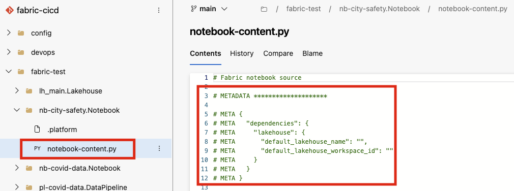

# Known issues, limitations, and workarounds <!-- omit in toc -->

This document lists the known issues and limitations specific to the sample, as well as to Fabric in general. These issues and limitations are based on the current state of the Fabric REST APIs and Fabric deployment pipelines. The document also provides recommendations on how to handle these challenges.

## Contents <!-- omit in toc -->

- [Passing the Fabric bearer token](#passing-the-fabric-bearer-token)
- [Implications of using Fabric deployment pipelines for CD](#implications-of-using-fabric-deployment-pipelines-for-cd)
- [Direct changes made to the "main" branch](#direct-changes-made-to-the-main-branch)
- [Engineers kicking off the deployment pipeline manually via Fabric UI](#engineers-kicking-off-the-deployment-pipeline-manually-via-fabric-ui)
- [Handing Notebook's default Lakehouse](#handing-notebooks-default-lakehouse)
- [Existing workspace warning](#existing-workspace-warning)
- [Several run attempts might lead to strange errors](#several-run-attempts-might-lead-to-strange-errors)
- [The pagination issue with the Fabric REST APIs for list operations](#the-pagination-issue-with-the-fabric-rest-apis-for-list-operations)

## Passing the Fabric bearer token

This is due to a known limitation that the Fabric APIs don't have Service Principal (SP) support (See [Microsoft Documentation](https://learn.microsoft.com/rest/api/fabric/articles/using-fabric-apis#considerations-and-limitation)). Currently, the script uses the Fabric Bearer Token to authenticate with the Fabric API.

For now, the token has to be manually generated and passed to the script as an environment variable. This token is valid for one hour and needs to be refreshed after that. There are several ways to generate the token:

- **Using PowerShell**: The token can be generated by using the following PowerShell command:

    ```powershell
    [PS]> Connect-PowerBIServiceAccount
    [PS]> Get-PowerBIAccessToken
    ```

- **Using browser devtools (F12)**: If you are already logged into Fabric portal, you can invoke the following command from the Browser DevTools (F12) console:

    ```powershell
    > copy(powerBIAccessToken)
    ```

    This would copy the token in your clipboard that you can update in the .env file.

- **Acquiring the token programmatically**: A programmatic way of acquiring the access token can be found [here](https://learn.microsoft.com/rest/api/fabric/articles/get-started/fabric-api-quickstart#c-code-sample-for-acquiring-a-microsoft-entra-access-token).

## Implications of using Fabric deployment pipelines for CD

It should be noted that the GIT integration and deployment pipelines are optional features in the sense that you can have a workspace without attaching it to a GIT repository or a deployment pipeline. Also, the workspace GIT integration and deployment pipelines are independent features. i.e., You can have a workspace connected to a GIT repository without a deployment pipeline, and vice versa.

Now, each DEV workspace can have a state of changes that are not yet committed to the GIT repository. Let's term it as "local state". Similarly, there might be changes committed to the GIT repository but not yet synced to the DEV workspace. Let's term it as "remote state".

The possibility of having two different states for the changes has implications on the CI/CD process. As deployment pipeline is associated with the workspaces, and is independent of GIT integration, it would trigger the deployment based on the "local state" of the workspace. This means that the deployment pipeline will trigger the deployment based on the changes that are not yet committed to the GIT repository, and would ignore the committed changes that are yet to be synced to the workspace. And this would result in inconsistent and incorrect deployments. The following diagram illustrates the issue:


- Initially, both the workspace and the GIT repository are in sync. This is represented by the `Local State: V0` in the diagram.
- The developer makes changes to the workspace and commits them to the GIT repository. However, the changes are not yet synced to the workspace. This is represented by the `Remote State: V1` in the diagram.
- Another developer makes changes to the workspace directly. These changes are not yet committed to the GIT repository. This is represented by the `Local State: V2` in the diagram.
- The deployment pipeline is triggered. It will deploy the changes in the `Local State: V2` to the target environment. The changes in the `Remote State: V1` are ignored.

To avoid such issues, the CD pipelines should follow the following steps in the sequence:

1. Sync the workspace with the GIT repository (with "PreferRemote" conflict resolution policy, and "allowOverrideItems" update option set to True).
1. Undo the changes in the workspace that are not yet committed to the GIT repository.
1. Kick-off the deployment pipeline.

For achieving the step 1, the script [update-workspace-from-git.ps1](./devops/devops_scripts/update-workspace-from-git.ps1) can be used. The script fetches the latest changes from the GIT repository and syncs the workspace with the latest changes. This script is already included in the [azdo-fabric-cd-release.yml](./devops/azdo-fabric-cd-release.yml) [azdo-fabric-cd-release-with-approvals.yml](./devops/azdo-fabric-cd-release-with-approvals.yml) release pipelines.

Unfortunately, the functionality to undo the local workspace changes is only available on Fabric UI, and can't be done programmatically for now. This is currently a limitation that you should be aware of. As soon as the undo APIs are available, the script will be updated to include this functionality.

## Direct changes made to the "main" branch

Ideally, the changes to the "main" branch should only be made through the "feature" branches and then merged into the "main" branch. This is to ensure that the changes are validated and tested before they are promoted to the "main" branch.

It's possible for the developers to make changes directly to the DEV workspace and push them to the "main" branch. To avoid this, [branch policies](https://learn.microsoft.com/azure/devops/repos/git/repository-settings?view=azure-devops&tabs=browser#branch-policies) in Azure DevOps can be setup to enforce the PR workflow. Please check the [official documentation](https://learn.microsoft.com/azure/devops/repos/git/branch-policies?view=azure-devops&tabs=browser) on how to set up branch policies in Azure DevOps. With branch policies in place, it's not possible to push changes directly to the "main" branch, but only through the PR workflow.

Please note that the sample doesn't enforce the PR workflow as of now. It's the responsibility of the project administrators to set up the branch policies in Azure DevOps.

Also, note that the sample doesn't prevent the developers from making local changes to the DEV workspace directly. The developers should be aware of this and should follow the PR workflow to promote the changes to the "main" branch. Once the APIs to undo the local workspace changes are available, the CD process would be able to handle this scenario.

## Engineers kicking off the deployment pipeline manually via Fabric UI

Depending on the permissions, it's possible for the engineers to kick off the deployment pipeline manually via the Fabric UI. This is not recommended as the deployment pipeline should be triggered only through the Azure DevOps pipelines. The deployment pipeline is created using the Fabric APIs and is associated with the workspaces. The manual triggering of the deployment pipeline via the Fabric UI might result in inconsistent deployments.

To avoid this scenario, ensure that the privileges to trigger the deployment pipeline are only with the Azure DevOps pipelines, the engineers should not have the permissions to trigger the deployment pipeline. Note that pipelines only have one permission, Admin, which is required for sharing, editing and deleting a pipeline. For more information about the permissions, see the [official documentation](https://learn.microsoft.com/fabric/cicd/deployment-pipelines/understand-the-deployment-process#permissions).

## Handing Notebook's default Lakehouse

You can choose to define a default lakehouse for your notebooks. This default lakehouse is then mounted to the runtime working directory, and you can read or write to the default lakehouse using a local path. The information about the default lakehouse gets added as metadata comments within the notebook definition as shown below:



This is a great feature to have, but it creates its own challenges for the CD process. When a notebook is promoted using deployment pipelines to a different workspace, the default lakehouse information doesn't get updated. This means that the notebook will still try to read or write to the default lakehouse of the source workspace. This can lead to inconsistent behavior and errors.

This can be avoided in two ways:

1. Avoid using the default lakehouse in the notebooks. Instead, use the actual lakehouse id and rely on the absolute path. This way, the notebook will always read or write to the correct lakehouse irrespective of the workspace it is associated with. This approach would generally work, but it might not be feasible in all scenarios.

2. Fabric supports parameterizing the default lakehouse for each notebook instance when deploying with deployment rules. Using "Default lakehouse rule", you can select a lakehouse to connect to the notebook in the target stage and set it as its default. For more information, please refer to the [official documentation](https://learn.microsoft.com/fabric/data-engineering/notebook-source-control-deployment#notebook-in-deployment-pipelines).

Unfortunately, setting the default lakehouse using the deployment rules is not yet supported through the Fabric APIs. This means that the default lakehouse information in the notebook definition is not updated when the notebook is promoted to a different workspace. The notebooks in the sample avoids this issue by using the approach 1, i.e., using absolute lakehouse path instead of the default one.

If you really want to use the default lakehouse, you can define the deployment rules manually in the Fabric UI after running the bootstrap script. This way, you can set the default lakehouse for each notebook instance in the target stage. These rules needs to be setup up once per notebook and will be applied automatically to all the subsequent deployments.

## Existing workspace warning

The script starts by creating a new capacity in Azure. If the capacity already exists, the script will fetch the Id based on the name. The script then tries to create new workspaces and associate them to the capacity.

Now, if the workspaces already exist, the script doesn't attempt to delete and recreate them as it might result in losing data and business logic. Instead, the script writes the following warning message:

```txt
[W] Workspace 'ws-fb-1-e2e-sample-uat' (999999999-9999-4f20-ac52-d8ce297dba31) already exists. Please verify the attached capacity manually.
```

As stated in the warning message, you might want to review the workspace and assign it to the right capacity manually. You can also choose to either delete the workspaces manually and attempt to run the script again, or turn off the flag at the beginning of the bootstrap script by setting create_workspaces variable to "false".

## Several run attempts might lead to strange errors

Because the scripts relies heavily on the Fabric API, there are a lot of reasons that it might fail. Here are some examples:

```txt
*[E] {"error":{"code":"Alm_InvalidRequest_WorkspaceHasNoCapacity","pbi.error":{"code":"Alm_InvalidRequest_WorkspaceHasNoCapacity","parameters":{},"details":[],"exceptionCulprit":1}}}[I] Assigned workspace '<ID>>' to stage '0' successfully.   
[I] Workspace ws-fb-1-e2e-sample-uat (ID)*

*[E] {"requestId":"<ID>>","errorCode":"UnsupportedCapacitySKU","message":"The operation is not supported over the capacity SKU"}*
```

If you are running into such issue, you might want to add additional debugging information to the script to understand the root cause of the issue. For a fresh start, you might want to delete the capacity and the workspaces and run the script again. An ideal execution of the script should look something like this:

```txt
[I] ############ START ############
[I] ############ Azure Resource Deployment ############
[I] Creating resource group 'rg-fabric-cicd'
[I] Deploying Azure resources to resource group 'rg-fabric-cicd'
[I] Capacity 'capfabriccicd' created successfully.
[I] ############ Workspace Creation ############
[I] Fabric capacity is 'capfabriccicd' (2a76fa8a-ee52-4251-968c-fc7b295fcbc0)
[I] Created workspace 'ws-fabric-cicd-dev' (8978c223-2ec9-4522-a172-073c4604e1f6)
[I] Created workspace 'ws-fabric-cicd-uat' (92d8d07a-ebe8-40ac-928f-bb29b7b7f13c)
[I] Created workspace 'ws-fabric-cicd-prd' (dc30ea98-704f-45e6-b9fd-2d985526da5a)
[I] ############ Deployment Pipeline Creation ############
[I] No deployment pipeline with name 'dp-fabric-cicd' found, creating one.
[I] Created deployment pipeline 'dp-fabric-cicd' (ed946d85-6370-4bc7-b134-af865a4fd1e4) successfully.
[I] Workspace ws-fabric-cicd-dev (8978c223-2ec9-4522-a172-073c4604e1f6)
[I] Existing workspace for stage '0' is .
[I] Assigned workspace '8978c223-2ec9-4522-a172-073c4604e1f6' to stage '0' successfully.
[I] Workspace ws-fabric-cicd-uat (92d8d07a-ebe8-40ac-928f-bb29b7b7f13c)
[I] Existing workspace for stage '1' is .
[I] Assigned workspace '92d8d07a-ebe8-40ac-928f-bb29b7b7f13c' to stage '1' successfully.
[I] Workspace ws-fabric-cicd-prd (dc30ea98-704f-45e6-b9fd-2d985526da5a)
[I] Existing workspace for stage '2' is .
[I] Assigned workspace 'dc30ea98-704f-45e6-b9fd-2d985526da5a' to stage '2' successfully.
[I] ############ Lakehouse Creation (DEV) ############
[I] Created Lakehouse 'lh_main' (51b03016-8a14-4c65-ae9a-ce0743fdfa35) successfully.
[I] ############ Notebooks Creation (DEV) ############
[I] Created Notebook 'nb-city-safety' (ff1a27c2-ea4b-4cbb-91c9-4883afed61fc) successfully.
[I] Created Notebook 'nb-covid-data' (d3fd147a-40ae-40d4-8c95-44cae3a96ac3) successfully.
[I] ############ Data Pipelines Creation (DEV) ############
[I] Created DataPipeline 'pl-covid-data' (3877e187-b966-41a9-a7db-a1113fafc39b) successfully.
[I] ############ Triggering Notebook Execution (DEV) ############
[I] Notebook execution triggered successfully.
[I] ############ Triggering Data Pipeline Execution (DEV) ############
[I] Data pipeline execution triggered successfully.
[I] ############ GIT Integration (DEV) ############
[I] Workspace connected to the git repository.
[I] The Git connection has been successfully initialized.
[I] Committed workspace changes to git successfully.
[I] ############ Creating (sub)domain attaching workspaces to it ############
[I] Created domain '<FABRIC_DOMAIN_NAME>' (81ef81ae-ca83-4c40-92e4-a7dfa7813824) successfully.
[I] Created subdomain '<FABRIC_SUBDOMAIN_NAME>' (84133035-ba3e-42ca-bd59-6e105f6de69e) successfully.
[I] Assigned workspaces to the (sub)domain successfully.
[I] ############ Adding Workspace Admins ############
[I] Workspace 'ws-fabric-cicd-dev' (8978c223-2ec9-4522-a172-073c4604e1f6)
[I] Added 'user1@contoso.com' as admin of the workspace.
[I] Added 'user2@contoso.com' as admin of the workspace.
[I] Workspace 'ws-fabric-cicd-uat' (92d8d07a-ebe8-40ac-928f-bb29b7b7f13c)
[I] Added 'user1@contoso.com' as admin of the workspace.
[I] Added 'user2@contoso.com' as admin of the workspace.
[I] Workspace 'ws-fabric-cicd-prd' (dc30ea98-704f-45e6-b9fd-2d985526da5a)
[I] Added 'user1@contoso.com' as admin of the workspace.
[I] Added 'user2@contoso.com' as admin of the workspace.
[I] ############ Adding Deployment Pipeline Admins ############
[I] Deployment pipeline 'dp-fabric-cicd' (ed946d85-6370-4bc7-b134-af865a4fd1e4)
[I] Added 'user1@contoso.com' as admin of the deployment pipeline.
[I] Added 'user2@contoso.com' as admin of the deployment pipeline.
[I] ############ Creating Azure DevOps Variable Groups ############
[I] Variable group 'vg-fabric-cicd-dev' already exists. Deleting it.
[I] Creating variable group: vg-fabric-cicd-dev
[I] Adding variable 'fabricRestApiEndpoint'
[I] Adding variable 'token'
[I] Adding variable 'pipelineName'
[I] Adding variable 'workspaceName'
[I] Adding variable 'workspaceId'
[I] Adding variable 'mainLakehouseName'
[I] Adding variable 'mainLakehouseId'
[I] Variable group 'vg-fabric-cicd-uat' already exists. Deleting it.
[I] Creating variable group: vg-fabric-cicd-uat
[I] Adding variable 'fabricRestApiEndpoint'
[I] Adding variable 'token'
[I] Adding variable 'pipelineName'
[I] Adding variable 'workspaceName'
[I] Adding variable 'workspaceId'
[I] Adding variable 'mainLakehouseName'
[I] Adding variable 'sourceStageName'
[I] Adding variable 'targetStageName'
[I] Adding variable 'sourceStageWorkspaceName'
[I] Adding variable 'sourceStageWorkspaceId'
[I] Variable group 'vg-fabric-cicd-prd' already exists. Deleting it.
[I] Creating variable group: vg-fabric-cicd-prd
[I] Adding variable 'fabricRestApiEndpoint'
[I] Adding variable 'token'
[I] Adding variable 'pipelineName'
[I] Adding variable 'workspaceName'
[I] Adding variable 'workspaceId'
[I] Adding variable 'mainLakehouseName'
[I] Adding variable 'sourceStageName'
[I] Adding variable 'targetStageName'
[I] Adding variable 'sourceStageWorkspaceName'
[I] Adding variable 'sourceStageWorkspaceId'
[I] ############ END ############
```

## The pagination issue with the Fabric REST APIs for list operations

The Fabric REST APIs to `List` things like workspaces, domains, items, etc. have the concept of pagination. If there are a lot of items, the initial API call returns a batch of items along with a `continuationToken` and `continuationUri` to fetch the next batch of items. If the `continuationToken` is not present in the response, it means that there are no more items to fetch.

The script doesn't handle pagination at the moment. It makes the initial call and assumes that all the items are fetched in the first batch. If there are more items to fetch, the script might wrongly assume that the item doesn't exist and try to create it. This is a known limitation with the script and will be addressed in the future.
