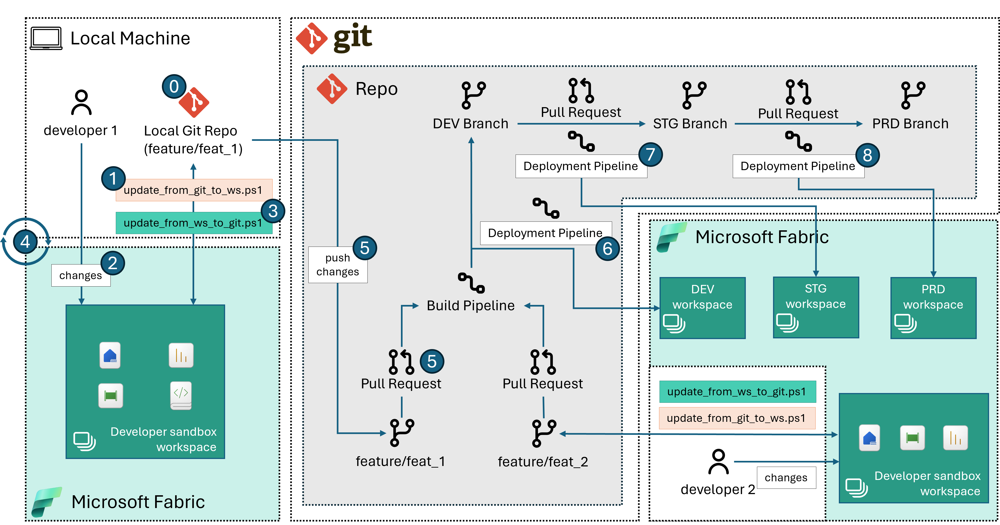

# Fabric CI/CD Sample for Multi-Tenancy or Generic Git

## Introduction

This code sample provides an advanced mechanism for implementing a CI/CD process with Microsoft Fabric, accomodating multi-tenancy and generic-git deployments. While the sample currently has some [limitations](#known-limitations), the goal is to iteratively enhance its capabilities in alignment with Fabric’s advancements.

This sample is recommended if:

- your organization adopts multi-tenancy in their CI/CD processes, such as the different environments (such as Development, Staging and Production) are on different Microsoft Entra IDs.
- your organization's preferred git tool is today not yet supported by Fabric (i.e. such as GitLab, and Bitbucket).

If none of the scenarios above match your current situation, consider using the [Fabric CI/CD sample for Azure DevOps](../fabric_ci_cd/README.md).

## How Does It Work?

### Using REST APIs for creating/updating Fabric items

Currently, Microsoft Fabric supports Git integration for Azure DevOps only. For this reason, this sample presents a way to use [Fabric REST APIs](https://learn.microsoft.com/rest/api/fabric/articles/using-fabric-apis) to integrate with other GIT source control mechanisms beyond Azure devOps. A brief summary of the steps involved are:

1. Creating a Fabric workspace (if not existing already)
2. Creating/updating Fabric items in the workspace to reflect what is on the developer branch.
3. Working as needed in the Fabric workspace.
4. Updating changes from workspace to reflect them back in source control.

> **Note 1**: This sample follows a strategy where each feature branch is paired with a corresponding Fabric workspace, implementing a one-workspace-per-branch approach.
>
> **Note 2**: This example includes a set of Fabric items to demonstrate the functionality of the solution. You are welcome to substitute these with your own items. In doing so, we advise maintaining identifiers such as workspaceIds and LakehouseIds as parameters for Notebooks and Data Pipelines. Failure to do this may result in the script being unable to push your item definitions if they reference item ids that have been removed.

This approach assumes that the developer will operate by following the recommended workflow, as described below in the [Recommended Workflow](#recommended-workflow) section.

### Source control mechanism for Fabric items

This sample maintains a record of changes to Fabric items in source control to prevent the need for constant deletion and recreation of modified items. It does this by tracking the *Object Id*s (the GUIDs of the items in the Fabric workspace, as per the Fabric REST APIs) in an `item-config.json` configuration file.

All Fabric items come with a minimal definition (at the time of writing comprising of Name, Type and Description). Such minimal defintion is stored in the `item-metadata.json` file.

Certain types of items in Fabric can have an [item definition](https://learn.microsoft.com/rest/api/fabric/articles/item-management/definitions/item-definition-overview). You can get this definition by using the [`getDefinition`](https://learn.microsoft.com/rest/api/fabric/core/items/get-item-definition) API. The result of this API call is saved in a file called `item-definition.json`.

To make things easier for developers, the definition, which is encoded in base64 in the `item-definition.json` file, is also stored in the repository. For instance, if the item is a Notebook, a notebook in ipynb format is saved in the repository. This is done by decoding the base64 data that the `getDefinition` API returns. This allows the developer to edit the notebook using their favorite IDE. Any changes made are then saved back in Fabric when the corresponding Fabric item is updated using the [`updateDefinition`](https://learn.microsoft.com/rest/api/fabric/core/items/update-item-definition) API.

All the files that compose a specific Fabric item are stored in a corresponding folder (`Item1Folder.ItemType` in the example below).

All these individual item folders are then stored in one main folder, named `fabric` in this sample.

### Understanding repository structure

The below folder structure offers a visual representation of how this code sample will organize source control files in the repository:

```fsys
/ (root of this project)
│
└───...
│
└───fabric
│   └───Item1Folder.ItemType
│   |   │   item-config.json
│   |   │   item-definition.json (optional)
│   |   │   item-metadata.json
│   |   │   (other optional files that may vary by item type)
│   |
│   └───Item2Folder.ItemType
│       │   ...
│
└───...
```

### Understanding The PowerShell Scripts

This sample uses PowerShell scripts to automate the CI/CD process. Below, you’ll find a brief overview of their purpose.

| Script/File | Description |
|--------|-------------|
|[params.psd1](./src/params.psd1)|Parameters file - used to store the values of input arguments to the scripts. Update the values as needed.|
|[update_from_git_to_ws.ps1](./src/update_from_git_to_ws.ps1)|Script to create a Fabric workspace (if non existing) and sync assets from source control (local git branch) to the workspace.|
|[update_from_ws_to_git.ps1](./src/update_from_ws_to_git.ps1)|Script to update the local repository from the item defintions in the Fabric workspace.|

> Note: to avoid committing secrets to your remote branch, make sure to ignore changes to the local version of your `params.psd1` file.

### Understanding The DevOps Pipelines

The [DevOps Pipelies README](./devops/README.md) provides a comprehensive explanation of the functionality of the DevOps Pipelines showcased in this example.

## Set-up Instructions

### Pre-Requisites

- Powershell version 7+
- Local IDE with `git` command installed.
- A DevOps source control system, like Azure DevOps or GitLab.
- A Fabric tenant with at least one capacity running.
  - If you don't have a Fabric tenant you can create a [Fabric trial](https://learn.microsoft.com/fabric/get-started/fabric-trial) and use a trial capacity instead.

### Setting Up Your GIT Repository

To use this sample it is advisable that you:

1. Create a brand new repository with your source control tool of choice.
2. Clone the entire repository locally to a directory of your choice.
3. Copy everything that is under [this sample's folder](./) to the directory from step 2.
4. Read remaining instructions.

### Deployment Steps

Create Build (CI) and Release (CD) pipelines from the YML definitions provided in this sample. To do so, refer to the information in the [DevOps pipeline readme](./devops/README.md).

### Recommended Workflow

The below picture illustrates these followed by a description of each of the numbered step:



**Step 0. Prepare for local development**:

- In a `bash` shell run the following command. Replace `feat/feat_1` with your feature branch name and `dev` with you main development branch name. This commands creates a new feature branch locally from `dev` (or the specified branch). It then instructs git to disregard local modifications to any new or existing `item-config.json` file. The purpose of this is to prevent the `objectId`s in the `dev` branch from being replaced by the `objectId`s from the developer workspace during a commit. For more information see the [Source Control Mechanisms for Fabric Items](#source-control-mechanism-for-fabric-items) section.

    ```sh
    .\new_branch.sh feat/feat_1 dev
    ```

> Note: this approach will also work if no Fabric assets are present on your branch, but you will still need a folder for storing Fabric items definitions later.

**Step 1. Create/Update Fabric workspace and create Fabric items from local branch**:

- Update the `params.psd1` file as needed. If you need to generate a new token refer to the [Generating a Fabric Bearer Token](#generating-a-fabric-bearer-token) section. Load the values of the parameters file as follows:

    ```pwsh
    $config = Import-PowerShellDataFile .\src\params.psd1
    ```

- Run the [`update_from_git_to_ws.ps1`](./src/update_from_git_to_ws.ps1) script from the local repository folder. This step will create a new workspace and mirror what is on the repo to the workspace.
    > **CAUTION: Workspace items that are not in the local branch will be deleted from Fabric workspace.**

  - When running this for the first time on a new branch, utilize the `-resetConfig` setting it to `$true`. This ignores any existing `item-config.json` files and creates corresponding new objects in the workspace. This step is crucial as it prevents the script from failing due to a search for `objectId`s that are coming from the `dev` branch/workspace, which would not exist in the new Fabric workspace.

    ```pwsh
    .\src\update_from_git_to_ws.ps1 -baseUrl $config.baseUrl -fabricToken $config.fabricToken -workspaceName $config.workspaceName -capacityId $config.capacityId -folder $config.folder -resetConfig $true
    ```

  - All other times you can omit the flag `-resetConfig` (it will default to `$false`).

    ```pwsh
    .\src\update_from_git_to_ws.ps1 -baseUrl $config.baseUrl -fabricToken $config.fabricToken -workspaceName $config.workspaceName -capacityId $config.capacityId -folder $config.folder
    ```

**Step 2. Develop in the Fabric workspace**:

- Work as needed in your Fabric workspace (you can find it in Fabric looking for the Workspace `$config.workspaceName`).

**Step 3. Sync the local branch with Fabric workspace**:

- Once you are ready to commit your changes to your branch, run the [`update_from_ws_to_git.ps1`](./src/update_from_ws_to_git.ps1). The script will update your local branch mirroring what is in your Fabric workspace. This creates/updates folders in the `$config.folder` on your local branch. For more information on folder structure see the [Fabric Items and Source Control](#fabric-items-and-source-control) section.
    > **CAUTION: local branch items that are not in the workspace will be deleted from local branch.**

    ```pwsh
    .\<local-file-path>\update_from_ws_to_git.ps1 -baseUrl $config.baseUrl -fabricToken $config.fabricToken -workspaceName $config.workspaceName -capacityId $config.capacityId -folder $config.folder
    ```

**Step 4. Repeat until done**:

- Iterate between step 1 to step 3 as needed.

**Step 5. Push changes and create a PR**:

- When happy with the changes, create a PR to merge the changes.

   > **CAUTION**: Make sure that when creating the PR no `item-config.json` files are pushed to `dev`. These files are created in each of the workspace item folder as part of Step 3. This file contains the *logical ids and object ids* to identify each of the assets. However, these vary from workspace to another hence these should not be checked in.
   >
   > **Note**: After the PR is merged it is recommended that the developer delete the feature branch. When, in the local development environment, the developer will switch back to the `dev` branch they will be warned that local changes to `.gitignore` and `item-config.json` files will be lost. There is no harm in doing this.

**Step 6. Follow PR approval process to DEV workspace**:

- When the PR is approved, devops Build and Release pipelines are triggered:

    1. the Build pipeline checks that no `item-config.json` files are being pushed to `dev`. For more information on usage of DevOps Pipelines in this sample, review the [DevOps Pipelines README](./devops/README.md).
    2. the release pipeline will mirror what is on `dev` to the development workspace by running `update_from_git_to_ws.ps1`.

**Step 7 and 8. Use Release pipeline to deploy to all environments/stages**:

- The release pipeline for STG and PRD can be identical or a variation to the release pipeline for DEV. For more information on usage of DevOps Pipelines in this sample, review the [DevOps Pipelines README](./devops/README.md).

## Common errors

- `Error reponse: Response status code does not indicate success: 400 (Bad Request)`
  - Likely one of the Fabric items you are trying to update has a defintion containing errors. We advise maintaining identifiers such as workspaceIds and LakehouseIds as **parameters** for Notebooks and Data Pipelines. Failure to do this may result in the script being unable to push your item definitions if they reference item ids that have been removed.
- `Error reponse: Response status code does not indicate success: 401 (Unauthorized)`
  - Likely your user token has expired. Update it and source your params file and then try again.
  - If using Azure DevOps: if you are getting this error when running devops pipelines after refreshing the token variable, make sure you have toggled the secret variable type.
- `Error reponse: Response status code does not indicate success: 403 (Forbidden)`
  - Likely one of the Fabric items you are trying to update has a MIP label that prevents you from updating its definition.

- `Error reponse: Response status code does not indicate success: 404 (Not Found)`
  - Likely the capacity you specified cannot be used. Make sure that your Fabric capacity is available and running, it might have been paused, in this case you can resume it and re-run the script.
- `Error reponse: A parameter cannot be found that matches parameter name 'ResponseHeadersVariable'`
  - Likely you need to update your Powershell version to 7+.

## Known limitations

- Microsoft Information Protection labels are enforced by Fabric but there is still not a way to set MIP labels via APIs. When MIP labels are defaulting to Restricted/Confidential, then some of the API calls in the below scripts might fail.
- Service Principal authentication is currently not supported by Fabric APIs (See [Microsoft Documentation](https://learn.microsoft.com/rest/api/fabric/articles/using-fabric-apis#considerations-and-limitation)), therefore this sample is currently relying on user tokens. See the below instructions for generating a valid user token.

### Generating a Fabric Bearer Token

Until Service Principal Authentication will be supported by Fabric APIs, a user token has to be manually generated and passed to the script as a variable. Such user token is valid for one hour and needs to be refreshed after that. There are several ways to generate the token:

- **Using PowerShell**: The token can be generated by using the following PowerShell command:

    ```powershell
    [PS]> Connect-PowerBIServiceAccount
    [PS]> Get-PowerBIAccessToken
    ```

- **Using Edge browser devtools (F12)**: If you are already logged into Fabric portal, you can invoke the following command from the Edge Browser DevTools (F12) console:

    ```sh
    > copy(PowerBIAccessToken)
    ```

    This will copy the token to your clipboard. You can then paste its value in the `params.psd1` file.

## Roadmap

- Triggering hydration of Lakehouse (via Data Pipelines and Notebook).
