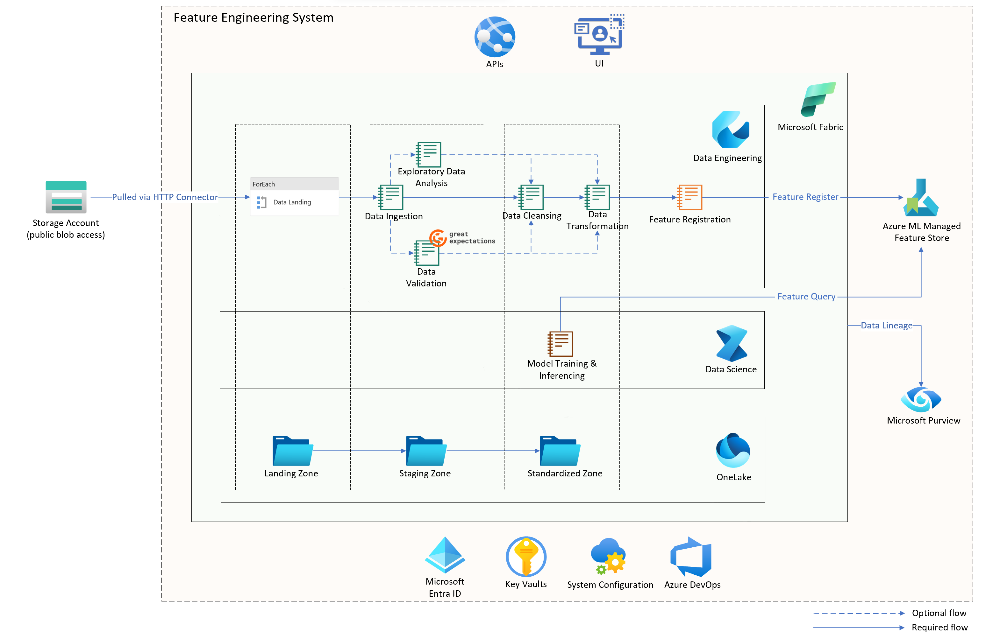
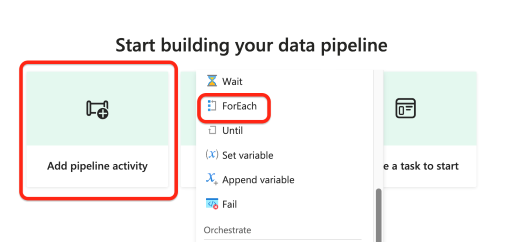
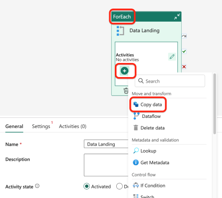
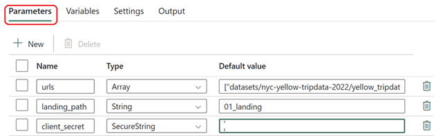
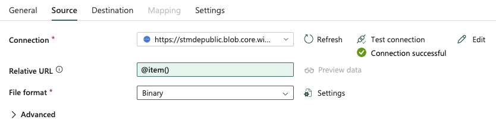
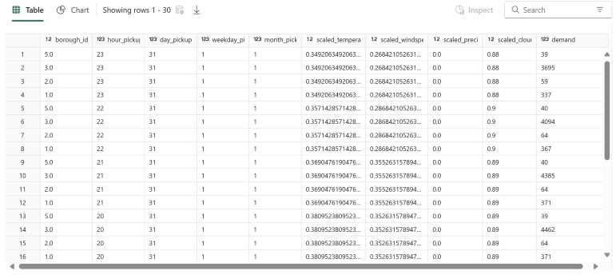
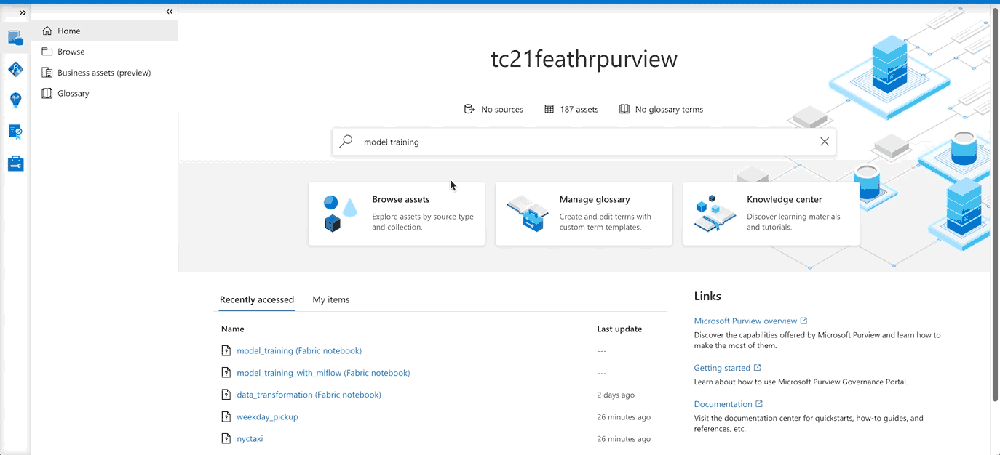

# Introduction <!-- omit in toc -->

[Feature engineering](https://learn.microsoft.com/azure/architecture/data-science-process/create-features#what-is-feature-engineering) is the process of selecting, transforming, or creating relevant features (variables) from raw data to improve the performance of a machine learning model. It involves extracting meaningful information, handling missing values, scaling, encoding categorical variables, and creating new features. Effective feature engineering enhances a model's ability to understand patterns, leading to better predictions and improved overall performance in data science and machine learning tasks.

With the recent launch of Azure ML managed feature store, machine learning professionals are now empowered to develop and productionize features independently.
You simply provide a feature set specification and let the system handle serving, securing, and monitoring of your features, freeing you from the overhead of setting up and managing the underlying feature engineering pipelines.

To learn more, read the [launch blog](https://techcommunity.microsoft.com/t5/ai-machine-learning-blog/announcing-managed-feature-store-in-azure-machine-learning/ba-p/3823043) and [Azure ML managed feature store documentation](https://learn.microsoft.com/azure/machine-learning/concept-what-is-managed-feature-store?view=azureml-api-2).

[Microsoft Fabric](https://learn.microsoft.com/fabric/get-started/microsoft-fabric-overview) is an all-in-one analytics solution for enterprises, and is an excellent choice for machine learning and data science tasks on Azure. The Data Science experience of Microsoft Fabric enables you to build, deploy, and operationalize machine learning models seamlessly within your Fabric experience. It integrates with Azure Machine Learning to provide built-in experiment tracking and model registry.

To learn more, read [Data Science documentation in Microsoft Fabric](https://learn.microsoft.com/en-us/fabric/data-science/).

This sample focuses on constructing a feature engineering system using Azure ML managed feature store and Microsoft Fabric. It delves into the tracking and monitoring of data lineage for these features through Microsoft Purview. The content includes a step-by-step guide for environment setup and running the demo, aiming to expedite the feature engineering process within the Azure ecosystem.

## Contents <!-- omit in toc -->

- [Architecture](#architecture)
- [Source dataset](#source-dataset)
- [Environment setup](#environment-setup)
  - [Prerequisites](#prerequisites)
  - [Required resources](#required-resources)
  - [Microsoft Fabric setup](#microsoft-fabric-setup)
- [Data pipeline setup](#data-pipeline-setup)
  - [Data landing activity](#data-landing-activity)
  - [Notebook activities](#notebook-activities)
- [Execute and verify](#execute-and-verify)
  - [Trigger the data pipeline](#trigger-the-data-pipeline)
  - [Verify lineage in Purview](#verify-lineage-in-purview)
    - [Data lineage](#data-lineage)
    - [Feature lineage](#feature-lineage)
  - [Verify the features in Feature Store](#verify-the-features-in-feature-store)
- [Model training and inferencing](#model-training-and-inferencing)
  - [Model training](#model-training)
  - [Model inferencing](#model-inferencing)
  - [Verify lineage in Purview](#verify-lineage-in-purview-1)
    - [Model training lineage](#model-training-lineage)
- [Additional Features](#additional-features)
  - [Exploratory data analysis](#exploratory-data-analysis)
  - [Data validation](#data-validation)
- [Conclusion](#conclusion)
- [References](#references)

## Architecture

Here is the high-level architecture diagram:



This architecture utilizes Microsoft Fabric as the data analytics platform. A [data pipeline](https://learn.microsoft.com/training/modules/use-data-factory-pipelines-fabric/) lands, ingests, and transform the incoming data. The transformed data is registered as [features](https://learn.microsoft.com/azure/machine-learning/concept-what-is-managed-feature-store?view=azureml-api-2#what-are-features) in Azure ML managed feature store. These features are used for model training and inferencing. Concurrently, the data lineage of both the data pipelines and the features is tracked and monitored using Microsoft Purview.

The sample follows a medallion architecture with `landing`, `staging` and `standard` zones created in the __File Section__ of a [lakehouse](https://learn.microsoft.com/fabric/data-engineering/lakehouse-overview) in [Fabric OneLake](https://learn.microsoft.com/fabric/onelake/onelake-overview). For data landing, 'ForEach' activity is used to download multiple files from a public blob storage. The rest of the processing (ingestion, transformation, feature registration, model training, and model inferencing) is done using Fabric 'data notebooks'.

In addition to the main flow, there are optional steps for performing 'exploratory data analysis' and 'data validations' (illustrated by dotted lines in the diagram). These features are not part of the main processing steps, but are covered separately under [Additional Features](#additional-features).

## Source dataset

The sample uses the public yellow taxi trip dataset from [New York City Taxi & Limousine Commission](https://www.nyc.gov/site/tlc/about/tlc-trip-record-data.page). However, we have hosted a subset of this dataset on our own public blob storage at the following location:

Base URL: [https://stmdwpublic.blob.core.windows.net/](https://stmdwpublic.blob.core.windows.net/)

This subset contains data for the year 2022, and each month is available as a separate parquet file. The data includes anonymized travel details like departure points, destinations, times, distances, and costs. The data, in conjunction with taxi zone maps and lookup tables, aids in various research fields such as identifying frequent pickup and drop-off zones in the city.

## Environment setup

### Prerequisites

- Access to a [Microsoft Fabric enabled tenant](https://learn.microsoft.com/fabric/admin/fabric-switch#enable-for-your-tenant). You can sign up for Fabric (Preview) trials for a period of 60 days by following [this link](https://learn.microsoft.com/fabric/get-started/fabric-trial).
- Access to an Azure subscription. You can sign up for a free trial by following [this link](https://azure.microsoft.com/en-us/free/).
- Permissions to [create a service principal](https://learn.microsoft.com/entra/identity-platform/howto-create-service-principal-portal#register-an-application-with-microsoft-entra-id-and-create-a-service-principal) in Microsoft Entra ID.

### Required resources

As described above, the sample uses Microsoft Fabric as the data analytics platform, which provides SaaS based access to the required storage and compute resources. However, the following Microsoft/Azure resources, which are external to Microsoft Fabric, are still required:

- Microsoft Purview Account

  You can [create a new account](https://learn.microsoft.com/purview/create-microsoft-purview-portal) or use an existing one. Note down the purview account name.

- Azure ML Managed Feature Store

  You can create an [Azure ML managed feature store](https://learn.microsoft.com/azure/machine-learning/concept-what-is-managed-feature-store?view=azureml-api-2) by running the following Azure CLI:

  ```bash
  az ml feature-store create \
    --subscription <subscription-id> \
    --resource-group <resource-group-name> \
    --location <location> \
    --name <feature-store-name>
  ```

  To explore alternative methods for building a feature store, check out the [Microsoft documentation](https://learn.microsoft.com/azure/machine-learning/tutorial-get-started-with-feature-store?view=azureml-api-2&tabs=SDK-track#create-a-minimal-feature-store).

  Note down the subscription id, resource group, and feature store name.

- Azure Monitor Application Insights

  When setting up an Azure ML managed feature store, it automatically creates [Azure Monitor Application Insights](https://learn.microsoft.com/en-us/azure/azure-monitor/app/app-insights-overview).

- Service Principal

  This service principal is required to access and interact with the Azure ML managed feature store and with Microsoft Purview from Fabric notebooks. Create the service principal in Microsoft Entra ID by [registering an application](https://learn.microsoft.com/purview/create-service-principal-azure#app-registration) and [adding a secret to the client credentials](https://learn.microsoft.com/purview/create-service-principal-azure#adding-a-secret-to-the-client-credentials). Note down the client id, client secret, and tenant id.

- Grant access on Azure ML managed feature store and Purview to the service principal
  
  To grant managed feature store access to this service principal, go to the feature store in Azure Portal, and assign `AzureML Data Scientist` role to this SP.

  

  For granting access to Microsoft Purview access, assign [Data curators](https://learn.microsoft.com/en-us/purview/how-to-create-and-manage-collections#roles) role in the Purview root collection to this SP. For details, refer to [Microsoft documentation](https://learn.microsoft.com/purview/how-to-create-and-manage-collections#add-role-assignments).

> Note: *An optional (and novel) alternative for deploying the specified Azure resources involves utilizing the Fabric notebook. The [deploy-azure-resources.ipynb](./src/infra/deploy-azure-resources.ipynb) notebook can be used to interactively create the aforementioned resources. It utilizes Azure's Python SDK along with Azure CLI to facilitate the resource creation process.*

### Microsoft Fabric setup

1. Create a Microsoft Fabric workspace

   After signing into Microsoft Fabric, the very first step is to create a workspace. Workspaces contain the Fabric items such as lakehouses, warehouses, and reports. For detailed instructions about creating a Fabric workspace, refer to [this documentation](https://learn.microsoft.com/fabric/data-warehouse/tutorial-create-workspace).

   Please note that you need to select 'trial' under the 'license mode' in the advanced options, as currently only this type supports all the Microsoft Fabric features required for this sample.

2. Create a Fabric lakehouse

   Within the workspace, create a new lakehouse by clicking the 'New' button on the top of the page. Refer to [this documentation](https://learn.microsoft.com/fabric/onelake/create-lakehouse-onelake#create-a-lakehouse) for detailed instructions.

3. Import the sample notebooks

   After the lakehouse is created, go back to the workspace. Click the 'New' button from the **Data Engineering** or the **Data Science** homepage and select 'Import notebook' from the menu. Navigate to `src/notebooks` folder under the repo, and select all the notebooks to import:

   

   And below are brief introductions for all notebooks.

   | Notebook | Description |
   |----------|-------------|
   | [data_ingestion](./src/notebooks/data_ingestion.ipynb) | Ingest data from the `Landing Zone` to the `Staging Zone`. |
   | [exploratory_data_analysis](./src/notebooks/exploratory_data_analysis.ipynb) | Explore and analyze data in `Staging Zone` to discover patterns, spot anomalies, test a hypothesis, or check assumptions by data scientists according to data analyzing or ML model training requirements. |
   | [data_validation](./src/notebooks/data_validation.ipynb) | Validate data in `Staging Zone` by user-defined rules using [Great Expectations](https://docs.greatexpectations.io/docs/) library. |
   | [data_cleansing](./src/notebooks/data_cleansing.ipynb) | Cleanse data in `Staging Zone` and sink it to `Standardized Zone`. |
   | [data_transformation](./src/notebooks/data_transformation.ipynb) | Transform cleansed data and sink it to `Standardized Zone`. |
   | [feature_set_registration](./src/notebooks/feature_set_registration.ipynb) | Create features based on transformed data and register them to Azure ML managed feature store. |
   | [data_catalog_and_lineage](./src/notebooks/data_catalog_and_lineage.ipynb) | Utility functions for registering data assets and lineage to Microsoft Purview. |
   | [model_training](./src/notebooks/model_training.ipynb) | Train ML models using features values retrieved from Azure ML managed feature store. |
   | [model_inferencing](./src/notebooks/model_inferencing.ipynb) | Perform inferencing based on trained model. |
   | [feature_set_retrieval](./src/notebooks/feature_set_retrieval.ipynb) | Utility functions for retrieving features values for model training. |
   | [utils](./src/notebooks/utils.ipynb) | Common utility functions. |

4. Add the created lakehouse to the imported notebooks

   After importing, open the following notebooks and add the lakehouse created in the previous step to them:

   - [data_cleansing](./src/notebooks/data_cleansing.ipynb)
   - [data_ingestion](./src/notebooks/data_ingestion.ipynb)
   - [data_transformation](./src/notebooks/data_transformation.ipynb)
   - [data_validation](./src/notebooks/data_validation.ipynb)
   - [exploratory_data_analysis](./src/notebooks/exploratory_data_analysis.ipynb)
   - [feature_set_registration](./src/notebooks/feature_set_registration.ipynb)

   

5. Create and setup a Fabric 'Environment'

   Go to Fabric workspace homepage and create a new __Environment__ by clicking '+ New' button and selecting `Environment (Preview)` under 'Data Engineering' or 'Data Science' experience.

   In this environment, you will setup the python environment under 'Public Libraries'. This can be done by adding `azureml-featurestore` package using PyPI, or by clicking 'Add from yml' and selecting [src/environment/Publiclibrary.yml](./src/environment/Publiclibrary.yml) from this repo.

   

   You will also need to edit the 'Spark properties' by clicking 'Add from .yml' and selecting [src/environment/sparkProperties.yml](./src/environment/sparkProperties.yml) file from this repo, then replace the placeholders with values of relevant resources that you created, or you can firstly replace the values in the yaml template and then add it to the 'Spark properties'.

   ```yaml
   runtime_version: '1.1'
   spark_conf:
     - spark.fsd.client_id: <sp-client-id>
     - spark.fsd.tenant_id: <sp-tenant-id>
     - spark.fsd.subscription_id: <subscription-id>
     - spark.fsd.rg_name: <feature-store-resouce-group>
     - spark.fsd.name: <feature-store-name>
     - spark.fsd.fabric.tenant: <fabric-tenant-name> # Fetch from Fabric base URL, like https://<fabric-tenant-name>.powerbi.com/
     - spark.fsd.purview.account: <purview-account-name>
   ```

   After this is done, click 'Save' to save the environment, and then 'Publish' to publish it. This may take a few minutes to finish.

   

   Finally, To apply the environment, you can set the newly created environment as 'default' in the Fabric workspace settings page.

   

   Or you can apply to each specific notebook in the notebook edition page.

   

## Data pipeline setup

This is the main data pipeline which contains all the activities required for data landing, ingestion, cleansing, transformation, and feature registration. Start by creating a new data pipeline in the workspace.


### Data landing activity

As mentioned in the introduction, a 'ForEach' activity is used for data landing. This activity downloads multiple files from a public blob storage. Add the 'ForEach' activity to the data pipeline [^1].



The configuration of this 'ForEach' activity follows a series of steps as below.

- Add copy data activity

  Select the 'ForEach' activity that was just created and click '+' to add a 'Copy data' activity.

  

- Define source and destination for 'Copy data' activity

  Select the 'Copy data' activity and switch to the 'Source' tab. Choose 'external' as the 'Data store type'. For 'Connection', click '+' to create a new HTTP link. On the creation page, enter <https://stmdwpublic.blob.core.windows.net/> as the server URL. Click the 'Create' button to complete the setup.

  

- Define pipeline parameters

  Return to the pipeline design panel and click anywhere on the blank area. Then, select 'Parameters' and add the following three parameters:

  - __URLs__

    Type: Array

    Default Value:

    ``` json
    ["datasets/nyc-yellow-tripdata-2022/yellow_tripdata_2022-01.parquet",
    "datasets/nyc-yellow-tripdata-2022/yellow_tripdata_2022-02.parquet",
    "datasets/nyc-yellow-tripdata-2022/yellow_tripdata_2022-03.parquet",
    "datasets/nyc-yellow-tripdata-2022/yellow_tripdata_2022-04.parquet",
    "datasets/nyc-yellow-tripdata-2022/yellow_tripdata_2022-05.parquet",
    "datasets/nyc-yellow-tripdata-2022/yellow_tripdata_2022-06.parquet",
    "datasets/nyc-yellow-tripdata-2022/yellow_tripdata_2022-07.parquet",
    "datasets/nyc-yellow-tripdata-2022/yellow_tripdata_2022-08.parquet",
    "datasets/nyc-yellow-tripdata-2022/yellow_tripdata_2022-09.parquet",
    "datasets/nyc-yellow-tripdata-2022/yellow_tripdata_2022-10.parquet",
    "datasets/nyc-yellow-tripdata-2022/yellow_tripdata_2022-11.parquet",
    "datasets/nyc-yellow-tripdata-2022/yellow_tripdata_2022-12.parquet",
    "datasets/nyc-yellow-tripdata-2022/taxi_zone_lookup.csv"]
    ```

  - __landing_path__

    Type: String

    Default Value: `01_landing`

  - __client_secret__

    Type: SecureString

    Default Value: _The client secret of the service principal that you created earlier._

  

- Configure 'Settings' for 'ForEach' activity

  Return to the Settings tab of the 'ForEach' activity and set the Batch count value to 20. This limits the maximum number of files to be downloaded concurrently. For 'Items', select the parameter 'URLs', or directly enter `@pipeline().parameters.URLs`.

  

- Review 'Source' settings for 'Copy data' activity

  Return to the 'Source' tab of the 'Copy data' activity within the 'ForEach' activity. In the connection, select the HTTP link that was created before. The 'Connection type' should be 'HTTP'. For 'Relative URL', enter '@item()' and select 'Binary' as the 'File format'. This completes the configuration of the Source in the Copy data Activity.

  

- Review 'Destination' settings for 'Copy data' activity

  Switch to the 'Destination' tab and enter the configuration as shown in the image. Note that if you have not already created a lakehouse, you need to create a new one in the workspace first and select it here. If you have already created the lakehouse, select that. The 'File path', use the following values:

  ```text
  File Path: @pipeline().parameters.landing_path
  File name: @last(array(split(item(),'/')))
  ```

  

- Test the pipeline

  Run this pipeline with the single 'Data Landing' activity. If everything is properly configured, you should be able to see the downloaded data in the lakehouse as shown below.

  
  
  

### Notebook activities

Once the 'Data Landing' activity is configured, we can start to add more activities to perform the data ingestion, cleansing, transformation, and feature set registration tasks. Each of these tasks is performed by a 'notebook' activity which invokes the corresponding notebook:

- [data_ingestion](./src/notebooks/data_ingestion.ipynb)
- [data_cleansing](./src/notebooks/data_cleansing.ipynb)
- [data_transformation](./src/notebooks/data_transformation.ipynb)
- [feature_set_registration](./src/notebooks/feature_set_registration.ipynb)

When we finish configuring the whole pipeline, it should look like this.


Here are the steps involved in configuring these notebook activities.

- Add four 'Notebook' activities

  Select 'Activities' tab and add four 'Notebook' activities.

  

- Link the activities

  Link the activities within the pipeline. Make sure to drag the 'On success' check mark located on the right side of each activity to the next one. It would ensure that the subsequent activity will be executed only when the current one has completed successfully.

  

- Configure the 'Notebook' activities

  Rename each notebook activity by selecting it, clicking 'General' tab and updating the name of the 'Notebook' activity. Name them as 'Data Ingestion', 'Data Cleansing', 'Data Transformation', and 'Feature Registration' respectively.

  For each notebook activity, add the following 'Base parameters' in the Settings' tab:

  ```text
  Name: client_secret
  Type: String
  Value: `@pipeline().parameters.client_secret`
  ```

- Associate actual notebooks with the activities

  Within the 'Settings' tab, select our current workspace and then choose the right Notebook file.

  ```text
  Data Ingestion       -> data_ingestion
  Data Cleansing       -> data_cleansing
  Data Transformation  -> data_transformation
  Feature Registration -> feature_set_registration
  ```
  
  

## Execute and verify

Once the setup is complete, you can trigger the pipeline and verify the results.

### Trigger the data pipeline

Access the Fabric workspace and locate the item categorized as a `Data pipeline`.


In order to trigger the data pipeline, choose this data pipeline, and click `Run`.


In the pane, you can check the input and output, which gives the more detailed execution result.


### Verify lineage in Purview

Once the Fabric data pipeline has executed successfully, the data pipeline and feature lineage can be checked in Microsoft Purview.

#### Data lineage

- Open the [Microsoft Purview Governance Portal](https://learn.microsoft.com/en-us/purview/use-microsoft-purview-governance-portal) of your Purview account.

- Go to _Data Catalog -> Home_ and type _Fabric notebook_ in the search field. In the _Asset suggestions_ list, you shall be able to see some Fabric notebook items that have been executed via the Fabric data pipeline. Click on one of the items such as _data_ingestion (Fabric notebook)_. To know more about searching the Purview catalog, refer to [this documentation](https://learn.microsoft.com/purview/how-to-search-catalog).

- Go to the _Properties_ tab of the asset page. There you can view inputs and outputs assets of this notebook asset, as well as the qualified name of this asset. Via this link, the Fabric notebook can be opened directly in a new browser tab.

- In the _Lineage_ tab, you can see the lineage view of the whole data processing lifecycle that was executed as part of this demo.

- Click any node in the lineage view and then click the _Switch to asset_ link in the lower-left to navigate to another asset to check more details.

  

#### Feature lineage

- In the lineage view of the transformed data asset, you can see three downstream assets, which are features registered in Azure ML managed feature store.

- Switch to one of the features. In the _Properties_ tab, you can see the data type of the feature as well as feature set each feature belongs to.

- Clicking the feature set link takes it to the related feature set asset. In the _Properties_ tab, you can tell what features it contains, which feature store it belongs to, as well as the qualified name. This link can be clicked to open the feature set view of Azure ML managed feature store in a new browser tab.

- Go to the _Related_ tab of the feature set asset. It shows the asset type hierarchy view of feature store relevant asset types. Click the _features_ node to get all available features displayed in the upper-left of the canvas, or click the _featurestore_ node to get the feature store details. Then click the link to navigate to another interested asset.

  

### Verify the features in Feature Store

If the pipeline executes successfully, you can verify the features registered in the Azure ML Managed Feature Store.

- Login to Azure ML Studio, and select _Feature stores_ tab from the left menu.
- Find the feature store under _Feature stores_ that you created and click on the link.
- Select _Feature sets_ tab from the left menu, and you can see the feature set that you registered. Click on the link.
- You can see the features that you registered under the _Features_ tab. You can also see the feature set specification under the _Specification_ tab.
- Similarly, you can also check the entities from the _Entities_ tab.

  

## Model training and inferencing

So far in this sample, the source data has been ingested, cleansed, transformed, and registered as features in Azure ML managed feature store. The data lineage of each processing step has also been registered in Microsoft Purview. Now, we can use these features to train a machine learning model.

Even though these can be included in the same data pipeline, the training and inferencing notebooks are run separately as distinct operations for the purpose of this sample.

### Model training

The model training notebook is available at [model_training](./src/notebooks/model_training.ipynb). This notebook uses the features registered in the previous step to train a machine learning model. Like previous notebooks, it also registers the lineage in Microsoft Purview. But this time, it's the model training lineage.

> *Note: the model_training will need to retrieve data from the feature store, which requires credential to access the feature store. Make sure the `client_secret` parameter is set in the notebook `feature_set_retrieval`*.

To run the notebook, Open it and click `Run all`. The model will be trained and registered as an `ML model` in the Fabric workspace.


For each ML model, different versions can be tracked with different parameters and metrics.


### Model inferencing

The model inferencing notebook is available at [model_inferencing](./src/notebooks/model_inferencing.ipynb). This notebook uses the 'ML Model' that was registered and trained during the model training phase (previous step) to perform inferencing.

Go to model_inferencing notebook, and click `Run all`. Once the execution is complete, the prediction results would be generated.



### Verify lineage in Purview

Once the training and inferencing notebooks have been executed successfully, the model training lineage can be checked in Microsoft Purview.

#### Model training lineage

- Go to _Data Catalog -> Home_ page, and type _Fabric notebook_ in the search field, click the 'model_training (Fabric notebook)' item in the _Asset suggestions_ list.

- Go to the _Lineage_ tab, we can see several extra assets appending to the end of the previous lineage path, which shows the lineage of the trained model; this can tell what features are used in the model training. You can navigate to the actual model training notebook via the qualified name to check more details, or go to the model training experiment page in Fabric to get more experiment runs details.

- Switch to the _demand_prediction_model_ asset, in the _Properties_ tab. It shows the model version and related experiment run name.

  

## Additional Features

### Exploratory data analysis

Exploratory data analysis is used by data scientists to analyze and investigate data sets and summarize characteristics of the data. It often uses visual techniques, such as graphs, plots, and other visualizations, to unveil patterns, spot anomalies, test hypotheses, or check assumptions, according to the requirements of data analysis or ML model training tasks.

The [exploratory_data_analysis.ipynb](./src/notebooks/exploratory_data_analysis.ipynb) notebook includes some basic data investigation and visualization logics as examples using [pandas](https://pandas.pydata.org/) library, you can run and explore the results by opening the notebook and clicking `Run all`.

### Data validation

Data validation is the process of ensuring the accuracy and quality of data. This is achieved by incorporating necessary checks to verify the correctness of data and ensure it meets the desired quality standards before entering downstream processes such as data analysis or ML model training.

The [data_validation.ipynb](./src/notebooks/data_validation.ipynb) notebook implements data validation checks with user-defined rules and generate data quality logs/reports leveraging [Great Expectations](https://docs.greatexpectations.io/docs/) library.
It encompasses several key steps:

- Configure a [Data Context](https://docs.greatexpectations.io/docs/terms/data_context), it is the primary entry point for a Great Expectations (GX) deployment, offering configurations and methods essential for the end-to-end data validation process, including tasks like setting up configurations, connecting to source data, creating expectations, and validating data.
- Create a [Batch Request](https://docs.greatexpectations.io/docs/terms/batch_request/), it contains all the necessary details to query the appropriate underlying data, forming a batch of data for subsequent validation steps.
- Define [Expectations](https://docs.greatexpectations.io/docs/terms/expectation) and [Expectation suite](https://docs.greatexpectations.io/docs/terms/expectation_suite). An Expectation is a verifiable assertion about data, while an Expectation Suite is a collection of expectations.
- Configure a [Checkpoint](https://docs.greatexpectations.io/docs/terms/checkpoint) and run the Expectation suite, checkpoint provides a convenient abstraction for bundling the validation of one or more batches of data provided by one or several Batch Requests, against one or more Expectation Suites.
- Report the data quality logs to [Azure Monitor Application Insights](https://learn.microsoft.com/en-us/azure/azure-monitor/app/app-insights-overview).

Before executing this notebook, ensure you [retrieve the connection string](https://learn.microsoft.com/en-us/azure/azure-monitor/app/sdk-connection-string?tabs=dotnet5#find-your-connection-string) for your Azure Monitor Application Insights resource and assign it to variable `AZURE_MONITOR_SECRET` in the last cell of the [data_validation](./src/notebooks/data_validation.ipynb) notebook.

```python
# Report Data Quality Metrics to Azure Monitor using python Azure Monitor open-census exporter 
import logging
import time
from opencensus.ext.azure.log_exporter import AzureLogHandler

AZURE_MONITOR_SECRET = "InstrumentationKey=xxxxxxxxxxxxxxxxxxxxxxxxxxxxxxxx"
```

For more details, refer to the article, [Data validation with Great Expectations on Microsoft Fabric](https://medium.com/@756025472/enhancing-data-validation-with-great-expectations-and-sending-logs-to-azure-monitor-19ba7d345d20).

## Conclusion

Congratulations on completing this sample! By now, you would have learned how to use Azure ML managed feature store and Microsoft Fabric to build a feature engineering system. You would have also learned how to track and monitor the data lineage of the features and the model training process using Microsoft Purview.

Feel free to check out the product documentation links in the references section below to learn more about the features and services used in this sample.

## References

- [Micrsoft Fabric](https://learn.microsoft.com/fabric/get-started/microsoft-fabric-overview)
- [Azure Machine Learning Managed Feature Store](https://learn.microsoft.com/azure/machine-learning/concept-what-is-managed-feature-store?view=azureml-api-2)
- [Azure Purview](https://azure.microsoft.com/en-us/products/purview/)

[^1]: For Data Landing, we can also use another approach, which is to use ADLS (Azure Data Lake Storage) or Blob storage. First, download these files to your local, then upload these documents to ADLS. Then use Copy Data Activity through a link service to the storage, so we can also complete the same task.
