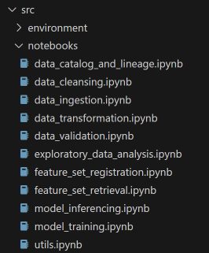
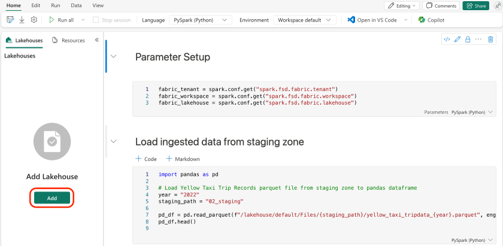
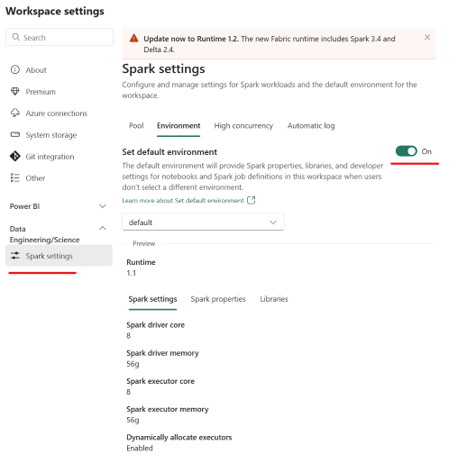
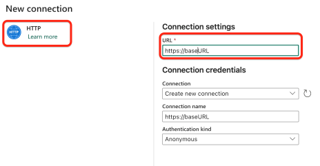
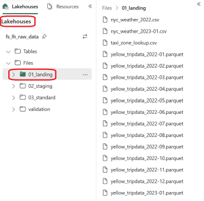
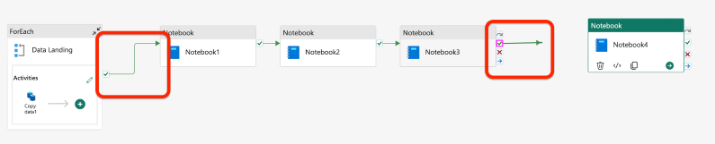
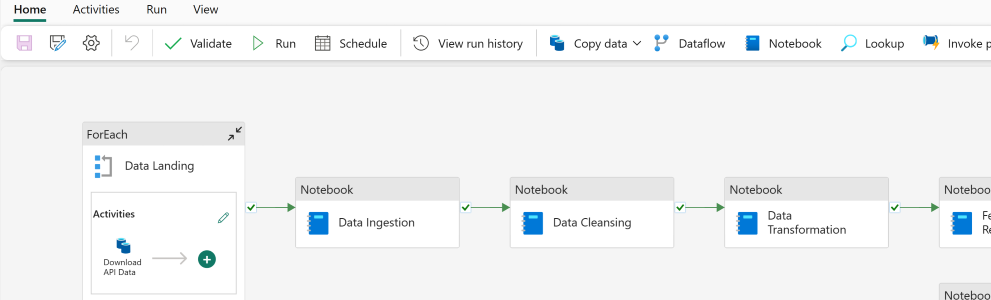
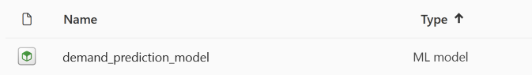

# Introduction <!-- omit in toc -->

[Feature engineering](https://learn.microsoft.com/azure/architecture/data-science-process/create-features#what-is-feature-engineering) is the process of selecting, transforming, or creating relevant features (variables) from raw data to improve the performance of a machine learning model. It involves extracting meaningful information, handling missing values, scaling, encoding categorical variables, and creating new features. Effective feature engineering enhances a model's ability to understand patterns, leading to better predictions and improved overall performance in data science and machine learning tasks.

With the recent launch of Azure ML managed feature store, machine learning professionals are now empowered to develop and productionize features independently.
You simply provide a feature set specification and let the system handle serving, securing, and monitoring of your features, freeing you from the overhead of setting up and managing the underlying feature engineering pipelines.

To learn more, read the [launch blog](https://techcommunity.microsoft.com/t5/ai-machine-learning-blog/announcing-managed-feature-store-in-azure-machine-learning/ba-p/3823043) and [Azure ML managed feature store documentation](https://learn.microsoft.com/azure/machine-learning/concept-what-is-managed-feature-store?view=azureml-api-2).

[Microsoft Fabric](https://learn.microsoft.com/fabric/get-started/microsoft-fabric-overview) is an all-in-one analytics solution for enterprises, and is an excellent choice for machine learning and data science tasks on Azure. The Data Science experience of Microsoft Fabric enables you to build, deploy, and operationalize machine learning models seamlessly within your Fabric experience. It integrates with Azure Machine Learning to provide built-in experiment tracking and model registry.

To learn more, read [Data Science documentation in Microsoft Fabric](https://learn.microsoft.com/en-us/fabric/data-science/).

The article focuses on constructing a feature engineering system using Azure ML managed feature store and Microsoft Fabric. It delves into the tracking and monitoring of data lineage for these features through Microsoft Purview. The content includes a step-by-step guide for environment setup and running the demo, aiming to expedite the feature engineering process within the Azure ecosystem.

## Contents <!-- omit in toc -->

- [Architecture](#architecture)
- [Environment setup](#environment-setup)
  - [Prerequisites](#prerequisites)
  - [Microsoft/Azure resources](#microsoftazure-resources)
  - [Microsoft Fabric setup](#microsoft-fabric-setup)
- [Source dataset](#source-dataset)
- [Data pipeline setup](#data-pipeline-setup)
  - [Data landing activity](#data-landing-activity)
  - [Notebook activities](#notebook-activities)
- [Build and Test](#build-and-test)
  - [Trigger the Data Pipeline](#trigger-the-data-pipeline)
  - [Check the Data Lineage in Purview](#check-the-data-lineage-in-purview)
- [Model Training and Inferencing](#model-training-and-inferencing)
  - [Model training](#model-training)
  - [Model inferencing](#model-inferencing)
- [References](#references)

## Architecture

Here is the high-level architecture diagram:


This architecture utilizes Microsoft Fabric as the data analytics platform. A [data pipeline](https://learn.microsoft.com/training/modules/use-data-factory-pipelines-fabric/) lands, ingests, and transform the incoming data. The transformed data is registered as [features](https://learn.microsoft.com/azure/machine-learning/concept-what-is-managed-feature-store?view=azureml-api-2#what-are-features) in Azure ML managed feature store. These features are used for model training and inferencing. Concurrently, the data lineage of both the data pipelines and the features is tracked and monitored using Microsoft Purview.

The sample follows a medallion architecture with `landing`, `staging` and `standard` zones created in the **File Section** of a [lakehouse](https://learn.microsoft.com/fabric/data-engineering/lakehouse-overview) in [Fabric OneLake](https://learn.microsoft.com/fabric/onelake/onelake-overview). For data landing, 'ForEach' activity is used to download multiple files from a public blob storage. The rest of the processing (ingestion, transformation, feature registration, model training, and model inferencing) is done using Fabric 'data notebooks'.

In addition to the main flow, there are optional steps for performing 'exploratory data analysis' and 'data validations' (illustrated by dotted lines in the diagram). These features are currently not covered as part of the step-by-step guide, but the notebooks are available in the repo for reference.

## Environment setup

### Prerequisites

- Access to a [Microsoft Fabric enabled tenant](https://learn.microsoft.com/fabric/admin/fabric-switch#enable-for-your-tenant). You can sign up for Fabric (Preview) trials for a period of 60 days by following [this link](https://learn.microsoft.com/fabric/get-started/fabric-trial).
- Access to an Azure subscription. You can sign up for a free trial by following [this link](https://azure.microsoft.com/free/).
- Permissions to [create a service principal](https://learn.microsoft.com/entra/identity-platform/howto-create-service-principal-portal#register-an-application-with-microsoft-entra-id-and-create-a-service-principal) in Microsoft Entra ID.

### Microsoft/Azure resources

As described above, the sample uses Microsoft Fabric as the data analytics platform, which provides SaaS based access to the required storage and compute resources. However, the following Microsoft/Azure resources, which are external to Microsoft Fabric, are still required:

- Microsoft Purview Account

  You can [create a new account](https://learn.microsoft.com/purview/create-microsoft-purview-portal) or use an existing one. Note down the purview account name.

- Azure ML Managed Feature Store

  You can create an [Azure ML managed feature store](https://learn.microsoft.com/azure/machine-learning/concept-what-is-managed-feature-store?view=azureml-api-2) by running the following Azure CLI:

  ```bash
  az ml feature-store create \
    --subscription <subscription-id> \
    --resource-group <resource-group-name> \
    --location <location> \
    --name <feature-store-name>
  ```

  To explore alternative methods for building a feature store, check out the [Microsoft documentation](https://learn.microsoft.com/azure/machine-learning/tutorial-get-started-with-feature-store?view=azureml-api-2&tabs=SDK-track#create-a-minimal-feature-store).

  Note down the subscription id, resource group, and feature store name.

- Service Principal

  This service principal is required to access and interact with the Azure ML managed feature store and with Microsoft Purview from Fabric notebooks. Create the service principal in Microsoft Entra ID by [registering an application](https://learn.microsoft.com/purview/create-service-principal-azure#app-registration) and [adding a secret to the client credentials](https://learn.microsoft.com/purview/create-service-principal-azure#adding-a-secret-to-the-client-credentials). Note down the client id, client secret, and tenant id.

- Grant access on Azure ML managed feature store and Purview to the service principal
  
  To grant managed feature store access to this service principal, go to the feature store in Azure Portal, and assign `AzureML Data Scientist` role to this SP.

  

  For granting access to Microsoft Purview access, assign [Data curators](https://learn.microsoft.com/en-us/purview/how-to-create-and-manage-collections#roles) role in the Purview root collection to this SP. For details, refer to [Microsoft documentation](https://learn.microsoft.com/purview/how-to-create-and-manage-collections#add-role-assignments).

### Microsoft Fabric setup

1. Create a Microsoft Fabric workspace

   After signing into Microsoft Fabric, it's necessary to create a new workspace for setting up a pipeline. Therefore, please navigate to the left-hand menu, select the workspace option, and proceed to create a new workspace.

   

   Enter workspace name and an optional description. Please note that you need to select 'trial' under the 'license mode' in the advanced options, as currently only this type supports all the features of Fabric. Then click the 'Apply' button to complete the creation of the workspace.

   

1. Create a Fabric lakehouse

   Within the workspace, create a new lakehouse by clicking the 'New' button on the top of the page.

1. Import the sample notebooks

   After the lakehouse is created, go back to the workspace. Click the 'New' button again and select 'Import notebook' from the menu. Navigate to `src/notebooks` folder under the repo, and select all the notebooks to import:

   

1. Add the created lakehouse to the imported notebooks

   After importing, open the following notebooks and add the lakehouse created in the previous step to them:

   - [data_cleansing](./src/notebooks/data_cleansing.ipynb)
   - [data_ingestion](./src/notebooks/data_ingestion.ipynb)
   - [data_transformation](./src/notebooks/data_transformation.ipynb)
   - [data_validation](./src/notebooks/data_validation.ipynb)
   - [exploratory_data_analysis](./src/notebooks/exploratory_data_analysis.ipynb)
   - [feature_set_registration](./src/notebooks/feature_set_registration.ipynb)

   

1. Create and setup a Fabric 'Environment'

   Go to Fabric workspace homepage and create a new __Environment__ by clicking '+ New' button and selecting `Environment (Preview)` under 'Data Engineering' or 'Data Science' experience.

   
   

   In this environment, you will setup the python environment under 'Public Libraries'. This can be done by adding `azureml-featurestore` package using PyPI, or by clicking 'Add from yml' and selecting `./src/environment/Publiclibrary.yml` from this repo.

   

   You will also need to edit the Spark properties. The yaml template with the required properties is available at `./src/environment/sparkProperties.yaml`. Replace the value with the resources that you created.

   ```yaml
   runtime_version: '1.1'
   spark_conf:
     - spark.fsd.client_id: <sp-client-id>
     - spark.fsd.tenant_id: <sp-tenant-id>
     - spark.fsd.subscription_id: <subscription-id>
     - spark.fsd.rg_name: <feature-store-resouce-group>
     - spark.fsd.name: <feature-store-name>
     - spark.fsd.fabric.tenant: <fabric-tenant-name> # Fetch from Fabric base URL, like https://<fabric-tenant-name>.powerbi.com/
     - spark.fsd.purview.account: <purview-account-name>
   ```

   After this is done, click 'Save' to save the environment, and then 'Publish' to publish it. This may take a few minutes to finish.

   Finally, To apply the environment, you can set the newly created environment as 'default' in the Fabric workspace settings page.

   

   Or you can apply to each specific notebook in the notebook edition page.

   

## Source dataset

The sample uses the public yellow taxi trip dataset from [New York City Taxi & Limousine Commission](https://www.nyc.gov/site/tlc/about/tlc-trip-record-data.page). However, we have hosted a subset of this dataset on our own public blob storage at the following location

Base URL: https://stmdwpublic.blob.core.windows.net/

This subset contains data for the year 2022, and each month is available as a separate parquet file. The data includes anonymized travel details like departure points, destinations, times, distances, and costs. The data, in conjunction with taxi zone maps and lookup tables, aids in various research fields such as identifying frequent pickup and drop-off zones in the city.

## Data pipeline setup

This is the main data pipeline which contains all the activities required for data landing, ingestion, cleansing, transformation, and feature registration. Start by creating a new data pipeline in the workspace.


### Data landing activity

As mentioned in the introduction, a 'ForEach' activity is used for data landing. This activity downloads multiple files from a public blob storage. Add the 'ForEach' activity to the data pipeline [^1].


The configuration of this 'ForEach' activity follows a series of steps as below.

- Add copy data activity

  Select the 'ForEach' activity that was just created and click '+' to add a 'Copy data' activity.

  

- Define source and destination for 'Copy data' activity

  Select the 'Copy data' activity and switch to the 'Source' tab. Choose 'external' as the 'Data store type'. For 'Connection', click '+' to create a new HTTP link. On the creation page, enter <https://stmdwpublic.blob.core.windows.net/> as the server URL. Click the 'Create' button to complete the setup.

 

- Define pipeline parameters

  Return to the pipeline design panel and click anywhere on the blank area. Then, select 'Parameters' and add the following three parameters:

  - __URLs__

    Type: Array

    Default Value:
    ``` json
    ["datasets/nyc-yellow-tripdata-2022/yellow_tripdata_2022-01.parquet",
    "datasets/nyc-yellow-tripdata-2022/yellow_tripdata_2022-02.parquet",
    "datasets/nyc-yellow-tripdata-2022/yellow_tripdata_2022-03.parquet",
    "datasets/nyc-yellow-tripdata-2022/yellow_tripdata_2022-04.parquet",
    "datasets/nyc-yellow-tripdata-2022/yellow_tripdata_2022-05.parquet",
    "datasets/nyc-yellow-tripdata-2022/yellow_tripdata_2022-06.parquet",
    "datasets/nyc-yellow-tripdata-2022/yellow_tripdata_2022-07.parquet",
    "datasets/nyc-yellow-tripdata-2022/yellow_tripdata_2022-08.parquet",
    "datasets/nyc-yellow-tripdata-2022/yellow_tripdata_2022-09.parquet",
    "datasets/nyc-yellow-tripdata-2022/yellow_tripdata_2022-10.parquet",
    "datasets/nyc-yellow-tripdata-2022/yellow_tripdata_2022-11.parquet",
    "datasets/nyc-yellow-tripdata-2022/yellow_tripdata_2022-12.parquet",
    "datasets/nyc-yellow-tripdata-2022/taxi_zone_lookup.csv"]
    ```
  - __landing_path__

    Type: String

    Default Value: `01_landing`

  - __client_secret__

    Type: SecureString

    Default Value: left blank

  

- Configure 'Settings' for 'ForEach' activity

  Return to the Settings tab of the 'ForEach' activity and set the Batch count value to 20. This limits the maximum number of files to be downloaded concurrently. For 'Items', select the parameter 'URLs', or directly enter `@pipeline().parameters.URLs`.

  

- Review 'Source' settings for 'Copy data' activity

  Return to the 'Source' tab of the 'Copy data' activity within the 'ForEach' activity. In the connection, select the HTTP link that was created before. The 'Connection type' should be 'HTTP'. For 'Relative URL', enter '@item()' and select 'Binary' as the 'File format'. This completes the configuration of the Source in the Copy data Activity.

  

- Review 'Destination' settings for 'Copy data' activity

  Switch to the 'Destination' tab and enter the configuration as shown in the image. Note that if you have not already created a lakehouse, you need to create a new one in the workspace first and select it here. If you have already created the lakehouse, select that. The 'File path', use the following values:

  ```text
  File Path: @pipeline().parameters.landing_path
  File name: @last(array(split(item(),'/')))
  ```

  

- Test the pipeline

  Run this pipeline with the single 'Data Landing' activity. If everything is properly configured, you shall should be able to see the downloaded data in the lakehouse as shown below.

  
  
  

### Notebook activities

Once the 'Data Landing' activity is configured, we can start to add more activities to perform the data ingestion, cleansing, transformation, and feature set registration tasks. Each of these tasks is performed by a 'notebook' activity which invokes the corresponding notebook:

- [data_ingestion](./src/notebooks/data_ingestion.ipynb)
- [data_cleansing](./src/notebooks/data_cleansing.ipynb)
- [data_transformation](./src/notebooks/data_transformation.ipynb)
- [feature_set_registration](./src/notebooks/feature_set_registration.ipynb)

When we finish configuring the whole pipeline, it should look like this.


Here are the steps involved in configuring these notebook activities.

- Add four 'Notebook' activities

  Select 'Activities' tab and add four 'Notebook' activities.

  

- Link the activities

  Link the activities within the pipeline. Make sure to drag the 'On success' check mark located on the right side of each activity to the next one. It would ensure that the subsequent activity will be executed only when the current one has completed successfully.

  

- Configure the 'Notebook' activities

  Rename each notebook activity by selecting it, clicking 'General' tab and updating the name of the 'Notebook' activity. Name them as 'Data Ingestion', 'Data Cleansing', 'Data Transformation', and 'Feature Registration' respectively.

  For each notebook activity, add the following 'Base parameters' in the Settings' tab:
  ```text
  Name: client_secret
  Type: String
  Value: `@pipeline().parameters.client_secret`
  ```

- Associate actual notebooks with the activities

  Within the 'Settings' tab, select our current workspace and then choose the right Notebook file.

  ```text
  Data Ingestion       -> data_ingestion
  Data Cleansing       -> data_cleansing
  Data Transformation  -> data_transformation
  Feature Registration -> feature_set_registration
  ```
  
  

## Build and Test

### Trigger the Data Pipeline

Access the Fabric workspace and locate the item categorized as a `Data pipeline`.


In order to trigger the data pipeline, choose this data pipeline, and click `Run`.



In the pane, you can check the input and output, which gives the more detailed execution result.


### Check the Data Lineage in Purview

TBA

## Model Training and Inferencing

### Model training

Go to model_training notebook, and click `Run all`.
> Notice: the model_training will need to retrieve data from the feature store, which requires credential to access the feature store. Make sure the `client_secret` parameter is set in the notebook `feature_set_retrieval`

The model will be trained and registered as an ML model.

Go to the Fabric workspace and locate the item categorized as a `ML model`.



For each ML model, you can track different versions with different parameters or metrics.


### Model inferencing

Go to model_inferencing notebook, and click `Run all`.

Once the execution is complete, the prediction results will be presented for your review.


## References

- [Micrsoft Fabric](https://learn.microsoft.com/fabric/get-started/microsoft-fabric-overview)
- [Azure Machine Learning Managed Feature Store](https://learn.microsoft.com/azure/machine-learning/concept-what-is-managed-feature-store?view=azureml-api-2)
- [Azure Purview](https://azure.microsoft.com/products/purview/)

[^1]: For Data Landing, we can also use another approach, which is to use ADLS (Azure Data Lake Storage) or Blob storage. First, download these files to your local, then upload these documents to ADLS. Then use Copy Data Activity through a link service to the storage, so we can also complete the same task.
