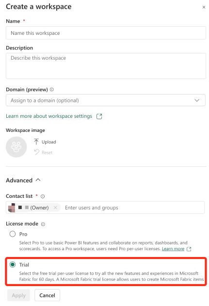
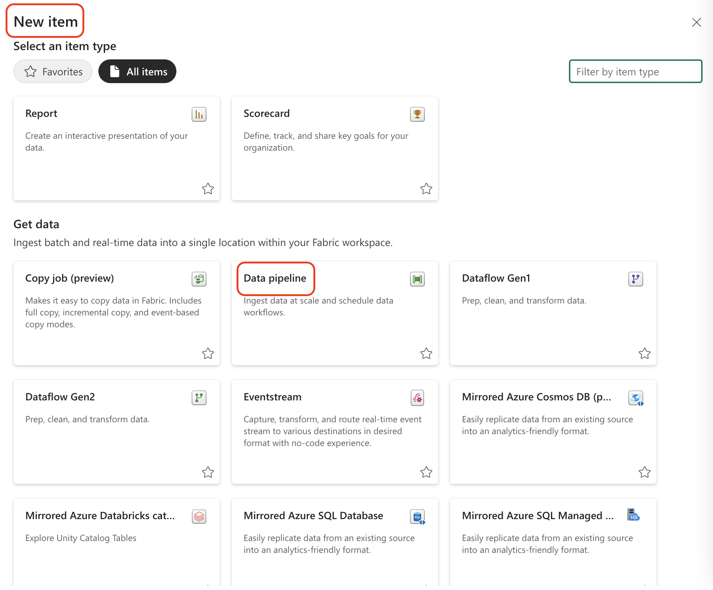
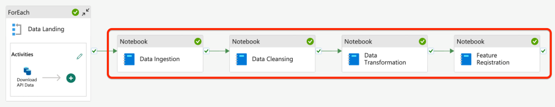
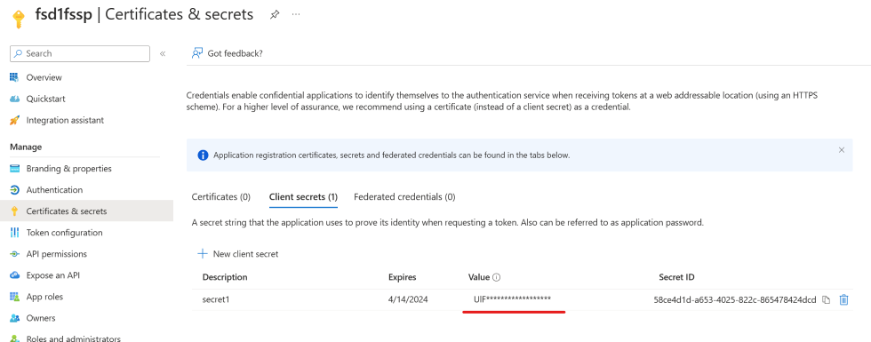
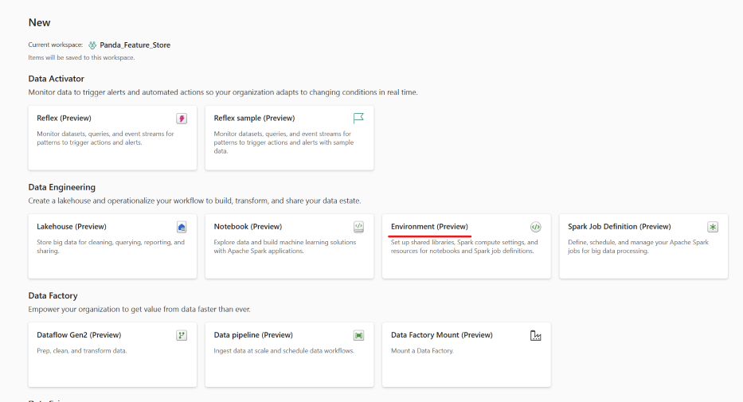

# Introduction

[Feature engineering](https://learn.microsoft.com/azure/architecture/data-science-process/create-features#what-is-feature-engineering) is the process of selecting, transforming, or creating relevant features (variables) from raw data to improve the performance of a machine learning model. It involves extracting meaningful information, handling missing values, scaling, encoding categorical variables, and creating new features. Effective feature engineering enhances a model's ability to understand patterns, leading to better predictions and improved overall performance in data science and machine learning tasks.

With the recent launch of Azure ML managed feature store, machine learning professionals are now empowered to develop and productionize features independently.
You simply provide a feature set specification and let the system handle serving, securing, and monitoring of your features, freeing you from the overhead of setting up and managing the underlying feature engineering pipelines.

To learn more, read the [launch blog](https://techcommunity.microsoft.com/t5/ai-machine-learning-blog/announcing-managed-feature-store-in-azure-machine-learning/ba-p/3823043) and [Azure ML managed feature store documentation](https://learn.microsoft.com/azure/machine-learning/concept-what-is-managed-feature-store?view=azureml-api-2).

[Microsoft Fabric](https://learn.microsoft.com/fabric/get-started/microsoft-fabric-overview) is an all-in-one analytics solution for enterprises, and is an excellent choice for machine learning and data science tasks on Azure. The Data Science experience of Microsoft Fabric enables you to build, deploy, and operationalize machine learning models seamlessly within your Fabric experience. It integrates with Azure Machine Learning to provide built-in experiment tracking and model registry.

To learn more, read [Data Science documentation in Microsoft Fabric](https://learn.microsoft.com/en-us/fabric/data-science/).

The article focuses on constructing a feature engineering system using Azure ML managed feature store and Microsoft Fabric. It delves into the tracking and monitoring of data lineage for these features through Microsoft Purview. The content includes a step-by-step guide for environment setup and running the demo, aiming to expedite the feature engineering process within the Azure ecosystem.

## Architecture

Here is the high-level architecture diagram:


This architecture utilizes Microsoft Fabric as the data analytics platform. A [data pipeline](https://learn.microsoft.com/training/modules/use-data-factory-pipelines-fabric/) lands, ingests, and transform the incoming data. The transformed data is registered as [features](https://learn.microsoft.com/azure/machine-learning/concept-what-is-managed-feature-store?view=azureml-api-2#what-are-features) in Azure ML managed feature store. These features are used for model training and inferencing. Concurrently, the data lineage of both the data pipelines and the features is tracked and monitored using Microsoft Purview.

The sample follows a medallion architecture with `landing`, `staging` and `standard` zones created in the **File Section** of a [lakehouse](https://learn.microsoft.com/fabric/data-engineering/lakehouse-overview) in [Fabric OneLake](https://learn.microsoft.com/fabric/onelake/onelake-overview). For data landing, 'ForEach' activity is used to download multiple files from a public blob storage. The rest of the processing (ingestion, transformation, feature registration, model training, and model inferencing) is done using Fabric 'data notebooks'.

In addition to the main flow, there are optional steps for performing 'exploratory data analysis' and 'data validations' (illustrated by dotted lines in the diagram). These features are currently not covered as part of the step-by-step guide, but the notebooks are available in the repo for reference.

## Environment Setup

### Prerequisites

- Access to a [Microsoft Fabric enabled tenant](https://learn.microsoft.com/fabric/admin/fabric-switch#enable-for-your-tenant). You can sign up for Fabric (Preview) trials for a period of 60 days by following [this link](https://learn.microsoft.com/fabric/get-started/fabric-trial).
- Access to an Azure subscription. You can sign up for a free trial by following [this link](https://azure.microsoft.com/free/).
- Permissions to [create a service principal](https://learn.microsoft.com/entra/identity-platform/howto-create-service-principal-portal#register-an-application-with-microsoft-entra-id-and-create-a-service-principal) in Microsoft Entra ID.


### [Optional] Setup Environment with a Local Notebook
For a guided setup, you can use the [SETUP_ENVIRONMENT.ipynb](./SETUP_ENVIRONMENT.ipynb) notebook. This tool simplifies the process of setting up essential Azure resources, including:

- Resource Group
- Azure ML Managed Feature Store
- Azure Purview account

It also assists with creating a service principal and assigning the necessary roles. While the notebook covers most of the setup, some steps will still need to be completed manually. Detailed instructions are provided within the notebook for your convenience.


### Microsoft/Azure Resources

As described above, the sample uses Microsoft Fabric as the data analytics platform, which provides SaaS based access to the required storage and compute resources. However, the following Microsoft/Azure resources, which are external to Microsoft Fabric, are still required:

- Microsoft Purview Account

  You can [create a new account](https://learn.microsoft.com/purview/create-microsoft-purview-portal) or use an existing one. Note down the purview account name.

- Azure ML Managed Feature Store

  You can create an [Azure ML managed feature store](https://learn.microsoft.com/azure/machine-learning/concept-what-is-managed-feature-store?view=azureml-api-2) by running the following Azure CLI:

  ```bash
  az ml feature-store create \
    --subscription <subscription-id> \
    --resource-group <resource-group-name> \
    --location <location> \
    --name <feature-store-name>
  ```

  To explore alternative methods for building a feature store, check out the [Microsoft documentation](https://learn.microsoft.com/azure/machine-learning/tutorial-get-started-with-feature-store?view=azureml-api-2&tabs=SDK-track#create-a-minimal-feature-store).

  Note down the subscription id, resource group, and feature store name.

### Microsoft Fabric Setup Steps

1. Create a Microsoft Fabric workspace

   After signing into Microsoft Fabric, it's necessary to create a new workspace for setting up a pipeline. Therefore, please navigate to the left-hand menu, select the workspace option, and proceed to create a new workspace.

   

   Enter workspace name and an optional description. Please note that you need to select 'trial' under the 'license mode' in the advanced options, as currently only this type supports all the features of Fabric. Then click the 'Apply' button to complete the creation of the workspace.

   

1. Create a Fabric lakehouse

   Within the workspace, create a new lakehouse by clicking the 'New' button on the top of the page.

1. Import the sample notebooks

   After the lakehouse is created, go back to the workspace. Click the 'New' button again and select 'Import notebook' from the menu. Navigate to `src/notebooks` folder under the repo, and select all the notebooks to import:

   

1. Add the created lakehouse to the imported notebooks

   After importing, open the following notebooks and add the lakehouse created in the previous step to them:

   - [data_cleansing](./src/notebooks/data_cleansing.ipynb)
   - [data_ingestion](./src/notebooks/data_ingestion.ipynb)
   - [data_transformation](./src/notebooks/data_transformation.ipynb)
   - [data_validation](./src/notebooks/data_validation.ipynb)
   - [exploratory_data_analysis](./src/notebooks/exploratory_data_analysis.ipynb)
   - [feature_set_registration](./src/notebooks/feature_set_registration.ipynb)

   

## Source Dataset

The sample uses the public yellow taxi trip dataset from [New York City Taxi & Limousine Commission](https://www.nyc.gov/site/tlc/about/tlc-trip-record-data.page). However, we have hosted a subset of this dataset on our own public blob storage at the following location

Base URL: https://stmdwpublic.blob.core.windows.net/

This subset contains data for the year 2022, and each month is available as a separate parquet file. The data includes anonymized travel details like departure points, destinations, times, distances, and costs. The data, in conjunction with taxi zone maps and lookup tables, aids in various research fields such as identifying frequent pickup and drop-off zones in the city.

## Data Pipeline Setup

For the Data Pipeline in Microsoft Fabric, first we need to create a Data Pipeline in the workspace, and then add a new activity in the new data pipeline.



### Data Landing Activity

Plaese select ForEach Activity, because we need to download multiple files, so we need a ForEach loop to help us complete this task. [^1]


- Step 1, Select the ForEach Activity we just created and click the Add Activities button. Select Copy Data Activity from the menu.
  
  

- Step 2, Set up the Copy Data Activity by configuring the Source and Destination tab. First, switch to the Source tab, then select 'external' for the Data Storage Type. Subsequently, for the connection, create a new HTTP link. On the creation page, enter the server URL as below. Finally, click the 'Create' button to complete the setup.
  
- Base url is: <https://stmdwpublic.blob.core.windows.net/>

  

- Step 3, Create parameters for our pipeline. We need to return to the pipeline design panel and click anywhere on the blank area. Then, select 'Parameter' at the place shown in the image, and add the following three parameters:
  
  
  
  - __urls__, Type: Array, Default Value:

    ``` json
    ["datasets/nyc-yellow-tripdata-2022/yellow_tripdata_2022-01.parquet",
    "datasets/nyc-yellow-tripdata-2022/yellow_tripdata_2022-02.parquet",
    "datasets/nyc-yellow-tripdata-2022/yellow_tripdata_2022-03.parquet",
    "datasets/nyc-yellow-tripdata-2022/yellow_tripdata_2022-04.parquet",
    "datasets/nyc-yellow-tripdata-2022/yellow_tripdata_2022-05.parquet",
    "datasets/nyc-yellow-tripdata-2022/yellow_tripdata_2022-06.parquet",
    "datasets/nyc-yellow-tripdata-2022/yellow_tripdata_2022-07.parquet",
    "datasets/nyc-yellow-tripdata-2022/yellow_tripdata_2022-08.parquet",
    "datasets/nyc-yellow-tripdata-2022/yellow_tripdata_2022-09.parquet",
    "datasets/nyc-yellow-tripdata-2022/yellow_tripdata_2022-10.parquet",
    "datasets/nyc-yellow-tripdata-2022/yellow_tripdata_2022-11.parquet",
    "datasets/nyc-yellow-tripdata-2022/yellow_tripdata_2022-12.parquet",
    "datasets/nyc-yellow-tripdata-2022/taxi_zone_lookup.csv"]
    ```

  - __landing_path__, Type: String; Default Value: `01_landing`.
  - __client_secret__, Type: SecureString, Default Value: left blank.

- Step 4, Return to the Settings tab of the ForEach Activity, set the Batch count value to 20, this limits the maximum number of files to be downloaded concurrently. Then, in the Items setting, select the parameter 'URLs' that we just created, or directly enter '@pipeline().parameters.URLs'. Now we completed the configuration of the ForEach Activity.
  
  

- Step 5, Return to the Source tab of the Copy data Activity within the ForEach Activity. In the connection, select the HTTP link that we just created. The Connection type should be HTTP. Then, enter '@item()' in the Relative URL, and select Binary as the File format. This completes the configuration of the Source in the Copy data Activity.
  
  

- Step 6, Switch to the Destination tab and make the following configurations as shown in the image. Please note, if you have not created a Lakehouse, you need to create a new Lakehouse named as '[prefix]_lh' in the workspace first, then select this Lakehouse here. If you have already created a Lakehouse, then you can directly select the Lakehouse you have created here. The file path here is the second parameter 'landing_path' that we just created, so our Copy data Activity will download the data to the corresponding folder in our Lakehouse.
  - File Path: __@pipeline().parameters.landing_path__
  - File name: __@last(array(split(item(),'/')))__
  
  

- Step 7, Run this pipeline with the single 'Data Landing' activity. If everything is good, then we should be able to see the downloaded data in our Lakehouse.
  
  
  
  

### The Rest of the Data Pipeline

After the Data Landing, we need to configure the subsequent steps of this pipeline. The following steps of this pipeline include __data ingestion__ -> __data cleansing__ -> __data transformation__ -> __feature registration__. Therefore, we need to create another 4 notebook activities to execute these data operations. When we finish configuring the whole pipeline, it should look like this.



- Step 1, click the Add Activities button 4 times to add 4 Notebook Activities.
  
  

- Step 2, Link the Activities within the pipeline. Please make sure to drag the check mark located on the right side of each Activity to the next one. This represents that the subsequent Activity will be executed once the current one has successfully completed.
  
  

- Step 3, Configure Notebook Activities, rename each activity select the Notebook Activity, and then click the __General__ tab and input the name of the Notebook Activity. Here's the list of the notebook activities:
  - __Data Ingestion__
  - __Data Cleansing__
  - __Data Transformation__
  - __Feature Registration__
  
  Then switch to the __Settings__ tab, select the Notebook Activity that we just created, and then click the __Base Parameters__. We need to add the following parameters to each Notebook Activity.
  - __client_secret__: Type: String; Default Value: `@pipeline().parameters.client_secret`

- Step 4, Within the 'Settings' tab, select our current workspace and then choose the right Notebook file.
  - __Data Ingestion__ -> __data_ingestion__
  - __Data Cleansing__ -> __data_cleansing__
  - __Data Transformation__ -> __data_transformation__
  - __Feature Registration__ -> __feature_set_registration__
  
  

## Feature Store Setup

Follow the official documentation to create a feature store:
[Create a Minimal Feature Store](https://learn.microsoft.com/en-us/azure/machine-learning/tutorial-get-started-with-feature-store?view=azureml-api-2&tabs=SDK-track#create-a-minimal-feature-store).

Create a Service Principle and make a memo of the client secret, client id and tenant id.


Go to the page of feature store in Azure portal, and assign the Service Principle with following role:

- `AzureML Data Scientist`

  

## Fabric Environment Setup

Go to Fabric workspace homepage, create a new __Environment__ by clicking __+ New__ button in workspace homepage and select __Environment__ under __Data Engineering__.



In the Environment, you will need to setup the python env under Public Libraries. You can do this by adding `azureml-featurestore` by PyPI, or by clicking __Add from yml__ and select `./src/environment/Publiclibrary.yml` under this repo.


You will also need to edit the Spark properties. Find the properties list yaml template in this repo `./src/environment/sparkProperties.yaml`. Replace the value with your created resources of Azure Machine Learning Managed Feature Store and Service Principle.

```yaml
runtime_version: '1.1'
spark_conf:
  - spark.fsd.client_id: <sp-client-id>
  - spark.fsd.tenant_id: <sp-tenant-id>
  - spark.fsd.subscription_id: <subscription-id>
  - spark.fsd.rg_name: <feature-store-resouce-group>
  - spark.fsd.name: <feature-store-name>
  - spark.fsd.fabric.tenant: <fabric-tenant-name> # Fetch from Fabric base URL, like https://<fabric-tenant-name>.powerbi.com/
  - spark.fsd.purview.account: <purview-account-name>

```

After this is done, click __Save__ to save the environment, and then __Publish__. This may take a few minutes to finish.

To apply the environment, you can set the newly created environment as 'default' in the Fabric workspace settings page.


Or you can apply to each specific notebook in the notebook edition page.


## Model Training and Inferencing Setup

Go to Fabric workspace, double check if the following notebooks are imported:

- model_training.ipynb
- model_inferencing.ipynb
- feature_set_retrieval.ipynb

## Data Lineage Setup

### Step 1

In our custom data lineage registration solution, we register data assets and their lineage to [Microsoft Purview](https://learn.microsoft.com/en-us/purview/purview), therefore a Microsoft Purview account is required for sure, please refer to the below online document to create a new account if you don't have one yet.

[Quickstart: Create an account in the Microsoft Purview governance portal](https://learn.microsoft.com/en-us/purview/create-microsoft-purview-portal)

### Step 2

Once the Purview account is ready, please assign the same Service Principle created during the [Feature Store Setup](#feature-store-setup) with the [Data curators](https://learn.microsoft.com/en-us/purview/how-to-create-and-manage-collections#roles) role in the Purview root collection, for details steps please refer to [this online help document](https://learn.microsoft.com/en-us/purview/how-to-create-and-manage-collections#add-role-assignments).

Then the data assets and lineage registration setup is done, either of the below notebooks run would trigger relevant data assets and lineage registration to your Purview account.

- data_ingestion
- data_cleansing
- data_transformation
- feature_set_registration
- model_training

## Build and Test

### Trigger the Data Pipeline

Access the Fabric workspace and locate the item categorized as a `Data pipeline`.


In order to trigger the data pipeline, choose this data pipeline, and click `Run`.


In the pane, you can check the input and output, which gives the more detailed execution result.


### Train the Model and Inferencing

#### Model training

Go to model_training notebook, and click `Run all`.
> Notice: the model_training will need to retrieve data from the feature store, which requires credential to access the feature store. Make sure the `client_secret` parameter is set in the notebook `feature_set_retrieval`

The model will be trained and registered as an ML model.

Go to the Fabric workspace and locate the item categorized as a `ML model`.


For each ML model, you can track different versions with different parameters or metrics.


#### Model inferencing

Go to model_inferencing notebook, and click `Run all`.

Once the execution is complete, the prediction results will be presented for your review.


## References

- [Micrsoft Fabric](https://learn.microsoft.com/en-us/fabric/get-started/microsoft-fabric-overview)
- [Azure Machine Learning Managed Feature Store](https://learn.microsoft.com/en-us/azure/machine-learning/concept-what-is-managed-feature-store?view=azureml-api-2)
- [Azure Purview](https://azure.microsoft.com/en-us/services/purview/)

[^1]: For Data Landing, we can also use another approach, which is to use ADLS (Azure Data Lake Storage) or Blob storage. First, download these files to your local, then upload these documents to ADLS. Then use Copy Data Activity through a link service to the storage, so we can also complete the same task.
