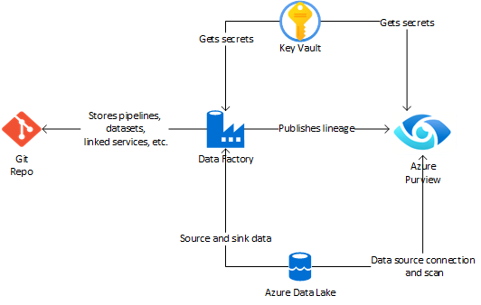

# Azure Purview in MDW <!-- omit in toc -->

This sample demonstrates how to provision Azure Purview and connect it to other parts of the modern data warehouse, like Azure Data Lake, Azure Data Factory and Azure Key Vault.

Azure Purview is a managed data governance cloud service for centrally managing data across data estate spanning cloud and on-premises environments. This service enables business analysts to search for relevant data using business terms that are meaningful to them. Additionally, technical users can view meta-data and lineage of data assets in a central catalog using a UI or Apache Atlas API. Data assets can be annotated by experts and owners sharing tribal knowledge through the UI, or at scale through automated classification based on meta-data and content inspection.

## Contents <!-- omit in toc -->

- [Solution Overview](#solution-overview)
  - [Architecture](#architecture)
  - [Technologies used](#technologies-used)
- [Key Learnings](#key-learnings)
  - [1. Leverage Apache Atlas 2.0 API for programmatic data management](#1-leverage-apache-atlas-20-api-for-programmatic-data-management)
  - [2. Publish data lineage by connecting Azure Data Factory to Purview](#2-publish-data-lineage-by-connecting-azure-data-factory-to-purview)
  - [3. Use search to create custom reporting](#3-use-search-to-create-custom-reporting)
- [Key Concepts](#key-concepts)
  - [Environments](#environments)
  - [Resources](#resources)
- [How to use the sample](#how-to-use-the-sample)
  - [Prerequisites](#prerequisites)
    - [Software pre-requisites](#software-pre-requisites)
  - [Setup and Deployment](#setup-and-deployment)
    - [Deployed Resources](#deployed-resources)
  - [Optional scripts](#optional-scripts)
    - [search_advanced.sh](#search_advancedsh)
    - [delete_purview_data.sh](#delete_purview_datash)

## Solution Overview

This solution sets up an [Azure Data Lake Gen2](https://docs.microsoft.com/en-us/azure/storage/blobs/data-lake-storage-introduction) storage account, with a folder structure that enables data tiering (bronze, silver, gold), an [Azure Data Factory](https://azure.microsoft.com/en-au/services/data-factory/)(ADF) instance with linked services connecting to the data lake, a [key vault](https://azure.microsoft.com/en-us/services/key-vault/) for any secrets, and an [Azure Purview](https://azure.microsoft.com/en-us/services/purview/) account for data governance.

The Azure Data Factory contains a simple ADF Pipeline that is stored in a git repository, that is taking data from the Dropzone and ingesting it into the bronze folder.

The main purpose of this sample is to showcase how to provision Purview and expose data from Data Lake, data lineage from Data Factory, and how to leverage Key Vault for secure key storage.

### Architecture

The following shows the simple architecture of the Azure Purview connected to few basic services.

### Technologies used

- [Azure Purview](https://azure.microsoft.com/en-au/services/devops/)
- [Azure Data Factory](https://azure.microsoft.com/en-au/services/data-factory/)
- [Azure Data Lake Gen2](https://docs.microsoft.com/en-us/azure/storage/blobs/data-lake-storage-introduction)
- [Azure Key Vault](https://azure.microsoft.com/en-us/services/key-vault/)

## Key Learnings

The following summarizes key learnings and best practices demonstrated by this sample solution

### 1. Leverage Apache Atlas 2.0 API for programmatic data management

Azure Purview exposes an extended version of Apache Atlas 2.0 API that can be used to populate and query data programmatically. Purview provides a Catalog and Scan REST API URIs that be used with [Bearer Token authentication](./scripts/get_purview_access_token.sh).

While Purview UI enables users to add data sources and scans, other, more detailed data management is limited. For example the following can only be done through the API:

- Deletion of any scanned data. Sample of this can be found in the [delete_purview_data.sh](./scripts/delete_purview_data.sh).
- Adding custom lineage tracking, including custom types and unsupported data sources.
- Any modifications to scanned data beyond name, description, classification, glossary and contacts.

### 2. Publish data lineage by connecting Azure Data Factory to Purview

A connection between Azure Data Factory and Purview can be established from the UI or manually by:

- Adding a Data Factory MSI to Purview Access Control with role "Purview Data Curator"
- Adding the a tag with "catalogUri" name to the Data Factory and entering as value the catalog URI of your Purview instance

A few things to note about the ADF-Purview connection:

- Purview does not have any access to Data Factory, and all operations are "push" from ADF to Purview.
- Only one Purview connection can be maintained per ADF.
- Any pipeline that is executed from ADF will be tracked and pushed to Purview, including running pipelines in debug mode.
- While ADF will push most of the information about the source and sink to Purview, it still might make sense to scan the source and sink (e.g. Azure Data Lake), since it in some cases might be able to pickup more details (e.g. better classification)
- Automatic lineage tracking is supported by ADF Copy, ADF Mapping Data Flows, and execute SSIS jobs.

### 3. Use search to create custom reporting

While Purview does not support creating custom reports via the UI, it does expose the Atlas API which enables users to query the data within Purview. This enables users to create their own reports by using EntityREST and DiscoveryREST API.

[search_advanced.sh](./scripts/search_advanced.sh) showcases a sample REST API call to demonstrate searching and retrieving details entity information from Azure Purview Atlas API.

## Key Concepts

### Environments

- **Dev** - the DEV resource group is used by developers to build and test their solutions.
- **Stage** - the STG resource group is used to test deployments prior to going to production in a production-like environment. Any integration tests are run in this environment
- **Production** - the PROD resource group is the final Production environment

Each environment has an identical set of resources

### Resources

To view the API Swagger documentation, download [PurviewCatalogAPISwagger.zip](https://github.com/Azure/Purview-Samples/raw/master/rest-api/PurviewCatalogAPISwagger.zip), extract its files, and open index.html.

## How to use the sample

### Prerequisites

1. [Github account](https://github.com/)
2. [Azure Account](https://azure.microsoft.com/en-au/free/search/?&ef_id=Cj0KCQiAr8bwBRD4ARIsAHa4YyLdFKh7JC0jhbxhwPeNa8tmnhXciOHcYsgPfNB7DEFFGpNLTjdTPbwaAh8bEALw_wcB:G:s&OCID=AID2000051_SEM_O2ShDlJP&MarinID=O2ShDlJP_332092752199_azure%20account_e_c__63148277493_aud-390212648371:kwd-295861291340&lnkd=Google_Azure_Brand&dclid=CKjVuKOP7uYCFVapaAoddSkKcA)
   - *Permissions needed*: ability to create and deploy to an azure [resource group](https://docs.microsoft.com/en-us/azure/azure-resource-manager/management/overview), a [service principal](https://docs.microsoft.com/en-us/azure/active-directory/develop/app-objects-and-service-principals), and grant the [collaborator role](https://docs.microsoft.com/en-us/azure/role-based-access-control/overview) to the service principal over the resource group.

#### Software pre-requisites

- For Windows users, [Windows Subsystem For Linux](https://docs.microsoft.com/en-us/windows/wsl/install-win10)
- [az cli 2.6+](https://docs.microsoft.com/en-us/cli/azure/install-azure-cli?view=azure-cli-latest)
- [jq](https://stedolan.github.io/jq/)

### Setup and Deployment

> **IMPORTANT NOTE:** As with all Azure Deployments, this will **incur associated costs**. Remember to teardown all related resources after use to avoid unnecessary costs. See [here](#deployed-resources) for list of deployed resources.
>
> **NOTE ABOUT AZURE PURVIEW PUBLIC PREVIEW** Azure Purview is currently in public preview, and due to this your subsciption might be limited to only one Purview account per region, per subscription. Notice also that deleting Purview might take some time, due to the deletion of underlying resources. It might not always be visible from the Azure Portal, for example Purview might disappear from the resource list and Portal report resource as deleted, when in fact the process is continuing. In some rare cases, Portal might throw an error during the deletion, while the resources are still being deleted. Issue is usually solved by just deleting the resource again.

This deployment was tested using WSL 2 (Ubuntu 20.04)

1. **Initial Setup**
   1. Ensure that:
      - You are logged in to the Azure CLI. To login, run `az login`.
      - Azure CLI is targeting the Azure Subscription you want to deploy the resources to.
         - To set target Azure Subscription, run `az account set -s <AZURE_SUBSCRIPTION_ID>`
   2. **Import** this repository into a new Github or Azure DevOps Git repo. See [here](https://help.github.com/en/github/importing-your-projects-to-github/importing-a-repository-with-github-importer) on how to import a github repo. Importing is necessary for setting up git integration with Azure Data Factory.
   3. Set the following **required** environment variables:
       - **GITHUB_REPO** - Name of your imported github repo in this form `<my_github_handle>/<repo>`
       - **GITHUB_PAT_TOKEN** - a Github PAT token. Generate them [here](https://github.com/settings/tokens). This requires "repo" scope.

       Optionally, set the following environment variables:
       - **RESOURCE_GROUP_LOCATION** - Azure location to deploy resources. *Default*: `westus`.
       - **AZURE_SUBSCRIPTION_ID** - Azure subscription id to use to deploy resources. *Default*: default azure subscription. To see your default, run `az account list`.
       - **RESOURCE_GROUP_NAME_PREFIX** - name of the resource group. This will automatically be appended with the environment name. For example: `RESOURCE_GROUP_NAME_PREFIX-dev-rg`. *Default*: mdwdo-ado-${DEPLOYMENT_ID}.
       - **DEPLOYMENT_ID** - string appended to all resource names. This is to ensure uniqueness of azure resource names. *Default*: random five character string.

      To further customize the solution, set parameters in `arm.parameters` files located in the `infrastructure` folder.

2. **Deploy Azure resources**
   1. Clone locally the imported Github Repo, then `cd` into the `single_tech_samples/purview` folder of the repo
   2. Run `./deploy.sh`.
      - After a successful deployment, you will find `.env.{environment_name}` files containing essential configuration information per environment. See [here](#deployed-resources) for list of deployed resources.

   > **Note:** Depending on your authentication setup with Git repository, the deployment job might ask for a password when committing the updated Azure Data Factory files back to your repository. Please enter the token as password to continue.

3. **Setup ADF git integration in DEV Data Factory**
    1. In the Azure Portal, navigate to the Data Factory in the **DEV** environment.
    2. Click "Author & Monitor" to launch the Data Factory portal.
    3. On the landing page, select "Set up code repository". For more information, see [here](https://docs.microsoft.com/en-us/azure/data-factory/source-control).
    4. Fill in the repository settings with the following:
        - Repository type: **Github**
        - Github Account: **your_Github_account**
        - Git repository name: **imported Github repository**
        - Collaboration branch: **main**
        - Root folder: **/single_tech_samples/purview/adf**
        - Import Existing Data Factory resource to repository: **Selected**
        - Branch to import resource into: **Use Collaboration**
    5. When prompted to select a working branch, select **main**

   > **IMPORTANT NOTE:** Only the **DEV** Data Factory should be setup with Git integration. Do **NOT** setup git integration in the STG and PROD Data Factories.

4. **Run a pipeline in debug mode**

   1. In the **DEV** Data Factory portal, click `Debug` to run the pipeline in debug mode.
   2. After completion, this should automatically push the lineage to Azure Purview. You can now navigate to your Azure Purview instance and check if the pipeline run is visible.

Congratulations!! 🥳 You have successfully deployed the solution and published first dataset to Azure Purview.

#### Deployed Resources

After a successful deployment, you should have the following resources:

- In Azure, **three Resource Groups** (one per environment) each with the following Azure resources.
  - **Data Factory** - with pipelines, datasets and linked services, a connection to Purview (tag), with Data Factory Managed Service Identity having Data Contributor rights in Purview
  - **Data Lake Store Gen2**
  - **KeyVault** with all relevant secrets stored.
  - **Purview** and a **Service Principal (SP)** with the following connected services in Purview:
    - One Data Factory connection
    - One Data Source (Azure Data Lake) with one Scan
    - One Key Vault connection

### Optional scripts

To use the two optional scripts edit the scripts with the values found in the created .env file (e.g. .env.dev).

#### search_advanced.sh

This file demonstrates keyword based search and then fetching detailed data based on the retrieved GUID

#### delete_purview_data.sh

This script can be used to purge all the stale data from Purview.

Similar to the search script, this script will also execute a keyword search, retrieve all the entity GUIDs matching the keyword and then execute a DELETE call to the GUID URI in order to delete the entity. Since the search returns only a subset of results, the script will loop through the results until all matching GUIDs have been deleted.
