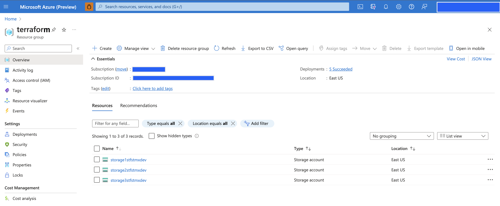
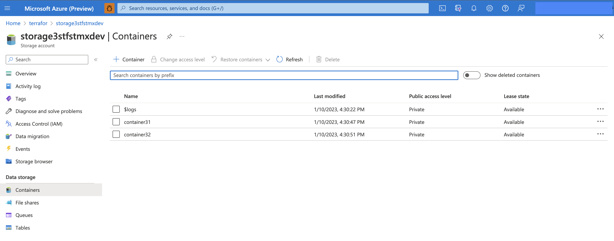
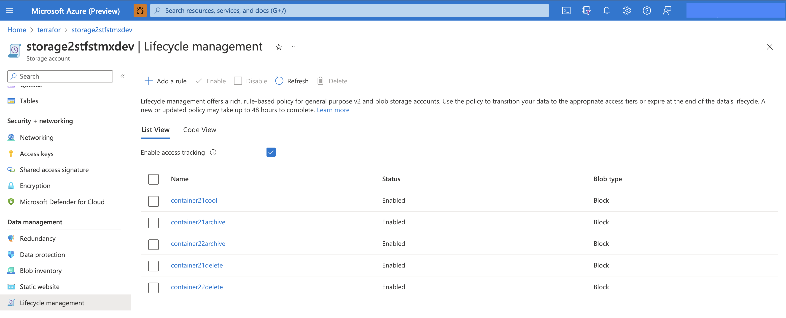

# Terraform Script to create Storage Account , Containers and Data Lifecycle Rules at scale in Azure <!-- omit in toc -->

## Contents <!-- omit in toc -->

- [1. Solution Overview](#1-solution-overview)
  - [1.1. Scope](#11-scope)
  - [1.2. Use Case](#12-use-case)
  - [1.3. Architecture](#13-architecture)
  - [1.4. Technologies used](#14-technologies-used)
- [2. How to use this sample](#2-how-to-use-this-sample)
  - [2.1. Prerequisites](#21-prerequisites)
    - [2.1.1 Software Prerequisites](#211-software-prerequisites)
  - [2.2. Setup and deployment](#22-setup-and-deployment)
  - [2.3. Deployed Resources](#23-deployed-resources)
  - [2.4. Deployment validation and Execution](#24-deployment-validation-and-execution)
  - [2.5. Clean-up](#25-clean-up)
- [3. Troubleshooting](#3-troubleshooting)

## 1. Solution Overview

With wide scale adaptation of Infrastructure As Code (IAC), many a times we would need to create storage accounts and corresponding entities dynamically using Infra As Code (IAC) Scripts.

This solution demonstrates how we can create data storage accounts, containers and data lifecycle rules in Azure using Terraform scripting.

The solution is flexible,extensible and scalable to accommodate any number of storage accounts, containers and data life cycle rules.

### 1.1. Scope

The following list captures the scope of this sample:

The following items will be provisioned as a part of this sample setup:
   1. Azure Storage Accounts (ADLS Gen2).
   2. Storage Containers.
   3. Data lifecycle rules.

Details about [how to use this sample](#2-how-to-use-this-sample) can be found in the later sections of this document.

### 1.2. Use Case

It is desirable to reduce the costs by optimizing the resource usage costs in cloud environments.

Data lifecycle is one such feature on Azure using which you can optimize costs by moving your data to lower cost tiers when their access is less frequent. It also supports deleting obselete data to save costs.

More details can be found in [this link](https://learn.microsoft.com/en-us/azure/storage/blobs/lifecycle-management-overview)

We can define data lifecycle rules to move data from one tier to other. The current solution provides Infra As Code script written in Terraform, to provision these rules in Azure.

Details about [how to run the pipeline](#24-deployment-validation-and-execution) can be found in the later sections of this document.

### 1.3. Architecture

The below diagram illustrates the design and the flow of the system:


### 1.4. Technologies used

The following technologies are used to build this sample:

- [Azure Storage](https://azure.microsoft.com/en-au/services/storage/data-lake-storage/)
- [Terraform](https://www.terraform.io/)

## 2. How to use this sample

This section holds the information about usage instructions of this sample.

### 2.1. Prerequisites

The following are the prerequisites for deploying this sample:

1. [Github account](https://github.com/)
2. [Azure Account](https://azure.microsoft.com/en-au/free/search/?&ef_id=Cj0KCQiAr8bwBRD4ARIsAHa4YyLdFKh7JC0jhbxhwPeNa8tmnhXciOHcYsgPfNB7DEFFGpNLTjdTPbwaAh8bEALw_wcB:G:s&OCID=AID2000051_SEM_O2ShDlJP&MarinID=O2ShDlJP_332092752199_azure%20account_e_c__63148277493_aud-390212648371:kwd-295861291340&lnkd=Google_Azure_Brand&dclid=CKjVuKOP7uYCFVapaAoddSkKcA)
   - *Permissions needed*:  The ability to create and deploy to an Azure [resource group](https://docs.microsoft.com/en-us/azure/azure-resource-manager/management/overview), a [service principal](https://docs.microsoft.com/en-us/azure/active-directory/develop/app-objects-and-service-principals), and grant the [collaborator role](https://docs.microsoft.com/en-us/azure/role-based-access-control/overview) to the service principal over the resource group.

   - Active subscription with the following [resource providers](https://docs.microsoft.com/en-us/azure/azure-resource-manager/management/azure-services-resource-providers) enabled:

     - Microsoft.Storage

#### 2.1.1 Software Prerequisites

1. [Azure CLI](https://docs.microsoft.com/en-us/cli/azure/) installed on the local machine
   - *Installation instructions* can be found [here](https://docs.microsoft.com/en-us/cli/azure/install-azure-cli)
1. [Terraform](https://www.terraform.io/) installed on the local machine
   - *Installation instructions* can be found [here](https://developer.hashicorp.com/terraform/downloads)

### 2.2. Setup and deployment

> **IMPORTANT NOTE:** As with all Azure Deployments, this will **incur associated costs**. Remember to teardown all related resources after use to avoid unnecessary costs. See [here](#4.3.-deployed-resources) for a list of deployed resources.

Below listed are the steps to deploy this sample :

1. Fork and clone this repository. Navigate to  `single_tech_samples/storage/sample1_data_lifecycle/terraform/`.

1. The sample depends on the variables to be set before the deployment script is run; You can set these variables by editing the variables.tf and terraform.auto.tfvars files, otherwise the default values provided would be considered.

The script is configuration driven and based on a variable of type map(map(map))).

    First level map represents storage accounts.

    Second level map represents the containers inside the respective storage account.

    Third level map represents the data life cycle rules under respective container.

Sample variable format is shown below:

    "storage_account_container_config = {
        "StorageAccountName1" = {
            "Container1"       = { "LifeCycleAction1" : "NumberOfDays", "LifeCycleAction2" : "NumberOfDays"}
        }
        "StorageAccountName2" = {
            "Container2"       = { "LifeCycleAction1" : "NumberOfDays", "LifeCycleAction1" : "NumberOfDays" }
        }
        "StorageAccountName3" = {
            "Container3"       = { "LifeCycleAction1" : "NumberOfDays" }
            "Container4"       = {   }
        }
    }
Configure as many storage accounts, containers and lifecycle rules as needed and run the IAC script provided in this git repo.

1. Run below commands in the sequence:

* terraform init
* terraform plan
* terraform apply

   > Note: The script would expect that you are logged in to the Azure account using az login command, before you deploy resources to Azure.

    

### 2.3. Deployed Resources

The following resources will be deployed as a part of this sample once the script is executed:

1.Azure Storage Accounts. Sample view is shown below.


You can observe the appended random strings to make the storage accounts’ names unique since we have used the azurecaf feature.

2.Azure Storage Containers. Sample view is shown below.



2.Azure data lifecycle rules. Sample view is shown below.



### 2.4. Deployment validation and Execution

The following steps can be performed to validate the correct deployment and execution of the sample:

- Users with appropriate access rights should be able to:

   1. View the storage accounts in the Azure portal.
   2. View the storage containers under the storage accounts through the Azure portal.
   3. View the data lifecycle rules created in the Azure portal under storage accounts.

- Detail steps on how to execute the sample:

  I. Checkout the code.

II. Configure the variables as needed under the files variables.tf and terraform.auto.tfvars

III. Here are the sequence of commands to run from the main directory :

terraform init

terraform plan

terraform apply

After you run the above commands successfully, you should be able to see the following items under your Azure Subscription:

### 2.5. Clean-up

Please follow the below steps to clean up your environment :

The clean-up script can be executed to clean up the resources provisioned in this sample. Following are the steps to execute the script:

1. Navigate to `single_tech_samples/synapseanalytics/sample1_loading_dynamic_modules/setup/`.

2. Run `terraform destroy`

## 3. Troubleshooting

### Error Building AzureRM Client

If you run the terraform plan command, you may run into the following error:
>
> Error: building AzureRM Client: obtain subscription() from Azure CLI: parsing json result from the Azure CLI: waiting for the Azure CLI: >exit status 1: ERROR: No subscription found. Run 'az account set' to select a subscription.
> 
>   with provider["registry.terraform.io/hashicorp/azurerm"],
>   on provider.tf line 14, in provider "azurerm":
>   14: provider "azurerm" {

This is usually happen when terraform is unable to find Azure Subscription. The core issue behind this is that user is not logged to Azure account.

In order to fix this you must login to Azure using the following command:

```bash
az login
```
