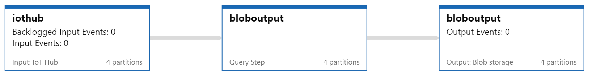
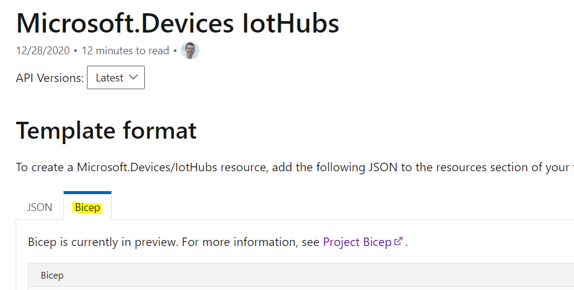
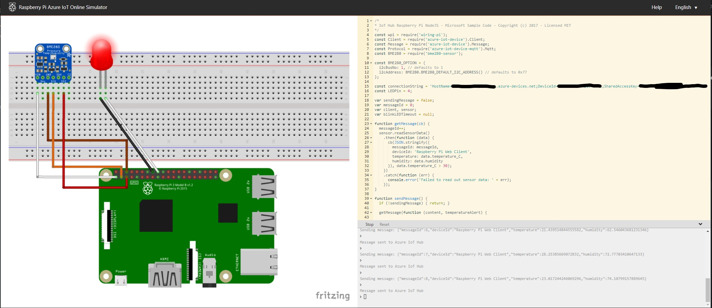
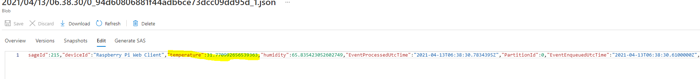
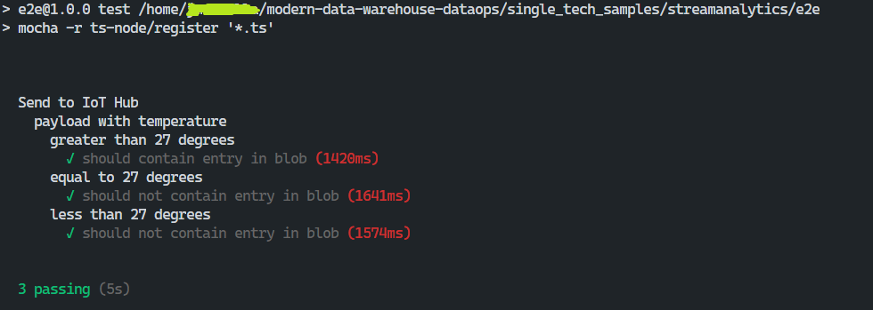

# Azure Stream Analytics



[Azure Stream Analytics](https://azure.microsoft.com/en-us/services/stream-analytics/) is a serverless real-time analytics service. The goal of this sample is to demonstrate how to develop a streaming pipeline, with IaC and testability in mind.

## Prerequisites

## Setup

1. __Azure Cli__ Will be necessary for various tasks. Please follow the instructions found [here](https://docs.microsoft.com/en-us/cli/azure/install-azure-cli).

1. __Bicep__  This project uses `Bicep` templates to setup `Azure` infrastructure. Please follow the steps under [Install Bicep Tools](https://docs.microsoft.com/en-us/azure/azure-resource-manager/bicep/install) to install the `Azure Cli` extension.

   For an introduction to `Bicep`, you can find more information in the `Bicep` repo under [Get started with Bicep](https://github.com/Azure/bicep/#get-started-with-bicep).

1. __Raspberry Pi Azure IoT Online Simulator__ To run through the [Functional Test](#Functional%20Test) section, you can use [this](https://azure-samples.github.io/raspberry-pi-web-simulator/) simulator. Makes sure to follow the step required to edit the js code.

1. __azure-streamanalytics-cicd__ Unit testing is possible using the `npm` package [azure-streamanalytics-cicd](https://www.npmjs.com/package/azure-streamanalytics-cicd). The tool provides additional features for working with `Azure Stream Analytics` locally. Check [here](https://docs.microsoft.com/en-us/azure/stream-analytics/cicd-tools?tabs=visual-studio-code) for more info.

1. __Configure environment variables.__ We will assume these are customized and configured per your needs

   ```bash
   APP="tech-sample"
   ENVIRONMENT="test"
   LOCATION="westus"
   STORAGE_ACCOUNT="st${APP/-/}${ENVIRONMENT}"
   ```

## Build

```bash
# Run Unit Tests
azure-streamanalytics-cicd test -project ./asaproj.json -outputPath ./output/

# Create Resource Group

az group create -n rg-${APP} -l ${LOCATION}

# Validate Generated Template
az deployment group validate -f main.bicep -g rg-${APP} --parameters query='@./streamanalytics-tech-sample.asaql' name=${APP} env=${ENVIRONMENT}

# Show plan
az deployment group what-if -f main.bicep -g rg-${APP} --parameters query='@./streamanalytics-tech-sample.asaql' name=${APP} env=${ENVIRONMENT}
```

## Deploy

```bash
# Create Azure Resources. This will also start the job

az deployment group create -f main.bicep -g rg-${APP} --parameters query='@./streamanalytics-tech-sample.asaql' name=${APP} env=${ENVIRONMENT}

# Add device

az iot hub device-identity create --hub-name iot-${APP}-${ENVIRONMENT} --device-id iot-${APP}-${ENVIRONMENT} --edge-enabled
```

## Functional Test

```bash

# Use connection information with "Raspberry Pi Azure IoT Online Simulator": https://azure-samples.github.io/raspberry-pi-web-simulator/

az iot hub device-identity connection-string show --hub-name iot-${APP}-${ENVIRONMENT} --device-id iot-${APP}-${ENVIRONMENT} --output tsv
```

> Check the blob storage container to ensure that a json file exists with expected temperature sensor data (exceeding 27 degrees) is present.

## Automated End-to-End Test

```bash
export DEVICE_CONNECTION_STRING=$(az iot hub device-identity connection-string show --hub-name iot-${APP}-${ENVIRONMENT} --device-id iot-${APP}-${ENVIRONMENT} --output tsv)
export AZURE_STORAGE_CONNECTION_STRING=$(az storage account show-connection-string -n ${STORAGE_ACCOUNT} --query connectionString -o tsv)

cd e2e
npm install 
npm test
```

## Cleanup

```bash
az group delete -n rg-${APP}
```

## Key concepts

### Infrastructure as Code

This sample's infrastructure is created using [Bicep](https://github.com/Azure/bicep#what-is-bicep) templates. `Bicep` is a DSL that is transpiled into `Azure`'s native `ARM Templates`. It's currently in preview but already has been integrated into the `Azure Cli`. Also [ARM template reference documentation](https://docs.microsoft.com/en-us/azure/templates/microsoft.devices/iothubs?tabs=bicep) lists `Bicep` along side `ARM Templates`:



Alternatively, `Terraform` can also be used.

> Key take aways for `Bicep`
>
> * Day 0 resource provider support. Any Azure resource — whether in private or public preview or GA — can be provisioned using Bicep.
> * No state or state files to manage. All state is stored in Azure, so makes it easy to collaborate and make changes to resources confidently.
> * VSCode extension for Bicep makes it extremely easy to author and get started with advanced type validation based on all Azure resource type API definitions.

Resource naming conventions attempt to follow examples from [Define your naming convention
](https://docs.microsoft.com/en-us/azure/cloud-adoption-framework/ready/azure-best-practices/resource-naming#example-names-for-common-azure-resource-types) where appropriate.

The structure of the __IaC__ scripts allow you to setup as many versions or the infrastructure as you need easily. For example an individual developer may create a version to use within their __Inner Dev Loop__:

```bash
DEVELOPER="kaa"
ENVIRONMENT="inner"
LOCATION="japaneast"
STORAGE_ACCOUNT="st${DEVELOPER}${ENVIRONMENT}"

az group create -n rg-${DEVELOPER} -l $LOCATION

az deployment group create -f main.bicep -g rg-${DEVELOPER} --parameters query='@./streamanalytics-tech-sample.asaql' name=${DEVELOPER} env=${ENVIRONMENT}

az iot hub device-identity create --hub-name iot-${DEVELOPER}-${ENVIRONMENT} --device-id iot-${DEVELOPER}-${ENVIRONMENT} --edge-enabled

export DEVICE_CONNECTION_STRING=$(az iot hub device-identity connection-string show --hub-name iot-${DEVELOPER}-${ENVIRONMENT} --device-id iot-${DEVELOPER}-${ENVIRONMENT} --output tsv)
export AZURE_STORAGE_CONNECTION_STRING=$(az storage account show-connection-string -g rg-${DEVELOPER} -n ${STORAGE_ACCOUNT} --query connectionString -o tsv)

# Cleanup
az group delete -n rg-${DEVELOPER}
```

### Testing

#### Unit

`Azure Stream Analytics` can be unit tested locally via the [azure-streamanalytics-cicd](https://www.npmjs.com/package/azure-streamanalytics-cicd) npm package.

Also this package can be used as part of an Azure DevOps CI\CD pipeline. More info can be found [here](https://docs.microsoft.com/en-us/azure/stream-analytics/set-up-cicd-pipeline). This should make integrating this into your existing CI\CD fairly straight forward.

> Key take aways for `azure-streamanalytics-cicd`
>
> * Test configuration is found under the __/test__ directory.
> * This is the default location for `azure-streamanalytics-cicd`.
> * __test/testConfig.json__ defines the test cases.
> * __test/temperature ... .json__ defines pipeline inputs and outputs (as `JSON`)

#### Functional



Functional testing can be done using the online tool [Raspberry Pi Web Client Simulator](https://azure-samples.github.io/raspberry-pi-web-simulator/). Source code can be found [here](https://github.com/Azure-Samples/raspberry-pi-web-simulator). This is an easy way to interacte with your `Azure Streaming Analytics` pipeline.

You can manually check the blob storage to see that events are coming through correctly.



> One aspect to consider, is that events will be batched on the scale of seconds due to the `pathPattern` defined in [streamingjobs.bicep](./streamingjobs.bicep) for `bloboutput`. This is done to aid automated testing. You can adjust during functional testing, and for production as required:
>
> _example_
> <!-- markdownlint-disable MD037 -->
> ```bicep
>   pathPattern: '{date}'
> ```
> <!-- markdownlint-enable MD037 -->
> Then you should be able to see many events per file.

#### Automated End-to-End

This sample combines [Azure IoT device SDK](https://www.npmjs.com/package/azure-iot-device) and [Microsoft Azure Storage SDK for JavaScript](https://www.npmjs.com/package/@azure/storage-blob) to create a Node.js (TypeScript) based End-to-End test solution. As mentioned under __Functional__ by default blob output partitioning is done on the seconds resolution to prevent the automated test from waiting an impractical amount of time. This can be made configurable according to your requirements on deploy by altering the `Bicep` template.



Within the test file [e2e/e2e.ts](e2e/e2e.ts) there is the `EXPECTED_E2E_LATENCY_MS` defined to be 1s. So this would also need to be adjusted for a real implementation.

#### CI/CD

A sample CI/CD Pipeline YAML file is present in this repo under "samplecicdpipeline.yml". This pipeline runs the tests present under the tests folder,
sets up the IoTHub, and deploys the ASA job using the contents of the streamingjobs.bicep file. In order to add a new ASA job, please do the following:

1. Include a new bicep file for the additional ASA job, and add it to the main.bicep file.
2. Add the query into the inlineScript under the parameters of the yaml file where the deployment of main.bicep happens.
