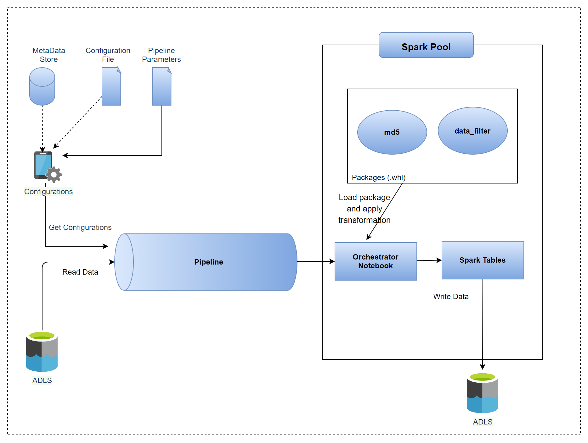
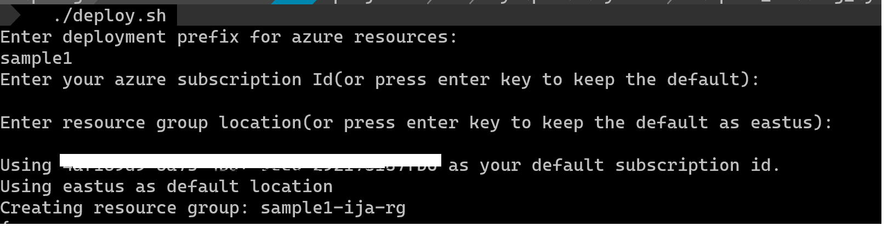
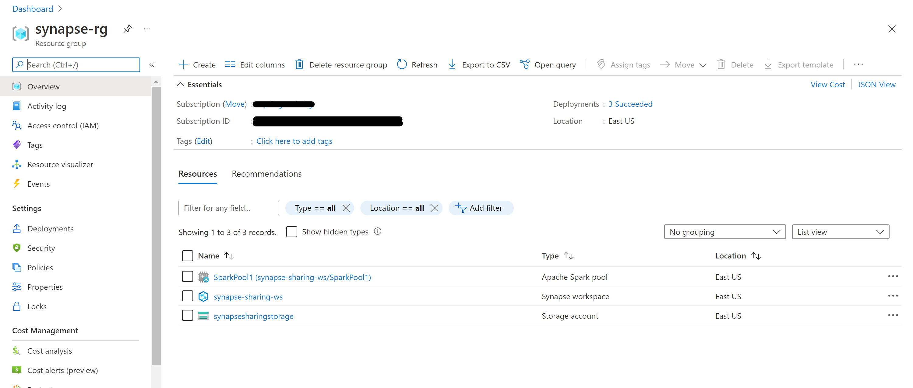
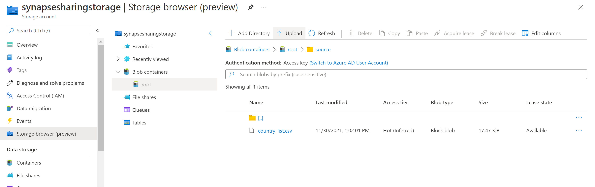
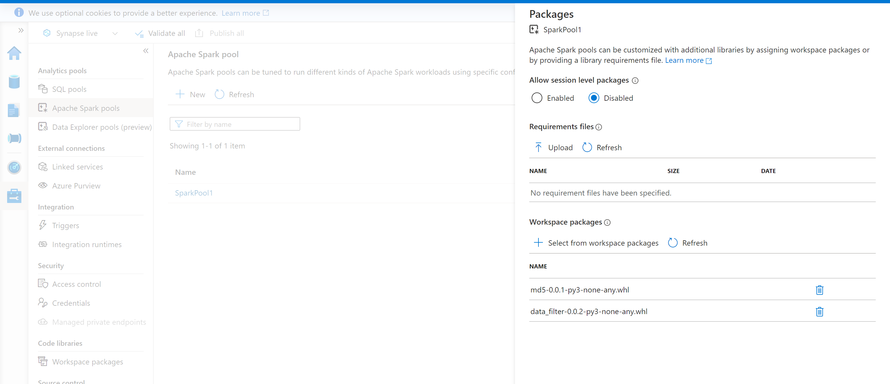
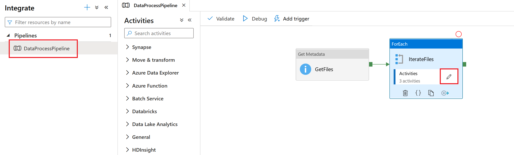
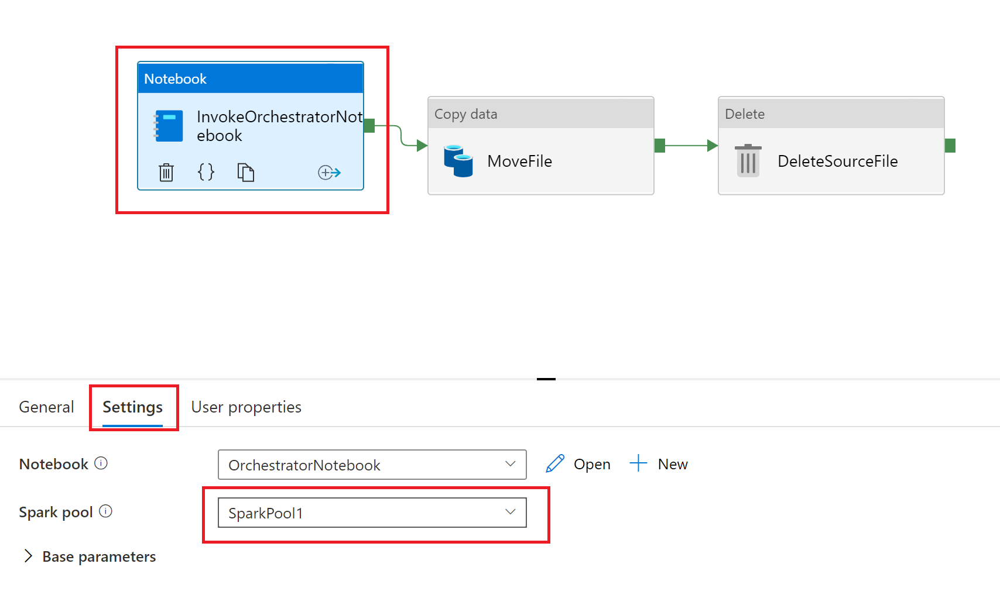
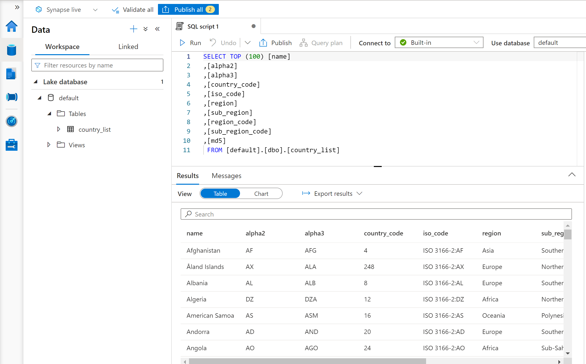
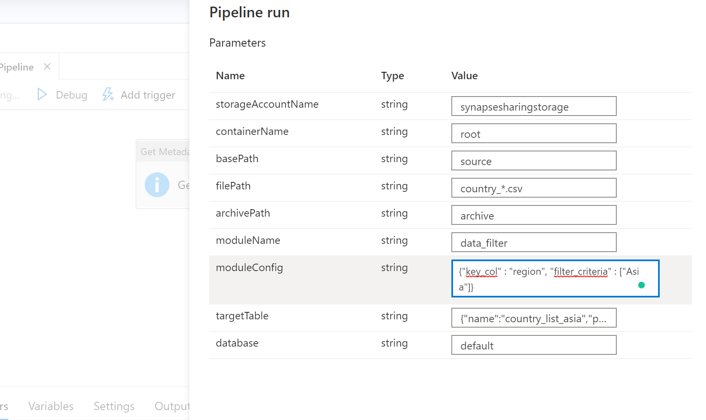
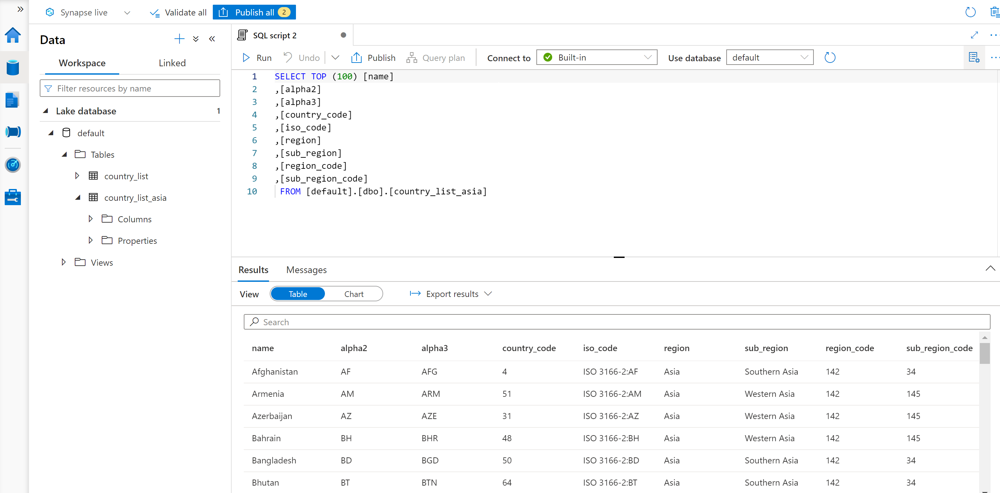

# Metadata driven dynamic loading of modules in synapse <!-- omit in toc -->

## Contents <!-- omit in toc -->

- [1. Solution Overview](#1-solution-overview)
  - [1.1. Scope](#11-scope)
  - [1.2. Use Case](#12-use-case)
  - [1.3. Architecture](#13-architecture)
  - [1.4. Technologies used](#14-technologies-used)
- [2. How to use this sample](#2-how-to-use-this-sample)
  - [2.1. Prerequisites](#21-prerequisites)
    - [2.1.1 Software Prerequisites](#211-software-prerequisites)
  - [2.2. Setup and deployment](#22-setup-and-deployment)
  - [2.3. Deployed Resources](#23-deployed-resources)
  - [2.4. Deployment validation and Execution](#24-deployment-validation-and-execution)
  - [2.5. Clean-up](#25-clean-up)

## 1. Solution Overview

This solution demonstrates how we can separate our business logic transformations into different modules which can be packaged and loaded dynamically into synapse spark pools based on the defined metadata.

We can define the metadata in a separate database, a json configuration file or provide them as synapse pipeline parameters. To keep this sample simple and light weighted we are using pipeline parameters to store metadata for running our pipelines.

This sample will focus on provisioning a synapse work space and required resources where you can run the synapse pipeline to see how the same pipeline can be used with multiple datasets to perform data sepecific transformations by loading the module dynamically at run time.

### 1.1. Scope

The following list captures the scope of this sample:

1. Provision an Azure Synapse environment by a shell script.
1. The following services will be provisioned as a part of this sample setup:
   1. Synapse work space.
   2. Azure Storage account with a root container having sample csv data file.
   3. Synapse spark pool.
   4. Synapse pipeline.

Details about [how to use this sample](#2-how-to-use-this-sample) can be found in the later sections of this document.

### 1.2. Use Case

For our sample use case we have a country list csv file which gets processed via synapse pipeline and data gets stored in spark external tables.

We have two sample transformation modules:

- md5: This module calculates the hash of all the columns and adds that as a separate column to the country list data.
- data_filter: This module returns a filtered dataset based on what condition we pass to the module. E.g get the countries where region is **Asia**

Synpase pipeline will be run twice to demonstrate how the two different transformations will be applied to the country list data.

Details about [how to run the pipeline](#24-deployment-validation-and-execution) can be found in the later sections of this document.

### 1.3. Architecture

The below diagram illustrates the design and the flow of the system:

### 1.4. Technologies used

The following technologies are used to build this sample:

- [Azure Synapse Analytics](https://azure.microsoft.com/en-in/services/synapse-analytics/)
- [Azure Storage](https://azure.microsoft.com/en-au/services/storage/data-lake-storage/)

## 2. How to use this sample

This section holds the information about usage instructions of this sample.

### 2.1. Prerequisites

The following are the prerequisites for deploying this sample:

1. [Github account](https://github.com/)
2. [Azure Account](https://azure.microsoft.com/en-au/free/search/?&ef_id=Cj0KCQiAr8bwBRD4ARIsAHa4YyLdFKh7JC0jhbxhwPeNa8tmnhXciOHcYsgPfNB7DEFFGpNLTjdTPbwaAh8bEALw_wcB:G:s&OCID=AID2000051_SEM_O2ShDlJP&MarinID=O2ShDlJP_332092752199_azure%20account_e_c__63148277493_aud-390212648371:kwd-295861291340&lnkd=Google_Azure_Brand&dclid=CKjVuKOP7uYCFVapaAoddSkKcA)
   - *Permissions needed*:  The ability to create and deploy to an Azure [resource group](https://docs.microsoft.com/en-us/azure/azure-resource-manager/management/overview), a [service principal](https://docs.microsoft.com/en-us/azure/active-directory/develop/app-objects-and-service-principals), and grant the [collaborator role](https://docs.microsoft.com/en-us/azure/role-based-access-control/overview) to the service principal over the resource group.

   - Active subscription with the following [resource providers](https://docs.microsoft.com/en-us/azure/azure-resource-manager/management/azure-services-resource-providers) enabled:

     - Microsoft.Synapse
     - Microsoft.Storage

#### 2.1.1 Software Prerequisites

1. [Azure CLI](https://docs.microsoft.com/en-us/cli/azure/) installed on the local machine
   - *Installation instructions* can be found [here](https://docs.microsoft.com/en-us/cli/azure/install-azure-cli)
1. For Windows users,
   1. Option 1: [Windows Subsystem for Linux](https://docs.microsoft.com/en-us/windows/wsl/install-win10)
   2. Option 2: Use the devcontainer published [here](../.devcontainer) as a host for the bash shell.
      For more information about Devcontainers, see [here](https://code.visualstudio.com/docs/remote/containers).

### 2.2. Setup and deployment

> **IMPORTANT NOTE:** As with all Azure Deployments, this will **incur associated costs**. Remember to teardown all related resources after use to avoid unnecessary costs. See [here](#4.3.-deployed-resources) for a list of deployed resources.

Below listed are the steps to deploy this sample :

1. Fork and clone this repository. Navigate to  `single_tech_samples/synapseanalytics/sample1_loading_dynamic_modules/setup/`.

1. The sample depends on the variables to be set before the deployment script is run; You can set these as environment variables, otherwise the deploy script will prompt you to provide input for following variables.
  
    > - `DEPLOYMENT_PREFIX` - Prefix for the resource names which will be created as a part of this deployment. Default: *syndyn*.
    > - `AZURE_SUBSCRIPTION_ID` - Subscription ID of the Azure subscription where the resources should be deployed. Default: *your default Azure subscription*.
    > - `AZURE_RESOURCE_GROUP_LOCATION` - Azure region where the resources will be deployed (e.g. australiaeast, eastus, etc.). Default: *eastus*.

1. Run `/deploy.sh`
   > Note: The script will prompt you to log in to the Azure account for authorization to deploy resources.

   The script will create the Synapse analytics workspace, Azure storage, Synapse pipelines & Synapse notebook. This script will also upload the sample file to blob storage and wheel packages to the Azure synapse.

    

### 2.3. Deployed Resources

The following resources will be deployed as a part of this sample once the script is executed:

1.Azure Synapse Analytics workspace.

2.Azure Storage with sample file.

2.Azure Synapse spark pool with wheel packages.

### 2.4. Deployment validation and Execution

The following steps can be performed to validate the correct deployment and execution of the sample:

- Users with appropriate access rights should be able to:

   1. Launch the synapse workspace from the Azure portal.
   2. Access the control plane for the storage account through the Azure portal.
   3. View the files uploaded in the Azure storage container

- Detail steps on how to execute the sample:

    1. Launch the Azure synapse workspace & open the synapse pipelines.
    2. Select on `DataProcessPipeline` and click on edit configurations for `IterateFiles`(ForEach) activity.
     
    3. Select `InvokeOrchestratorNotebook` activity and then click on `Setttings` tab and set the Spark pool to `SparkPool1`
     
    4. Click on debug or trigger to run the pipeline.
    >Note:  As part of deployment, 2 modules have already been uploaded to Azure synapse.

    

  - `storageAccountName` is Azure storage account name
  - `containerName` is Azure blob storage container name
  - `basePath` is the folder inside the container name where you want to pick the files from
  - `filPath` is file name regex with which you want to pick the files.
  - `arhivePath`: defaults to `archive` folder inside the azure blob container
  - `moduleName` is the name of the transformation module(wheel package) you want to transform your data with during the the pipeline run. Defaults to `md5`
  - `moduleConfig` is the configuration required for the transformation module. It can be empty incase the module doesn't take any configuration.
  - `targetTable` parameter takes a JSON object with table name and path where the parquet files will be stored for the external table.
  - `database`: Input for the spark database ; defaults to `default` value

    1. Fill in the parameters as required (or keeping the default values) and run the pipeline. Once the pipeline is successful, you'll see the data in the spark table as defined in the `targetTable` parameter
    

    1. Now let's run the same pipeline with another module, keeping everything same except the module name, module coinfiguration and target tables.

    1. Run the pipeline again with the moduleName as `data_filter` & this module will filter the data based on the filter criteria provided in the moduleConfig parameter, which in our case is "Asia" on `region` column.
    1. Once pipeline finished, you'll see a new spark table named `country_list_asia` created successfully.

   With this you can have generic pipelines which can load transformation modules dynamically based on configurations to process your data.

### 2.5. Clean-up

Please follow the below steps to clean up your environment :

The clean-up script can be executed to clean up the resources provisioned in this sample. Following are the steps to execute the script:

1. Navigate to `single_tech_samples/synapseanalytics/sample1_loading_dynamic_modules/setup/`.

2. Run `/destroy.sh`
