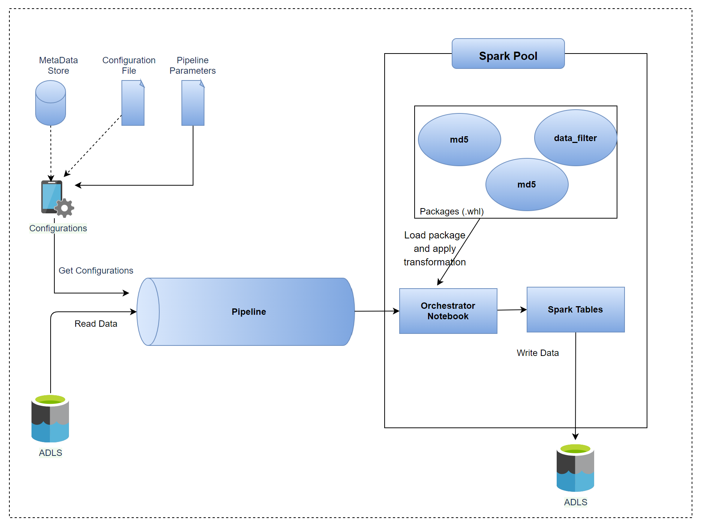

# Metadata driven dynamic loading of modules in synapse.

## Contents <!-- omit in toc -->

- [1. Solution Overview](#1-solution-overview)
  - [1.1. Scope](#11-scope)
  - [1.2. Use Case](#12-usecase)
  - [1.3. Architecture](#13-architecture)    
  - [1.4. Technologies used](#13-technologies-used)
- [2. How to use this sample](#2-how-to-use-this-sample)
  - [2.1. Prerequisites](#21-prerequisites)
    - [2.1.1 Software Prerequisites](#211-software-prerequisites)
  - [2.2. Setup and deployment](#22-setup-and-deployment)
  - [2.3. Deployed Resources](#23-deployed-resources)
  - [2.4. Deployment validation](#24-deployment-validation)
  - [2.5. Clean-up](#25-clean-up)
- [3. Next Step](#3-next-step)

## 1. Solution Overview

This solution demonstrates how we can separate our business logic transformations into different modules which can be packaged and loaded dynamically into synapse spark pools based on the defined metadata.

We can define the metadata in a separate database, a json configuration file or provide them as synapse pipeline parameters. To keep this sample simple and light weighted we are using pipeline parameters to store metadata for running our pipelines.

This sample will focus on provisioning a synapse work space and required resources where you can run the synapse pipeline to see how the same pipeline can be used with multiple datasets to perform data sepecific transformations by loading the module dynamically at run time.

### 1.1. Scope

The following list captures the scope of this sample:

1. Provision an Azure Synapse environment by a shell script.
1. The following services will be provisioned as a part of this sample setup:
   1. Synapse work space
   2. Azure Storage account with a root container having sample csv data file.
   3. Synapse spark pool.
   4. Synapse pipeline.   

Details about [how to use this sample](#3-how-to-use-this-sample) can be found in the later sections of this document.

### 1.2. Use Case
For our sample use case we have a country list csv file which gets processed via synapse pipeline and data gets stored in spark external tables. 

We have two sample transformation modules:
* md5: This module calculates the hash of all the columns and adds that as a separate column to the country list data.
* data_filter: This module returns a filtered dataset based on what condition we pass to the module. E.g get the countries where region is **Asia**

Synpase pipeline will be run twice to demonstrate how the two different transformations will be applied to the country list data.

Details about [how to run the pipeline](#3-how-to-use-this-sample) can be found in the later sections of this document.

### 1.3. Architecture

The below diagram illustrates the design and the flow the system:

### 1.4. Technologies used

The following technologies are used to build this sample:

- [Azure Synapse Analytics](https://azure.microsoft.com/en-in/services/synapse-analytics/)
- [Azure Storage](https://azure.microsoft.com/en-au/services/storage/data-lake-storage/)

