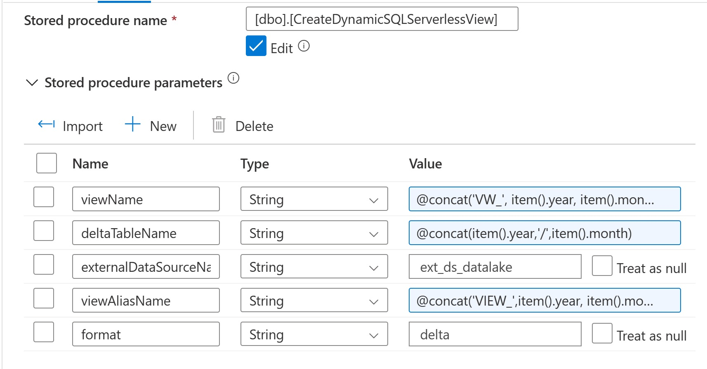
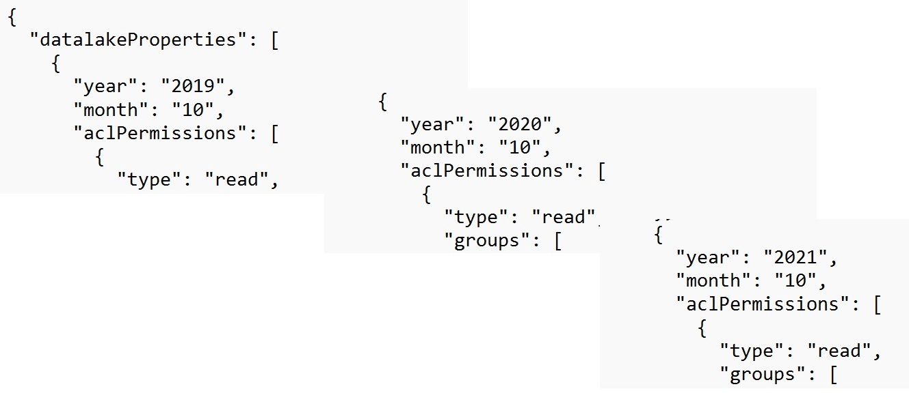
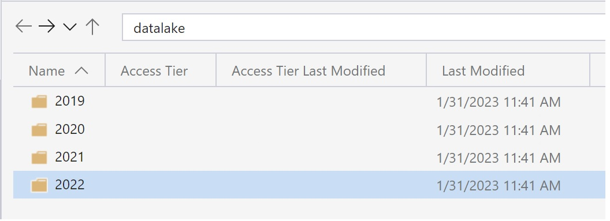
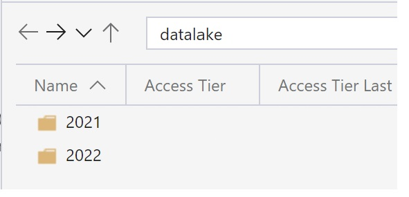
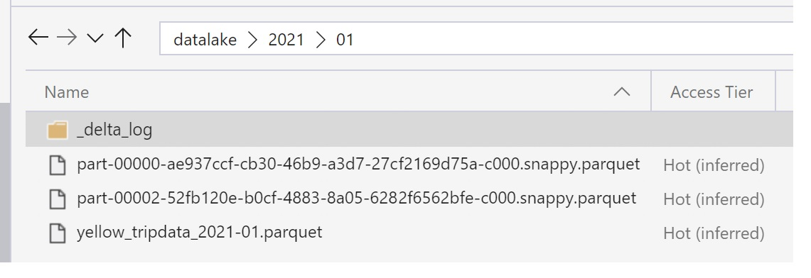
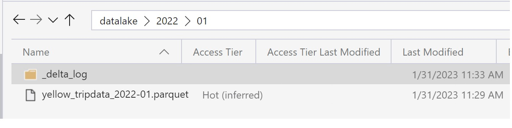

# Synapse Analytics Serverless Pools Best Practices using Delta Lake <!-- omit in toc -->

## Table of Contents <!-- omit in toc -->

- [Objectives](#objectives)
- [Key Learnings](#key-learnings)
- [Source System Data Considerations](#source-system-data-considerations)
- [Json Configuration File](#json-configuration-file)
  - [Configuration File Anatomy](#configuration-file-anatomy)
  - [Configuration File Parameters Definition](#configuration-file-parameters-definition)
  - [Configuration File Parameters Current Usage](#configuration-file-parameters-current-usage)
- [Synapse Serverless with Delta files and Partitioned Views](#synapse-serverless-with-delta-files-and-partitioned-views)
  - [Dynamic View Creation on top of Delta files](#dynamic-view-creation-on-top-of-delta-files)
  - [Implementing CLS on top of Delta files with Synapse Serverless](#implementing-cls-on-top-of-delta-files-with-synapse-serverless)
  - [Applying ACLs to the datalake (using a Spark pool)](#applying-acls-to-the-datalake-using-a-spark-pool)
  - [Implementing Data Retention (using a Spark pool)](#implementing-data-retention-using-a-spark-pool)
- [Working with the Sample](#working-with-the-sample)
  - [Pre-requisites](#pre-requisites)
  - [Using Dev Containers](#using-dev-containers)
  - [Without using Dev Containers](#without-using-dev-containers)
  - [Running the Sample](#running-the-sample)
  - [Infrastructure deployment considerations](#infrastructure-deployment-considerations)
  - [Synapse Artifacts deployment considerations](#synapse-artifacts-deployment-considerations)
- [Removing the Sample](#removing-the-sample)
- [Avoiding unnecessary costs](#avoiding-unnecessary-costs)
- [Issues and Workarounds](#issues-and-workarounds)
  - [Customer subscription \<SUBSCRIPTION\_ID\> needs to be registered with Microsoft.Sql resource provider](#customer-subscription-subscription_id-needs-to-be-registered-with-microsoftsql-resource-provider)
  - [I require jq but it's not installed. See jq](#i-require-jq-but-its-not-installed-see-jq)
  - [I require azure cli but it's not installed. See Az CLI](#i-require-azure-cli-but-its-not-installed-see-az-cli)
  - [Can't do az login: RuntimeError: 0. The ID token is not yet valid. See Az CLI](#cant-do-az-login-runtimeerror-0-the-id-token-is-not-yet-valid-see-az-cli)
  - [Other issues](#other-issues)

## Objectives

This sample aims to demonstrate the use of Synapse Serverless Pools with Delta Lake files including the automation towards the CI initial deployment of the necessary artifacts and the automation of the dynamic views creation on top of the delta lake files based on a json configuration file. A second and related objective is to demonstrates how to implement CLS (Column Level Security) on the delta tables using the previously created views. Finally, the sample also aims to demonstrate how to approach and execute on data retention requirements at the partition level or at the level of a particular data/time field.

## Key Learnings

When using this sample, you will learn:

- how to automate SQL scripts as part of the initial deployment using a synapse pipeline. We advise to use the Script task in Synapse pipelines with the type Query and to configure dynamically the Linked Services artifacts to make the automation possible.
- to use partitioned views instead of external tables in order to work with Delta Lake and Serverless pools so you can still benefit from partition elimination when running queries
- how to drive the ingestion behavior based on a json configuration file to avoid re-ingestion of unchanged data
- how to use Stored Procedure Task for Serverless pools and gain the awareness that to see the stored procedures listed you need to do it in SSMS (SQL Server Management Studio)
- to implement CLS on top of the lake
- to use only ACLs on the data lake in order to allow to access to the Synapse workspace but not direct access to the storage account. The use of Azure roles (Storage Reader for example) is not recommended in this case as it is too permissive and ACLs allow for a more fined grained approach
- understand how to implement common data retention requirements considering two angles:
  - physical partition year/month structure
  - specific datetime field

## Source System Data Considerations

For the purpose of demonstrating the mentioned goals, we are using the New York Taxi open data as a source system because is a known global dataset and quite simple to understand.

However, it's important to mention that the use of any data source that is star schema like can also be used for the same purpose and furthermore better mirror some real-life use cases.

## Json Configuration File

The sample makes use of a json configuration file. This file drives different behaviors through out the sample by using different parameters.

A template named datalake_config_template.json is provided and the deployment script dynamically updates a datalake_config.json file with the information of the current deployment. The deployment then uploads the config file in the datalake storage account on a container called config.

The template file can be changed previously to the deployment to reflect other years and months.

### Configuration File Anatomy

The configuration file structure is as described below:

```json
{
  "datalakeProperties": [
    {
      "year": "2019",
      "month": "09",
      "aclPermissions": [
        {
          "type": "read",
          "groups": [
            "AADGR<PROJECT><DEPLOYMENT_ID>"
          ]
        },
        {
          "type": "write",
          "groups": [
            "AADGR<PROJECT><DEPLOYMENT_ID>"
          ]
        }
      ],
      "created": "2023-01-01T08:05:18Z",
      "lastUpdatedSourceSystem": "2023-01-15T08:05:18Z",
      "lastUpdatedDatalake": "2023-01-01T08:05:18Z"
    },...
```

### Configuration File Parameters Definition

The file defines the values for the following fields:

- **year**: year to ingest from source system. First level of the physical partition(*) in the destination system (datalake).
- **month**: to ingest from source system. Second level of the physical partition in the destination system (datalake).
- **aclPermissions**: definition of type of permission and AD groups groups that should be attributed to that year/month/file hierarchy. Type of permissions are: read, write and execute. Groups are AD Groups, and in the scope of the sample they have the following name convention: "AADGR"<PROJECT_NAME><DEPLOYMENT_ID>(**).
- **created**: datetime fields that represents the date and time that the file was created in the source system.
- **lastUpdatedSourceSystem**: datetime fields that represents the date and time that the file was last updated in the source system.
- **lastUpdatedDatalake**: datetime fields that represents the date and time that the file was updated in the Data Lake.
  
(*) - The partitioning implemented in the target destination follows a two-level physical partitioning strategy. There is no logical partitioning executed in the datalake.

(**) - As part of the sample, just one unique AD Group is automatically generated, but the code is prepared to take more groups in the list. Keep in mind the limits for ACL entries described [here](https://learn.microsoft.com/en-us/azure/storage/blobs/data-lake-storage-access-control#what-are-the-limits-for-azure-role-assignments-and-acl-entries)

### Configuration File Parameters Current Usage

Each pair year/month will be ingested into the same physical structure in the data lake. For that hierarchy (including the delta file and respective metadata), the aclPermissions will be applied.

The datetime fields are supporting fields used to optimize the ingestion process. When:

- lastUpdatedDatalake is empty, it means that the content is new and it needs to be ingested.
- lastUpdatedDatalake < lastUpdatedSourceSystem, it means that re-ingestion needs to occur.
- lastUpdatedDatalake >= lastUpdatedSourceSystem, it means that there were no changes in the source system and there is no need to re-ingest.

## Synapse Serverless with Delta files and Partitioned Views

Is known that the Delta format is supported within Synapse Serverless pools (which is not the case for Dedicated pools). Not surprisingly, using Serverless pools seems like the right choice when the goal is to use Delta lake format and there is a strong requirement to use T-SQL like syntax and maintaining the costs as low as possible. However, there are some limitations to be aware of.

One natural choice is to use External tables on top of the Data Lake files, however External tables don't support partitioning elimination on the Serverless pools, in this case when using Delta Lake files, [Partitioned Views](https://learn.microsoft.com/en-us/azure/synapse-analytics/sql/create-use-views#partitioned-views) need to be used instead:

` CREATE   VIEW [dbo].[VW_202010] As SELECT * FROM OPENROWSET(BULK '2020/10',DATA_SOURCE = 'ext_ds_datalake',FORMAT = 'delta')as [VIEW_202010]
`

### Dynamic View Creation on top of Delta files

An extra challenge when dealing with Delta Files is to expect a large number of tables (or folders) in the Data Lake. A great choice is to automatically create the partitioned views on top of the Delta lake folders after they are created - one view per delta table, and as we are using Synapse, a good choice is to use Synapse pipelines.

There are several aspects to consider in this process:

- Setup, that is responsible to automatically create a database within the serverless pool, creates a external data source to the data lake and a stored procedure in the serverless database that will be triggered later. This functionality is also aligned with the pipeline Pl_NYCTaxi_1_Setup. This pipeline needs to run before the P_NYCTaxi_2_IngestData pipeline.
- Ingest or re-ingest parquet data aligned with the datalake_config.json configuration file definitions and transform it to delta format. In order to have testing data we are downloading sample data from the NYC Taxi available open data as mentioned earlier, to demonstrate the behavior. The data is in parquet format and a second step is taken to transform the same data to the delta format. In case of re-ingestion, the previous version is dropped completely not to run into file inconsistencies and to guarantee that if there is a schema change in the source that fact is reflected in the destination without conflicts.
- Automatically creates partitioned views based on the delta lake file structure after its creation, this pillar of the process is responsible to point to the folders previously created  and dynamically create or re-create the partitioned views on top of it. For that purpose, the stored procedure that was created on the Setup pipeline is executed accordingly.
- Automatically and recursively applies ACLs list definitions read from the datalake_config.json file.
- Backup the configuration file with the following name convention <datalake_config.json.current_timestamp> and update the configuration file content to replace timestamp for the lastUpdatedDatalake field after the ingestion.

The Stored Procedure will be responsible to dynamically create the views and expects the following parameters:

- view_name, build as a concatenation of "VW_" and the name of the delta lake tables
- external_datasource (created in the Setup pipeline as well), and it has a fixed name: ext_ds_datalake.
- format, on our case we are dealing with the delta format
- view_alias, build as a concatenation of "VIEW_" and the name of the delta lake tables
  


There is an important information about this process, that is relevant to mention. The Stored procedure needs to be created against the Serverless pool, and this is done in the P_NYCTaxi_1_Setup pipeline, however the "Programmability" folder won't be available to navigate through the defined stored procedures in Synapse Studio. If there is a need to check the success of the stored procedure deployment, or a need to explore or test further on the serverless pool, a connection needs to be established to the serverless synapse endpoint through SSMS (SQL Server Management Studio) and explore the "Programmability" folder as showed below:


Expect to find as many views as existing delta folders and in alignment with the configuration file definition:




### Implementing CLS on top of Delta files with Synapse Serverless

Column Level Security is one important requirement when it comes to data access and being able to authorize the right people to access to the right data and the right columns for a more granular level.

There is no out-of-the box mechanism in Azure to implement CLS in the files that are stored in the datalake, however there is a possibility to implement CLS though the use of views on top of the datalake files. Furthermore, we can take advantage of AD Groups to implement a one to many relationship (1 AD Group containing many users mapped to 1 DB User) that implements the access level at the AD Level and still be able to audit per individual user on the activity performed on the database.

The diagram below illustrates the step-by-step process in order to successfully define CLS on top of a datalake file through a view:


### Applying ACLs to the datalake (using a Spark pool)

Once the ingestion is finished, a process that applies the ACL list defined in the configuration file in the datalake is triggered.
The main advantage of this process is that runs as an independent module. It can run after the ingestion within the same pipeline, but it can also be ran independently of the ingestion process if necessary.

In order to apply the ACLs, the azure-storage-file-datalake library was used and a Key Vault was included in the deployment to deal with the storage secrets properly.

Nevertheless, importing the library mentioned above might take a considerably amount of time from within Synapse.
In the table below the explored options with pros and cons are summarized:

| Method | Command used/Steps needed | Pros   | Cons |
|--------|---------------------------|--------|------|
| Import library directly in the notebook      | pip install azure-storage-file-datalake | Faster method to load the library (seconds after the Spark pools starts) | |
| Import requirements.txt and update Spark pool | az synapse spark pool update with --library-requirements requirements.txt | **1)** Centralized execution of the requirements. **2)** Runs one time at the deployment time. | Takes 20 minutes to run this step  |
| Import whl package| import whl to synapse package workspace and import package from the notebook| **1)** The use of whl packages is considered best practice because allows the simplification of the notebooks and enable a simpler way to do unit tests. **2)** Runs one time at the deployment time. | Takes 20 minutes to run this step |
| Run a similar script outside Synapse | script and language of choice | **1)** Faster runtime. **2)** Potential computation cost savings when compared with Spark. | Adds complexity to the architecture and loses centralization of the entire process in just one service - Synapse |

NOTE: when deploying the sample, the version using the notebook with the wheel sample import is used by default. However, a version with no wheel file is also provided under the name of Nb_NYCTaxi_Config_Operations_Library_No_Wheel.ipynb. To test the latest, is enough to change the Pl_NYCTaxi_0_Main pipeline to point to the second notebook instead.
The same applies to Nb_NYCTaxi_Run_Data_Retention and Nb_NYCTaxi_Run_Data_Retention_No_Wheel notebooks.

### Implementing Data Retention (using a Spark pool)

The correct implementation of data retention requirements is paramount to organizations due to compliance reasons and legal obligations. However, when those obligations are attained and the data no longer needs to be retained, the removal of that data should be incorporated in the data lifecycle execution process.

In the current sample implementation, the Data retention period is assumed to be two years back from the current date. This assumption can be easily changed in the pipeline parameters.

The Data Retention process runs under the execution of the Pl_NYCTaxi_Run_Data_Retention pipeline and the process considers several angles when iterating on the configuration file information.

- If the year and month in the configuration files is previous to the retention date obligation (current data minus 2 years) and that data is not present in the datalake, then those folders are not ingested and furthermore are deleted from the configuration file after properly backing it up.
- If the year and month in the configuration files is previous to the retention date obligation (current data minus 2 years) and that data is present in the datalake, then those folders are deleted as well as the corresponding partitioned views.
  
||
|:--:|
| Datalake after ingestion |

||
|:--:|
| Datalake after deleting folders outside of retention |

- If the year and month in the configuration files is covered by the retention date obligation and that data is present in the datalake, then a query is ran to delete individual records that are previous to the retention date in a specific field (tpep_pickup_datetime in the current example). In this case, because of the Delta lake default behavior of saving extra files to use later for time travel purposes, the notebook also runs a vacuum command to remove all unnecessary files. In the present sample, vacuum is ran with 0 retention hours setting, so users are able to check the results immediately, but in production environments caution is advised and is recommended to have at least 7 days of retention before running this command.

||
|:--:|
| Datalake after running delete query |

||
|:--:|
| Datalake after running vacuum|

## Working with the Sample

### Pre-requisites

- Azure account
- Visual Studio Code

### Using Dev Containers

To use a Dev Container, you need to have the following software in addition to the previous pre-requisites:

- Docker
- Visual Studio Code Remote Development Extension Pack

In order to open the project in a container follow the following steps:

- Open Visual Studio Code and clone the repository.
- Use the .envtemplate file located in \modern-data-warehouse-dataops\single_tech_samples\synapseanalytics\sample2_synapseserverless\.devcontainer to create a synapsecontainer.env file with the selected values for the current deployment
- Hit Ctlr-Shift-P to open the command palette and type Dev Containers: Open Folder in Container ...
- When prompted, select the directory \modern-data-warehouse-dataops\single_tech_samples\synapseanalytics\sample2_synapseserverless
- Wait for the container to build, check the logs for more information:
  
  

### Without using Dev Containers

Clone the repository and follow this prerequisites in order to run the sample:

- Login to Azure az login
- Install jq
    ```sudo apt-get install jq```
- Install Az CLI
    ```curl -sL https://aka.ms/InstallAzureCLIDeb | sudo bash``` (for Ubunto or Debian).
- Define the following environment variables:
  - export PROJECT=<PROJECT_NAME>
  - export AZURE_SUBSCRIPTION_ID=<SUBSCRIPTION_ID>
  - export DEPLOYMENT_ID=dep1 (or any other string). NOTE: if the deployment fails, you need either to delete the resources created or use a different DEPLOYMENT_ID.
  - export AZURE_LOCATION=westeurope (or any other Azure location)

NOTE: if you need to check the list of env variables use ```printenv```. If you need to delete an env variable use ```unset <NAME_USED_ON_THE_EXPORT>```

### Running the Sample

Navigate to the directory /modern-data-warehouse-dataops/single_tech_samples/synapseanalytics/sample2_synapseserverless and run the following command:

```bash -c ./deploy.sh```

Once the sample is deployed in the subscription of choice, navigate to Synapse Studio and either wait for the trigger to start the Pl_NYCTaxi_0_Main pipeline or you can trigger it manually. This pipeline is responsible to call P_NYCTaxi_1_Setup and Pl_NYCTaxi_2_IngestData pipelines is sequence.

The Pl_NYCTaxi_Run_Data_Retention pipeline does not have a trigger associated, the intend is to trigger it manually for the user to be able to analyze the results from the ingestion and the retention processes separately.

The deployment script responsible to deploy a AAD group called AADGR<PROJECT_NAME><DEPLOYMENT_ID> and add the owner of the deployment as a member. Once the pipeline finishes successfully, you can navigate through the db_serverless database and check the views that were created and experiment the CLS scripts.

To successfully test the CLS functionality there are a couple of steps you need to execute manually. After the deployment is complete:

- Add a second AD user to the AADGR <PROJECT_NAME><DEPLOYMENT_ID>
- In Synapse Studio, navigate to the Scripts and open the Sc_Column_Level_Security.sql script and follow the 9 steps described in the file

### Infrastructure deployment considerations

The script firstly deploys the infrastructure that is required to demonstrate the objectives of the sample.
The infrastructure is composed by:

- one resource group, named <PROJECT_NAME><DEPLOYMENT_ID>-rg, and within the resource group you can find:
  - one storage account for internal Synapse use, named <PROJECT_NAME>st2<DEPLOYMENT_ID>
  - one storage account that acts as the data lake to store the NYC Taxi Data, named <PROJECT_NAME>st1<DEPLOYMENT_ID>
  - a Synapse workspace that includes a Serverless pool and a Spark pool, named <PROJECT_NAME>st1<DEPLOYMENT_ID>
  - one AAD group, named AADGR<PROJECT_NAME><DEPLOYMENT_ID>
  - a key vault resource named, <PROJECT_NAME><DEPLOYMENT_ID>
- one resource group named <PROJECT_NAME>-syn-mrg-<DEPLOYMENT_ID>, for  internal use of Synapse

### Synapse Artifacts deployment considerations

The synapse artifacts are uploaded immediately after the infrastructure is successfully deployed and below you can find the list of what should be deployed in the Synapse workspace:

- Datasets
  - Ds_NYCTaxi_ADLS2
  - Ds_NYCTaxi_ADLS2_Folder
  - Ds_NYCTaxi_ADLS2_Year_Folder
  - Ds_NYCTaxi_HTTP
  - Ds_NYCTaxi_Config
- Linked Services
  - Ls_NYCTaxi_ADLS2
  - Ls_NYCTaxi_ADLS2_Folder
  - Ls_NYCTaxi_Config
  - Ls_NYCTaxi_HTTP
  - Ls_NYCTaxi_KeyVault
  - Ls_NYCTaxi_Synapse_Serverless_master
  - Ls_NYCTaxi_Synapse_Serverless_db
- Pipelines
  - Pl_NYCTaxi_0_Main
  - Pl_NYCTaxi_1_Setup
  - Pl_NYCTaxi_2_IngestData
  - Pl_NYCTaxi_Run_Data_Retention
- Notebooks
  - Nb_NYCTaxi_Convert_Parquet_to_Delta
  - Nb_NYCTaxi_Config_Operations_Library
  - Nb_NYCTaxi_Config_Operations_Library_No_Wheel
  - Nb_NYCTaxi_Run_Data_Retention
  - Nb_NYCTaxi_Run_Data_Retention_No_Wheel
- Packages
  - adlsaccess-1.0-py3-none-any.whl
- Trigger
  - Tg_NYCTaxi_0_Main
- Script
  - Sc_Column_Level_Security

## Removing the Sample

To remove the sample completely you need to remove the following assets:

- the resource group: <PROJECT_NAME><DEPLOYMENT_ID>-rg, resource group
- the aad group: AADGR<PROJECT_NAME><DEPLOYMENT_ID>

## Avoiding unnecessary costs

In case the sample is not being used and the user would like to avoid unnecessary costs until complete removal is possible, there are some actions can be done:

- purge the deployed key vault by running: `az keyvault purge --name  <keyvault-name>`
- stop the Spark pool if is not being used
- stop the automatic trigger Tg_NYCTaxi_0_Main
  
## Issues and Workarounds

### Customer subscription <SUBSCRIPTION_ID> needs to be registered with Microsoft.Sql resource provider

To overcome this problem, use the following command to verify that the Microsoft.Sql provider is registered on the subscription:

```az provider list --output table```

If is not registered, then run the following command:

```az provider register --namespace Microsoft.Sql```

### I require jq but it's not installed. See [jq](https://stedolan.github.io/jq/)

Install jq as explained in the pre-requirements section.

### I require azure cli but it's not installed. See [Az CLI](https://bit.ly/2Gc8IsS)

Install Azure CLI as explained in the pre-requirements section.

### Can't do az login: RuntimeError: 0. The ID token is not yet valid. See [Az CLI](https://github.com/Azure/azure-cli/issues/20388)

If using WSL on Windows, this error might arise.
Running sudo `hwclock -s` in wsl solves the issue.

### Other issues

If issues are encountered when deploying or running the sample, please file an issue in GitHub so it can be addressed.
