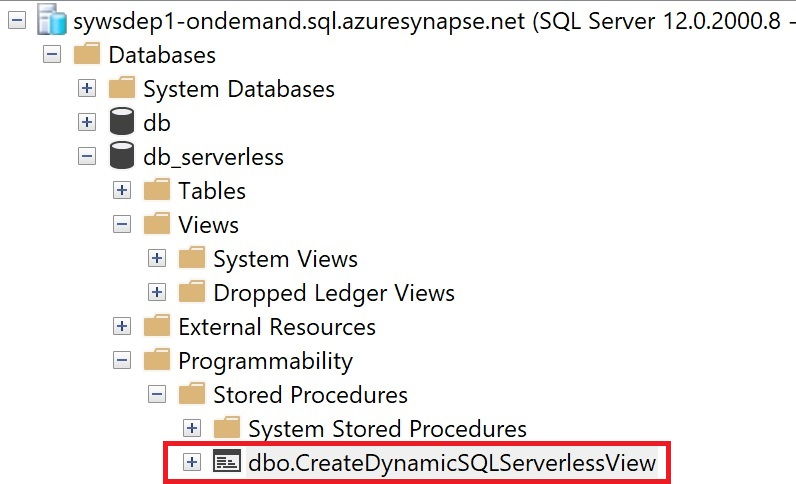
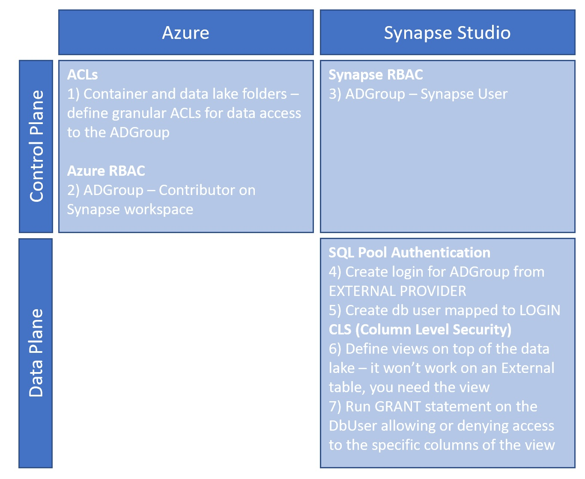

# Synapse Analytics Serverless Pools Best Practices using Delta Lake

## Objectives

This sample aims to demonstrate the use of Synapse Serverless Pools with Delta Lake files. A second objective is to share findings and challenges around automating view creation for a large number of tables stored on the Data Lake, and finally demonstrate how to implement CLS (Column Level Security) on top of these delta tables.

## Pre-requirements

In order to run this sample these are the prerequisites:

- Login to Azure az login
- Install jq
    ```sudo apt-get install jq```
- Install Az CLI
    ```curl -sL https://aka.ms/InstallAzureCLIDeb | sudo bash``` (for Ubunto or Debian).
- Define the following environment variables:
  - export PROJECT=<PROJECT_NAME>
  - export AZURE_SUBSCRIPTION_ID=<SUBSCRIPTION_ID>
  - export DEPLOYMENT_ID=dep1 (or any other string). NOTE: if the deployment fails, you need either to delete the resources created or use a different DEPLOYMENT_ID.
  - export AZURE_LOCATION=westeurope (or any other Azure location)

NOTE: if you need to check the list of env variables use ```printenv```. If you need to delete an env variable use ```unset <NAME_USED_ON_THE_EXPORT>```

## Infrastructure deployment

The script firstly deploys the infrastructure that is required to demonstrate the objectives of the sample.
The infrastructure is composed by:

- one resource group, named <PROJECT_NAME><DEPLOYMENT_ID>-rg, and within the resource group you can find:
  - one storage account for internal Synapse use, named <PROJECT_NAME>st2<DEPLOYMENT_ID>
  - one storage account that acts as the data lake to store the NYC Taxi Data, named <PROJECT_NAME>st1<DEPLOYMENT_ID>
  - a Synapse workspace that includes a Serverless pool and a Spark pool, named <PROJECT_NAME>st1<DEPLOYMENT_ID>

## Synapse Artifacts

The synapse artifacts are uploaded immediately after the infrastructure is successfully deployed and below you can find the list of what should be deployed in the Synapse workspace:

- Datasets
  - Ds_NYCTaxi_ADLS2
  - Ds_NYCTaxi_HTTP
  - Ds_NYCTaxi_ADLS2_Delta
- Linked Services
  - Ls_NYCTaxi_ADLS2
  - Ls_NYCTaxi_HTTP
  - Ls_NYCTaxi_Synapse_Serverless_master
  - Ls_NYCTaxi_Synapse_Serverless_db
- Pipelines
  - P_NYCTaxi_1_Setup
  - P_NYCTaxi_2_Main
- Notebook
  - Nb_Convert_Parquet_to_Delta

## Functional diagram

## Synapse Serverless with Delta files and Partitioned Views

Is known that the Delta format is supported within Synapse Serverless pools (which is not the case for Dedicated pools). Not surprinsingly, using Serverless pools seems like the right choice when the goal is to use Delta lake format and there is a strong requirement to use T-SQL like syntax and maintaining the costs as low as possible. However, there are some limitations to be aware of.

One natural choice is to use External tables on top of the Data Lake files, however External tables don't support partitioning on the Serverless pools, in this case when using Delta Lake files, Partitioned Views need to be used instead.

EXAMPLE OF CODE TO CREATE A PARTITIONED VIEW

### Dynamic view creation from ADLS Gen2 folder structure

An extra challenge when dealing with Delta Files is to expect a large number of tables (or folders) in the Data Lake. A great choice is to dynamically create the partioned views based on the Delta lake folder structure - one view per delta table, and as we are using Synapse, a good choice is to use Synapse pipelines.

IMAG WITH SYNAPSE PIPELINE and explanation on how to create the SP and use Stored procedure for a SQL instance

There are three main aspects to consider in this process:

- Setup, that is responsible to create a database within the serverless pool, creates a external data source to the data lake and a stored procedure in the serverless database that will be triggered later. This functionality is also aligned with the pipelineP_NYCTaxi_1_Setup. This pipeline has an important particularity: after it's deployed on the workspace needs to run before the P_NYCTaxi_2_Main pipeline.
- Get parquet data and transform it to delta format, in order to have testing data we are downloading some sample data from the NYC Taxi available open data to demonstrate the behaviour. The data is in parquet format and we take a second step to transform the same data to the delta format.
- Dynamically create partitioned views based on the delta lake file structure, the third pillar of the process is responsible to navigate through the data lake folder structure and dynamically create the partitioned views on top of it. For that it uses the stored procedure that was created on the Setup pipeline as explained above.

The Stored Procedure will be responsible to dynamically create the views and expects the following parameters:

- view_name, build as a concatenation of "VW_" and the name of the delta lake tables
- external_datasource (created in the Setup pipeline as well), and it has a fixed name: ext_ds_datalake.
- format, on our case we are dealing with the delta format
- view_alias, build as a concatenation of "VIEW_" and the name of the delta lake tables

There is an important information about this process, that is relevant to mention. The Stored procedure needs to be created against the Serverless pool, and this is done in the P_NYCTaxi_1_Setup pipeline, however the "Programability" folder won't be available to navigate through the defined stored procedures in Synapse Studio. If there is a need to check the success of the stored procedure deployment, or a need to explore or test further on the serverless pool, a connection needs to be established to the serverless synapse endpoint through SSMS (SQL Server Management Studio) and explore the "Programability" folder as showed below:



### Implementing CLS at the Delta Lake level

Column Level Security is one important requirement when it comes to data access and being able to authorize the right people to access to the rigth data and the right columns for a more granular level.

There is no out-of-the box mechanism in Azure to implement CLS in the files that are stored in the datalake, however there is a possibility to implement CLS though the use of views on top of the datalake files. Furthermore, we can take advantage of AD Groups to implement a one to many relationship (1 AD Group containing many users mapped to 1 DB User) that implements the access level at the AD Level and still be able to audit per individual user on the activity performed on the database.

The diagram below illustrates the step-by-step process in order to successfully define



## Running the Sample

Navigate to the directory /modern-data-warehouse-dataops/single_tech_samples/synapseserverless and run the following command:

```bash -c ./deploy.sh```

## Issues and Workarounds

### Customer subscription <SUBSCRIPTION_ID> needs to be registered with Microsoft.Sql resource provider

To overcome this problem, use the following command to verify that the Microsoft.Sql provider is registered on the subscription:

```az provider list --output table```

If is not registered, then run the following command:

```az provider register --namespace Microsoft.Sql```

### I require jq but it's not installed. See [jq](https://stedolan.github.io/jq/)

Install jq as explained in the pre-requirements section.

### I require azure cli but it's not installed. See [Az CLI](https://bit.ly/2Gc8IsS)

Install Azure CLI as explained in the pre-requirements section.
