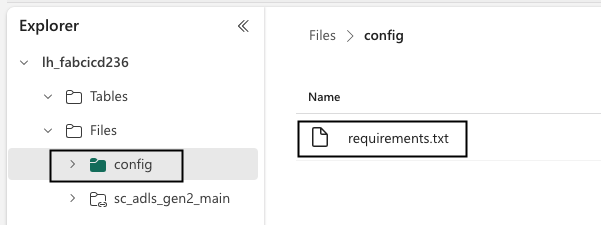

# Microsoft Fabric Utilities

## Python script to upload file in GIT repo to Fabric lakehouse

For config-driven data pipelines or notebooks, the config files are generally stored in the "Files" section of the Fabric Lakehouse. However, the Git integration with Fabric only syncs the lakehouse metadata, not the actual data files. Therefore, the config files must be version controlled outside of Fabric and uploaded to the lakehouse manually. Including this process in the CI/CD pipeline ensures that the latest config files are always available in the lakehouse, and can be promoted to the higher environments.

To facilitate that, the python script [upload-file-to-lakehouse.py](./lakehouse-file-upload/upload-file-to-lakehouse.py) uploads a file from a GIT repository to a Fabric lakehouse. The script uses a service principal with a client secret and uses Azure Data Lake APIs to authenticate and upload the file.

We plan to use this script in the future to automate the process of uploading "config" files from the Git repository to the Fabric Lakehouse as part of the CI/CD process.

### Usage

Here is a sample usage of the script:

- `cd` into the `lakehouse-file-upload` directory.

- Rename the [.envtemplate](./lakehouse-file-upload/.envtemplate) to `.env` and update the values for the following environment variables:

  ```bash
  # Service principal (SP) credentials
  AZURE_CLIENT_ID="<Azure SP client id>"
  AZURE_TENANT_ID="<Azure SP tenant id>"
  AZURE_CLIENT_SECRET="<Azure SP client secret>"
  # Microsoft Fabric workspace and lakehouse details
  ONELAKE_ACCOUNT_NAME="onelake"
  WORKSPACE_ID="<Microsoft Fabric workspace id>"
  LAKEHOUSE_ID="<Microsoft Fabric lakehouse id>"
  # Azure DevOps details and personal access token (PAT)
  GIT_ORGANIZATION_NAME="<Azure DevOps organization name>"
  GIT_PERSONAL_ACCESS_TOKEN="<Azure DevOps PAT>" # provided you are not using oauth 
  GIT_PROJECT_NAME="<Azure DevOps project name>"
  GIT_REPO_NAME="<Azure DevOps repository name>"
  GIT_BRANCH_NAME="<Azure DevOps branch name>"
  ```

- Run the script as instructed below:

  ```bash
  # Create a virtual environment
  $ python3 -m venv .venv

  # Activate the virtual environment
  source .venv/bin/activate

  # Install the dependencies
  $ pip install -r requirements.txt

  # View the help
  $ python3 upload-file-to-lakehouse.py -h
    usage: upload-file-to-lakehouse.py [-h] [--upload_from {local,git}] [--auth_method {pat,oauth} source_file_path target_file_path

    Script to upload local file or file from Azure Repo to Fabric lakehouse.

    positional arguments:
      source_file_path      The source file path of the local file or in the Azure Repo.
      target_file_path      The target file path in the Fabric lakehouse.

    options:
      -h, --help            show this help message and exit
      --upload_from {local,git}
                            Specify the source of the file to upload: 'local' or 'git'. Default is 'local'.
      --auth_method {pat,oauth}
                        Specify the authentication method: 'pat' (default) or
                        'oauth'.

  # Run the script to upload a file from the local file system to the lakehouse
  $ python3 upload-file-to-lakehouse.py --upload_from local requirements.txt config/requirements.txt

    [I] Fabric workspace id: a6730feb-5c55-4b6b-8ff7-7cde1d746452
    [I] Fabric lakehouse id: 4fd95a9f-160c-488c-8341-887974929c36
    [I] Source file path: ./requirements.txt
    [I] Target file path: config/requirements.txt
    [I] Upload from: local
    [I] Authentication method: pat
    [I] Uploading local './requirements.txt' to './requirements.txt'
    [I] Reading the file just uploaded from 4fd95a9f-160c-488c-8341-887974929c36/Files/config/requirements.txt
    b'azure-core==1.32.0\nazure-devops==7.1.0b4\nazure-identity==1.19.0\nazure-storage-blob==12.23.1\nazure-storage-file-datalake==12.17.0\npython-dotenv==1.0.  1\nrequests==2.32.3'
  ```

- The file will be uploaded to the lakehouse to the "Files section of the lakehouse as shown below:

  
